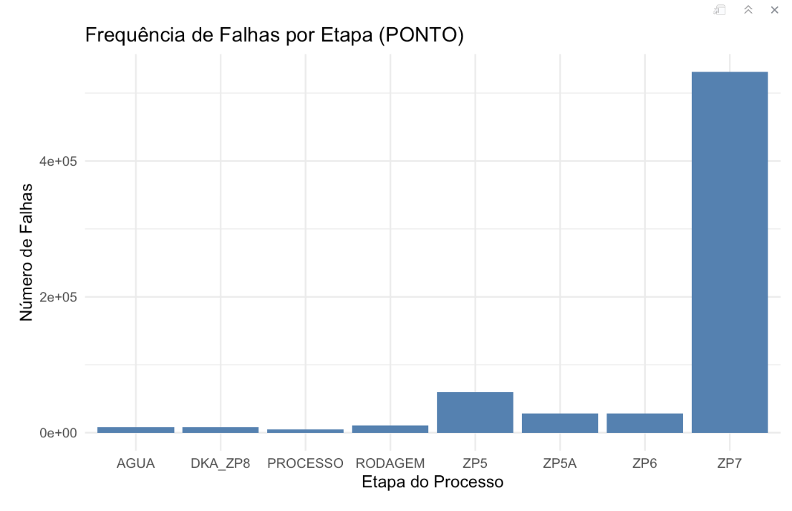
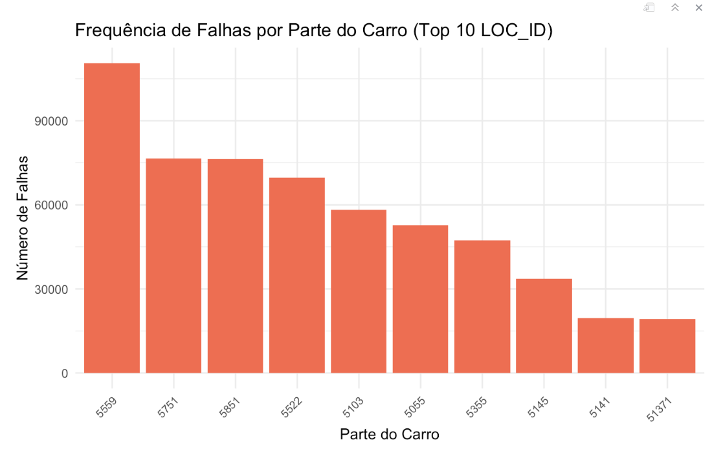
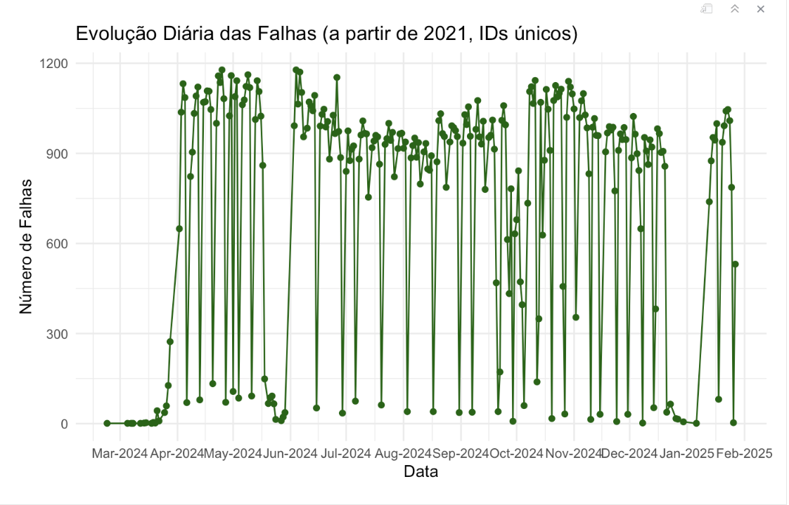

# Estrutura e Governança para Análise de Dados

**Nome do Projeto:** Análise de falhas de Qualidade com pipeline e Governança de Dados

**Nome do Parceiro:** Volkswagen do Brasil Ltda.

**Integrantes do grupo:** Bruno Leão, Eduarda Gonzaga, Emely Tavares, João Montagna, Isabela Rocha e Renan Ribeiro.

### **Conteúdo**

- [Introdução](#)
- [Análise Exploratória de Dados da Tabela Falhas](#Análise-Exploratória-de-Dados-da-Tabela-Falhas
) 
- [1 Variáveis e Pontos Estratégicos](#1-variáveis-e-pontos-estratégicos)
- [2 Representação Gráfica dos Dados - Data Visualization](#2-representação-gráfica-dos-dados---data-visualization)
- [3 Estrutura da Governança de Dados](#3-estrutura-da-governança-de-dados)
- [4 Análise Exploratória de Dados da Tabela Falhas](#4-análise-exploratória-de-dados-da-tabela-falhas)

# 1 Variáveis e Pontos Estratégicos

## 1.1 *Tabela de Resultados*

### 1.1.1 Modificações e Estrutura

-   **Removido**: `RESULT_DESCRIPTION` (redundante, já representado por `RESULT_ID`).
-   **Alterado**: `STATUS` convertido para binário (`0 = NOTOK`, `1 = OK`) para escalabilidade.
-   **Mantidos**:
    -   `CAPTURE_TIME`: Registro temporal.
    -   `RESULT_ID`: Identifica o tipo de verificação.
    -   `STATUS`  : Identifica se aquele ponto de verificação passou ou não
    -   `ID_CARRO`: Mantido para relacionar com os dados do veiculo.

### 1.1.2 Observações

-   Atualmente, todos os status são `NOTOK`, mas a estrutura suporta ambos (`OK` e `NOTOK`).
-   Permite consultas por veículo (`ID_CARRO`) e por tipo de verificação (`RESULT_ID`).

### 1.1.3 Estrutura da Tabela

| Coluna         | Tipo        | Descrição |
|---------------|------------|-------------|
| **`ID_CARRO`**  | `VARCHAR`   | Identificação do veículo (*chave estrangeira*), utilizada para associar os testes ao respectivo modelo e suas configurações. |
| **`RESULT_ID`** | `VARCHAR`   | Código identificador do tipo de verificação realizada. Permite classificar os diferentes testes aplicados ao veículo. |
| **`CAPTURE_TIME`** | `TIMESTAMP` | Data e hora do recebimento do resultado, garantindo o registro temporal da verificação. |
| **`STATUS`**    | `VARCHAR(6)` | Indica o resultado do teste, sendo **0** para falha (*NOTOK*) e **1** para aprovação (*OK*). |

## 1.2 *Tabela de Status*
### 1.2.1 Modificações e Estrutura

-   **Mantidos**:
    -   `ID`: Mantido para relacionar com os dados do veiculo.
    -   `STATUS`: Identifica o ponto da montagem onde o carro passou.
    -   `STATUS_DATA`: Registro temporal.

#### 1.2.2 Estrutura da Tabela

-   **`ID`** → Identificação do veículo (chave estrangeira). Serve para relacionar com os dados do veiculo. \
-   **`STATUS`** → Código do status.Identifica o ponto da esteira onde o carro passou.\
-   **`STATUS_DATA`** → Registro temporal..

## 1.3 *Tabela de Veiculos*

### 1.3.1 Relatoria Exploração
Todas as colunas desta tabela são essenciais para o projeto, sem necessidade de alterações. Além 

### 1.3.2 Colunas e Descrição

-   **`ID`** → Identificador único do carro.\
-   **`MODELL`** → Código do modelo e motorização (6 caracteres):
    -   **Exemplo:** `BZ3-2-K-3`
        -   `BZ3` → Modelo Polo PA\
        -   `2` → Versão Highline\
        -   `K` → Motorização 1.4 TSI\
        -   `3` → Câmbio Manual\
-   **`FARBAU`** → Cor externa.\
-   **`FARBIN`** → Cor interna.\
-   **`ZIEL_LAND`** → País de destino.\
-   **`PR`** → Configuração do carro no padrão `FFF:CCC`.
    -   **Exemplo:** `MOT:M7B` → (`MOT` = família motor, `M7B` = motor a ser montado)\
    -   Algumas famílias podem ter múltiplas configurações.

# 2. Representação Gráfica dos Dados - Data Visualization
# Discovery dos Dados
# Características e Justificativas de Estruturação dos Dados

# Avaliação da Governança de Dados

A avaliação da governança de dados do projeto foi realizada com base nas políticas estabelecidas, considerando conformidade, segurança, qualidade, transparência e aderência ao objetivo do projeto.

## 2.1 Conformidade com políticas de governança

O pipeline de dados foi feito com uma arquitetura clara, garantindo que as etapas de coleta, processamento, armazenamento e visualização estejam documentadas e alinhadas com as diretrizes estabelecidas para governança. O uso do formato **Parquet** no **Data Lake Supabase** reforça essa conformidade, com sua eficiência de compressão e otimização para análise, o que facilita a rastreabilidade das informações. 

Além disso, a escolha do **ClickHouse** como **Data Warehouse** permite análises consistentes e rápidas, o que ajuda a assegurar a governança de dados críticos relacionados à qualidade de produção.

## 2.2 Segurança e controle de acesso

O armazenamento no **Supabase** conta com recursos de controle de acesso, permitindo restringir e monitorar as permissões de leitura e escrita. A ferramenta possui a capacidade de monitorar o acesso por meio de logs e métricas, registrando todas as interações com os dados armazenados. 

Esse monitoramento contínuo ajuda na identificação de padrões anômalos que possam indicar tentativas de acesso não autorizado.

## 2.3 Qualidade e integridade dos dados

O módulo **Python** desenvolvido para pré-processamento dos dados é responsável pelas regras de validação, limpeza e padronização, evitando a propagação de informações incorretas. O pipeline também aplica o tratamento de outliers e parâmetros únicos, mitigando o risco de distorções causadas por registros atípicos. 

O processo de **ETL** foi estruturado com etapas claras, assegurando a consistência e a integridade dos dados durante todo o fluxo, desde a coleta até a análise.

## 2.4 Transparência e rastreabilidade

A organização dos arquivos no **Supabase** com base em timestamps e categorias de evento facilita o rastreamento. A camada de visualização, ainda a ser definida entre **Streamlit** e **Grafana**, mostrará dashboards interativos que exibirão padrões e insights relevantes, garantindo maior transparência sobre o comportamento dos dados e as falhas detectadas.

# 3. Estrutura da Governança de Dados

## 3.1 O que é governança de dados e sua importância nas organizações

A governança de dados é um conjunto de práticas, processos, políticas e ferramentas destinados a garantir a qualidade, segurança, disponibilidade e conformidade dos dados dentro de uma organização. 

No contexto do projeto **TAPI - Análise de Falhas de Qualidade com Pipeline e Governança de Dados da Volkswagen**, a governança de dados desempenha um papel estratégico ao assegurar que as informações coletadas no processo produtivo sejam tratadas, armazenadas e analisadas com precisão, de forma a atender às necessidades da área de **Qualidade Assegurada** e cumprir as regulamentações legais aplicáveis.

A importância da governança de dados nas organizações é essencial para manter a consistência e confiabilidade das informações, permitindo uma análise eficaz das causas das falhas e ajudando na tomada de decisões com base em evidências. 

No projeto, a governança dos dados garante que o pipeline em tempo real funcione de maneira eficiente, com dados rastreáveis, evitando análises incorretas.

## 3.2 Processos de gestão e governança relevantes no contexto do projeto

Para o gerenciamento e a governança de dados no contexto do projeto, foi estruturada uma arquitetura que segue etapas claras e mecanismos específicos para garantir a qualidade e segurança das informações. 

O fluxo de dados começa na **fila de eventos**, que atua como o ponto de entrada dos eventos gerados na linha de produção. O **módulo Python de pré-processamento** é o próximo passo, aplicando validações, tratamentos e padronizações antes do envio para o **Supabase**, que atua como **Data Lake** e armazena os registros no formato **Parquet**.

O processo de **ETL** é responsável por transformar e carregar os dados no **ClickHouse**, permitindo análises avançadas e alimentação dos dashboards interativos. Esse fluxo foi projetado para garantir a integridade e rastreabilidade dos dados, além de facilitar auditorias e inspeções técnicas.

Foram definidos controles para garantir a qualidade e disponibilidade dos dados ao longo do pipeline. O módulo Python de pré-processamento, por exemplo, realiza o tratamento de outliers e a padronização das informações, enquanto o **Supabase** armazena os registros de maneira organizada, com metadados que permitem a rastreabilidade e o monitoramento de cada evento registrado.

## 3.3 Importância da LGPD e seu impacto na gestão de dados

A **LGPD** tem um impacto significativo na gestão de dados, especialmente em projetos que envolvam informações sensíveis relacionadas à produção e qualidade automotiva. No projeto, a governança de dados foi estruturada considerando os princípios estabelecidos pela legislação, garantindo a aplicação de políticas e controles que asseguram o tratamento responsável e seguro das informações.

O armazenamento no **Supabase** conta com mecanismos de segurança, como o **Row-Level Security (RLS)**, que permite restringir e monitorar as permissões de acesso com base em atributos específicos, limitando a manipulação de dados a usuários previamente autorizados. 

Além disso, o **Supabase Auth** oferece suporte a protocolos de autenticação, permitindo uma autenticação segura e integrada com outras ferramentas utilizadas pela Volkswagen.

A rastreabilidade dos acessos é garantida pelo registro detalhado de logs, permitindo a identificação e análise de qualquer ação executada na base de dados. 

Essas práticas estão alinhadas ao princípio de **accountability** da **LGPD**, que exige a capacidade de demonstrar as ações realizadas para proteger as informações sob sua responsabilidade.

# Conclusão

A estrutura de governança de dados definida para o projeto segue os princípios e práticas exigidos pelas políticas internas e pela legislação brasileira, com destaque para a adequação à **LGPD**. 

Os processos implementados permitem o controle, a rastreabilidade e a análise dos dados gerados na linha de produção, possibilitando a melhoria contínua dos processos de qualidade e garantindo maior eficiência na identificação e correção de falhas.

# 4. Análise Exploratória de Dados da Tabela Falhas

## 4.1 Introdução

Esta análise exploratória tem como objetivo identificar padrões, tendências e variáveis críticas para a estratégia de governança de dados no projeto. Foram consideradas técnicas estatísticas e visuais, além da avaliação de dados estruturados, não estruturados e não convencionais.

## 4.2 Variáveis e Pontos Estratégicos

Foram selecionadas três variáveis essenciais, cada uma com análise completa e justificada:

### 4.2.1 **Frequência de Falhas por Etapa (PONTO)**
- **Descrição:** Quantidade de falhas registradas em cada etapa do processo.
- **Relevância Estratégica:** Permite identificar quais etapas apresentam maior índice de falhas e, assim, direcionar esforços corretivos.
- **Justificativa:** A análise revelou que a etapa `ZP7` concentra o maior número de falhas, exigindo uma investigação mais aprofundada.

### 4.2.2 **Frequência de Falhas por Parte do Carro (LOC_ID)**
- **Descrição:** Contagem de falhas por parte específica do carro.
- **Relevância Estratégica:** Permite identificar as peças mais suscetíveis a falhas.
- **Justificativa:** O `LOC_ID 5559` apresenta a maior frequência de falhas, indicando um ponto crítico no processo.

### 4.2.3 **Evolução Diária das Falhas**
- **Descrição:** Variação no número de falhas ao longo do tempo.
- **Relevância Estratégica:** Possibilita correlacionar períodos críticos com eventos específicos.
- **Justificativa:** Houve um aumento significativo a partir de março de 2024, sugerindo possíveis alterações no processo produtivo.

## 4.3 Representação Gráfica dos Dados - Data Visualization

Os gráficos a seguir foram gerados a partir das variáveis analisadas:

### 4.3.1 **Gráfico 1 - Frequência de Falhas por Etapa (PONTO)**

- **Análise:** O gráfico de barras indica que a etapa `ZP7` concentra a maioria das falhas, seguida de `ZP5` e `RODAGEM`.

### 4.3.2 **Gráfico 2 - Frequência de Falhas por Parte do Carro (LOC_ID)**

- **Análise:** O `LOC_ID 5559` é o mais afetado, seguido pelos `LOC_IDs 5751` e `5851`.

### 4.3.3 **Gráfico 3 - Evolução Diária das Falhas**

- **Análise:** Observou-se um aumento expressivo no número de falhas a partir de março de 2024, com oscilações frequentes.

*(As representações foram geradas e disponibilizadas no GitHub na pasta `docs`.)*

## 4.4 Discovery dos Dados

O processo de descoberta permitiu identificar os seguintes insights:

1. **Concentração de falhas na etapa ZP7**, o que sugere a necessidade de revisão dessa fase.
2. **`LOC_ID 5559` como ponto crítico**, demandando análise detalhada das peças correspondentes.
3. **Aumento de falhas a partir de março de 2024**, potencialmente associado a mudanças no processo produtivo.

## 4.5 Características e Justificativas de Estruturação dos Dados

Os dados analisados apresentam as seguintes características:

- **Estruturados:** Logs de falhas armazenados em bancos SQL.
- **Não Estruturados:** Registros de observações e notas de técnicos.
- **Não Convencionais:** Não identificados neste contexto.

**Justificativa:** O uso de um banco relacional assegura consistência, enquanto registros não estruturados oferecem detalhes complementares.

## 4.6 Governança de Dados

A análise atendeu às diretrizes estabelecidas pela política de governança da Volkswagen, com destaque para:

- Controle de acesso baseado em funções.
- Auditoria contínua das operações.
- Anonimização de dados sensíveis, conforme regulamentações vigentes.

