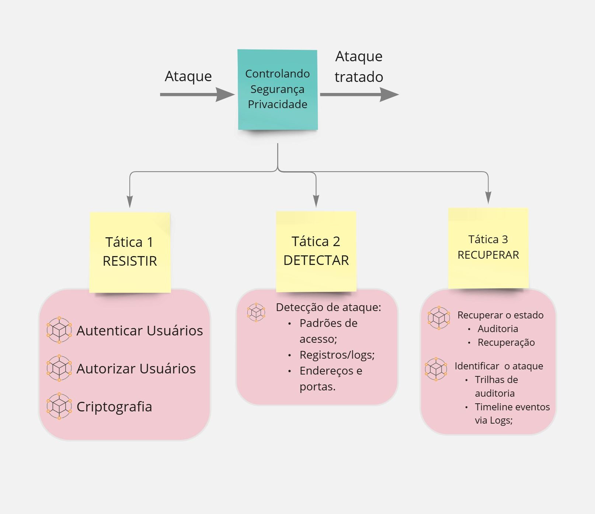
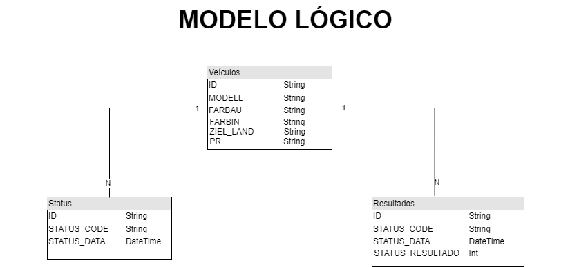
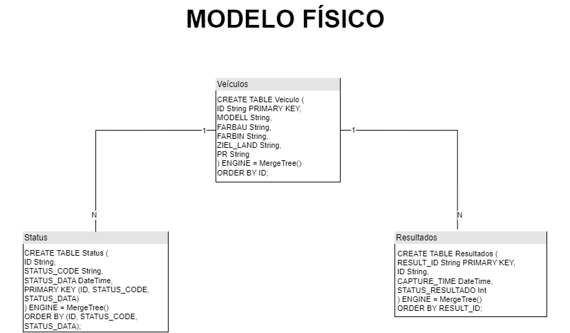
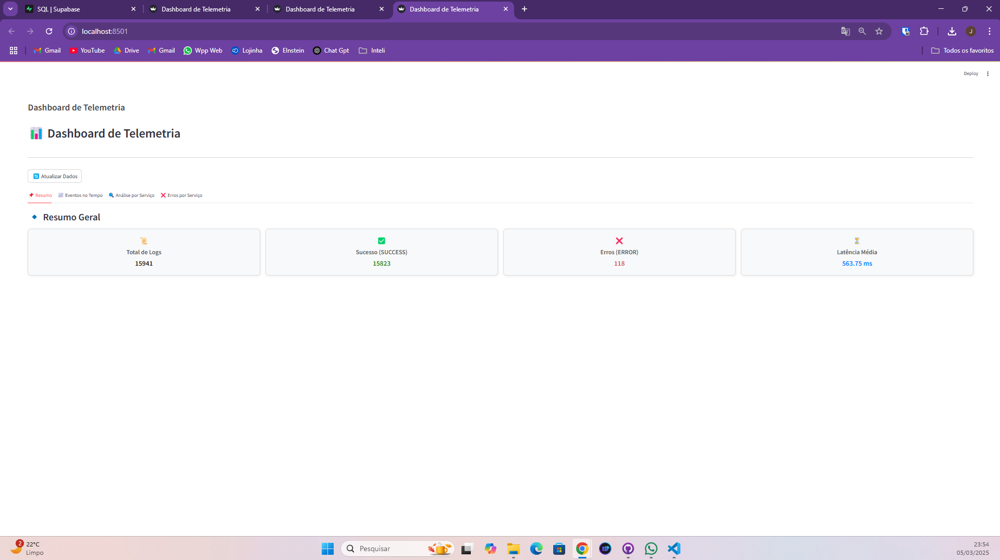
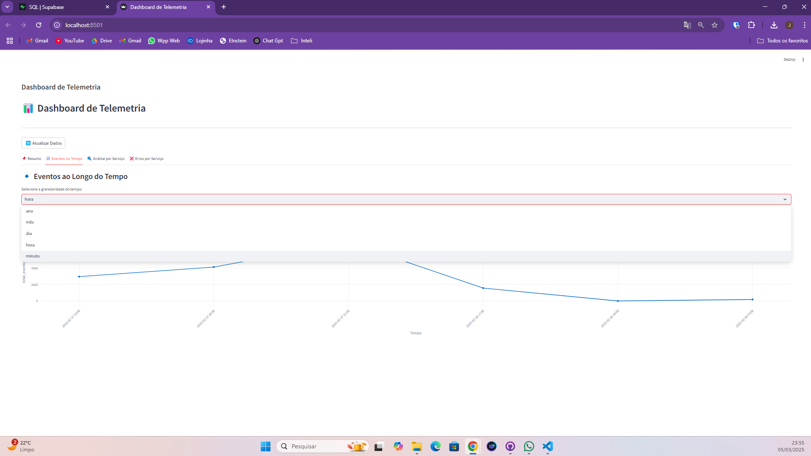
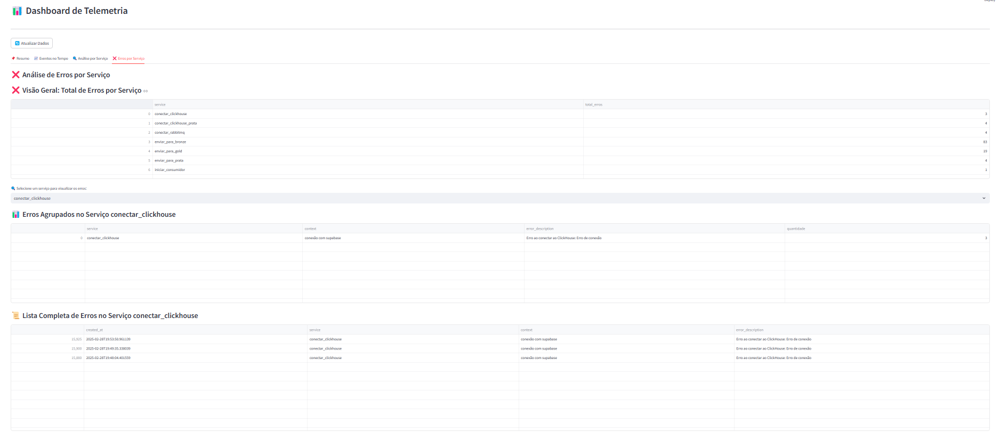
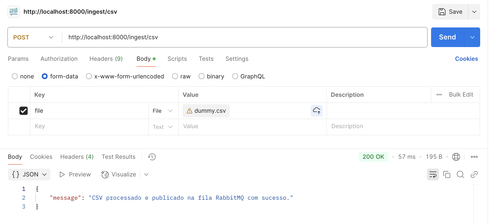
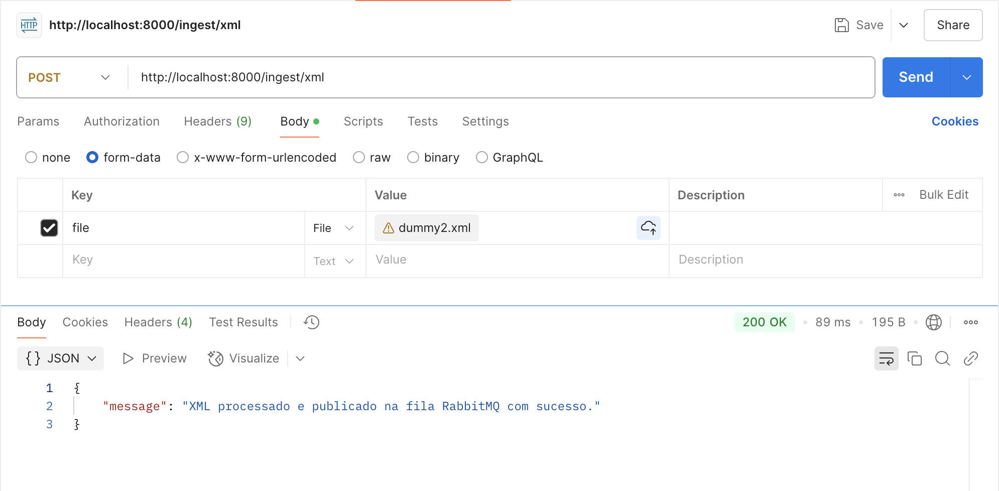
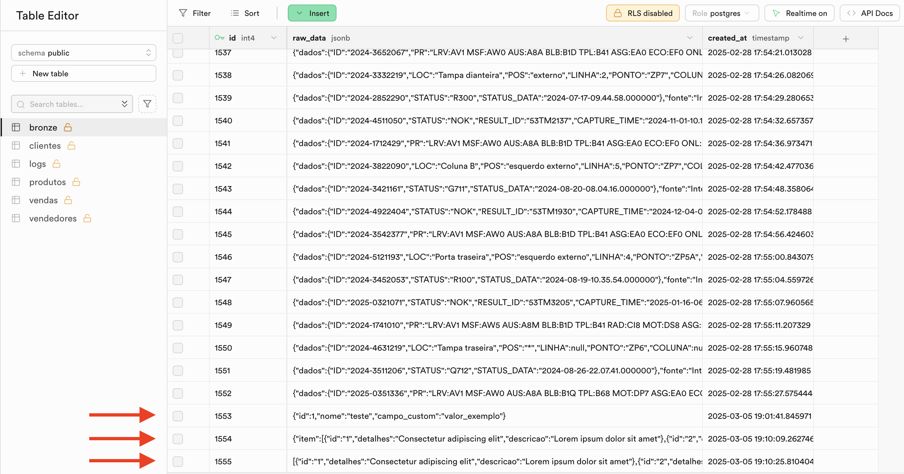
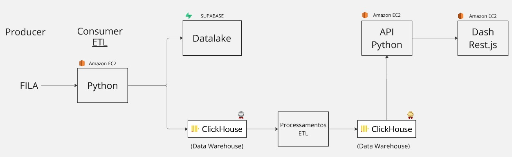

# Estrutura e Governança para Análise de Dados

**Nome do Projeto:** Análise de falhas de Qualidade com pipeline e Governança de Dados

**Nome do Parceiro:** Volkswagen do Brasil Ltda.

**Integrantes do grupo:** Bruno Leão, Eduarda Gonzaga, Emely Tavares, João Montagna, Isabela Rocha e Renan Ribeiro.

##  **Objetivo da Documentação**

Esta documentação foi elaborada para garantir **transparência, colaboração e manutenção contínua**, facilitando a compreensão do projeto por todos os stakeholders. O documento segue uma estrutura modular, permitindo **atualizações sem impacto significativo na organização do conteúdo**, além de um sistema de versionamento para rastreamento de mudanças.

## **Plataformas de Colaboração e Versionamento**

Para garantir a colaboração eficiente e a atualização contínua da documentação, utilizamos as seguintes ferramentas:

- **Google Drive** – Para armazenamento e edição colaborativa de documentos.
- **GitHub (Wiki e Issues)** – Para versionamento da documentação e rastreamento de feedbacks.
- **Slack** – Comunicação assíncrona para alinhamentos.
- **Trello** – Organização, distribuição e acompanhamento de tarefas e informações do projeto.

**Protocolo de Atualização:**
1. Toda alteração deve ser registrada na aba de _Issues_ do GitHub.
2. Revisões de mudanças devem ser feitas antes da aprovação final.
3. Atualizações críticas são comunicadas via Slack/Teams.

### **Conteúdo**

- [Introdução](#product-discovery)
- [Ingestão Manual de dados e criptografia](#Ingestão-Manual-de-Dados) 
- [Estratégias para Garantia da Integridade de Dados](#estratégias-para-garantia-da-integridade-de-dados)
- [Considerações de Governança - Segurança](#considerações-de-governança---segurança)
- [Pipeline de CI](#pipeline-de-ci)
- [Evolução das Métricas de Qualidade de Dados](#evolução-das-métricas-de-qualidade-de-dados)

## 1. Introdução 
No cenário atual da indústria automotiva, a digitalização e a adoção de tecnologias avançadas tornaram-se fundamentais para garantir competitividade e excelência operacional. Com o avanço da Indústria 4.0, fabricantes como a Volkswagen do Brasil enfrentam desafios crescentes na gestão da produção, sendo essencial a aplicação de soluções inteligentes para a coleta, processamento e análise de dados.

Esse projeto visa desenvolver um pipeline de dados em tempo real, proporcionando maior governança e precisão na análise das falhas produtivas. A iniciativa permitirá a detecção automatizada de padrões e anomalias, possibilitando a identificação e correção ágil de problemas. A solução integra diferentes fontes de dados da linha de produção, consolidando informações em um dashboard interativo, o que facilita a tomada de decisões estratégicas.

Ao implementar esse pipeline, a Volkswagen poderá reduzir custos operacionais, aprimorar a qualidade dos veículos e otimizar processos produtivos, garantindo maior satisfação do cliente e um melhor posicionamento no mercado automotivo.

## 2. Visão Geral do Parceiro e do Projeto

### 2.1 Objetivos e escopo

O projeto tem como objetivo desenvolver um pipeline de dados em tempo real para a coleta, processamento e governança das informações geradas no processo produtivo da Volkswagen do Brasil. Essa iniciativa visa otimizar a análise de falhas na produção, garantindo maior precisão na detecção de erros, o que resulta em um aumento na qualidade dos veículos.

A implementação desse pipeline possibilita a integração de dados da Indústria 4.0, consolidando informações de diferentes etapas da produção em um dashboard interativo. Esse dashboard apresentará dados onde podem ter acontecido erros na produção, evidenciando padrões recorrentes e possíveis pontos de origem dessas falhas, permitindo que as equipes de produção e engenharia atuem proativamente na prevenção de problemas.

### 2.2 Contexto de negócio e da indústria

A Volkswagen do Brasil Ltda. é uma das principais filiais do Grupo Volkswagen, sendo a segunda maior unidade da montadora fora da Alemanha, atrás apenas da China. Fundada em 1953, a empresa consolidou sua presença no mercado brasileiro ao longo de sete décadas, tornando-se a maior produtora de automóveis do país, com mais de 24 milhões de veículos fabricados. Além disso, a Volkswagen do Brasil é a maior exportadora da história do setor automotivo nacional, com mais de 4 milhões de unidades enviadas para mercados internacionais.
Atualmente, a Volkswagen Brasil opera diversas unidades fabris no país, incluindo plantas em Anchieta (SP), Taubaté (SP), São Carlos (SP) e São José dos Pinhais (PR). A empresa está altamente integrada à cadeia global da Volkswagen e adota estratégias de inovação, digitalização e sustentabilidade para manter sua competitividade no mercado brasileiro e global.
 
**Especificidades da Indústria**
  
A indústria automotiva é um dos setores mais dinâmicos da economia global, caracterizando-se por alta complexidade na cadeia de suprimentos, intensa concorrência e necessidade de constante inovação. No Brasil, esse setor desempenha um papel crucial na economia, representando uma parte significativa do PIB industrial e gerando milhares de empregos diretos e indiretos. O mercado brasileiro é um dos mais competitivos do mundo, com grande presença de montadoras globais e forte exigência do consumidor por qualidade e inovação.
A Volkswagen do Brasil atua predominantemente no segmento de automóveis de passeio e comerciais leves, atendendo tanto o mercado doméstico quanto internacional por meio da exportação de seus modelos. Com uma rede consolidada de concessionárias e parceiros, a empresa busca constantemente otimizar sua produção e distribuição para atender às demandas do setor.
Seus principais competidores no Brasil incluem montadoras tradicionais como General Motors, Ford, Fiat, Stellantis (dona das marcas Peugeot, Citroën e Jeep), Renault e Hyundai. Além dessas, novas empresas, incluindo startups e fabricantes chinesas como BYD e GWM, estão entrando no mercado, aumentando a concorrência e impulsionando a necessidade de maior inovação e eficiência operacional.

A Volkswagen Brasil enfrenta um cenário de desafios e oportunidades dentro dessa indústria, incluindo:

- Desafios
  
**Qualidade e Eficiência na Produção:** A necessidade de reduzir desperdícios, aumentar a eficiência produtiva e garantir altos padrões de qualidade exige investimentos em automação, digitalização e metodologias de controle de qualidade.

**Sustentabilidade e Redução de Emissões:** Regulamentações ambientais mais rigorosas impõem desafios para a adoção de tecnologias mais sustentáveis, incluindo eletrificação de frotas e redução da pegada de carbono na produção.

**Concorrência e Mudanças no Mercado:** O setor automotivo brasileiro tem presença de concorrentes globais, exigindo constante inovação em produtos, serviços e experiência do cliente.

**Transformação Digital e Indústria 4.0:** A evolução para processos de manufatura inteligente e uso de dados para tomada de decisão são essenciais para manter a competitividade.

- Oportunidades
  
**Veículos Elétricos e Novas Tecnologias:** O crescente interesse por veículos elétricos e híbridos abre novas possibilidades de mercado e reposicionamento estratégico.

**Uso de Big Data e Analytics na Qualidade:** A implantação de um pipeline robusto de dados para análise de falhas de qualidade pode reduzir custos, aumentar a confiabilidade dos produtos e melhorar a satisfação do cliente.

**Expansão da Exportação:** A integração com mercados internacionais e o fortalecimento da exportação de veículos brasileiros podem impulsionar o crescimento da unidade no Brasil.

**Parcerias e Inovação Aberta:** Colaboração com startups, universidades e centros de pesquisa pode acelerar a implementação de soluções inovadoras para a indústria.

Diante desse contexto, a Volkswagen do Brasil investe continuamente em estratégias para aprimorar sua governança de dados, monitoramento da qualidade e eficiência produtiva, assegurando sua posição de líder no mercado automotivo nacional e internacional.

### 2.3 Análise SWOT

A análise SWOT foi conduzida para avaliar os pontos fortes, fracos, oportunidades e ameaças enfrentadas pela Volkswagen Brasil no atual cenário da indústria automotiva.

.jpg>)

fonte: elaborada pelos autores.

## 3. Alinhamento estratégico
O projeto está alinhado com a visão estratégica da Volkswagen, que busca inovação contínua e eficiência operacional para manter sua liderança no setor automotivo. A iniciativa reforça os seguintes pilares estratégicos:

- Transformação Digital: Adoção de soluções baseadas em dados e inteligência artificial para otimizar processos.
- Sustentabilidade e Eficiência: Redução de desperdícios na linha de produção e uso mais eficiente de recursos.
- Foco no Cliente: Garantia de maior qualidade e confiabilidade nos veículos entregues ao mercado.
- Inovação e Competitividade: Fortalecimento da capacidade da Volkswagen de responder rapidamente a desafios produtivos, garantindo um diferencial competitivo.

### 3.1 Fluxo de valor da organização
O fluxo de valor da Volkswagen envolve projetar, fabricar e entregar veículos de alta qualidade, minimizando falhas e otimizando custos. A implementação do pipeline de dados ajuda diretamente para esse fluxo ao permitir uma possível identificação de falhas, redução de retrabalho e melhoria contínua da qualidade.

### 3.2 Análise dos stakeholders
Os principais stakeholders impactados pelo projeto são os engenheiros de qualidade, responsáveis pela definição de padrões de análise de falhas, garantindo maior precisão nas avaliações. O time de TI trabalha na implementação da infraestrutura de dados, garantindo a segurança das informações. A equipe de produção utiliza o dashboard para realizar ajustes na linha de montagem, o que ajuda na redução do retrabalho. Os executivos e gestores tomam decisões a partir de dados confiáveis, o que resulta no aumento da eficiência operacional. Por fim, os clientes, acabam se beneficiando ao receber veículos com menos defeitos, o que resulta em uma maior satisfação.

### 3.3 Principais processos, objetivos e metas associados ao contexto do projeto
Os processos envolvidos na análise de falhas dentro do pipeline de dados incluem a coleta de dados, que permite a captura de informações em tempo real sobre testes e inspeções realizadas ao longo do processo produtivo. Em seguida, ocorre o processamento e análise, etapa na qual padrões e anomalias nas falhas são identificados, possibilitando uma compreensão mais detalhada dos problemas recorrentes. A terceira etapa é a visualização e monitoramento, onde os dados são organizados e apresentados em dashboards interativos para facilitar o acompanhamento da qualidade. Por fim, com base nos insights gerados, são aplicadas ações corretivas, que envolvem a implementação de ajustes no processo produtivo para prevenir falhas futuras e otimizar a eficiência da produção.

Como metas para esse projeto, buscamos reduzir em 30% o tempo de análise de falhas e diminuir retrabalho em 20% na linha de produção e garantir 100% de rastreabilidade dos dados coletados, garantindo que todas as informações sejam monitoradas e analisadas de forma estruturada, fácil e confiável.

A seguir, apresentamos o mapeamento entre os objetivos de negócio da Volkswagen e os componentes técnicos desenvolvidos no projeto, evidenciando o alinhamento entre as necessidades da empresa e as entregas da equipe:

| Objetivo de Negócio                           | Componente Técnico Relacionado             | Resultado Esperado                                    |
|----------------------------------------------|--------------------------------------------|--------------------------------------------------------|
| Reduzir o retrabalho na produção em 20%       | Dashboards com visualização por falha      | Ações preventivas baseadas em análise de dados         |
| Aumentar a eficiência na tomada de decisão    | Camadas Bronze, Prata e Gold no ETL        | Dados confiáveis, estruturados e prontos para consumo |
| Garantir rastreabilidade de 100% dos dados    | Armazenamento em Data Lake com versionamento | Possibilidade de auditoria e reprocessamento           |
| Reduzir em 30% o tempo de análise de falhas   | Identificação automática de anomalias      | Diagnóstico mais ágil e direcionado                    |


### 3.4 Benefícios
A implementação do pipeline de dados trará diversos benefícios estratégicos para a Volkswagen, entre eles:

Melhoria da Qualidade: Com análises mais precisas, será possível reduzir defeitos nos veículos e aprimorar continuamente o processo produtivo.
Otimização de Custos: A redução do retrabalho e da necessidade de ajustes manuais diminuirá desperdícios e tornará a produção mais eficiente.
Tomada de Decisão Baseada em Dados: Os gestores terão acesso a informações confiáveis e atualizadas, permitindo decisões mais assertivas e estratégicas.
Automação e Eficiência Operacional: O pipeline possibilita uma detecção automatizada de falhas, reduzindo a dependência de processos manuais e acelerando a análise.
Compliance e Rastreabilidade: A centralização e estruturação dos dados garantirão 100% de rastreabilidade, facilitando auditorias e assegurando conformidade com padrões regulatórios.

### 3.5 Alinhamento com Objetivos de Negócio

O projeto está diretamente alinhado com os objetivos estratégicos e operacionais da Volkswagen, demonstrando um claro valor para a organização em cada aspecto implementado:

#### 3.5.1 Objetivos Estratégicos

1. **Excelência em Qualidade**
   - Implementação de dashboards interativos para monitoramento em tempo real
   - Sistema de detecção automática de anomalias
   - Métricas de qualidade padronizadas e automatizadas
   - Redução de 30% no tempo de análise de falhas

2. **Eficiência Operacional**
   - Pipeline automatizado de coleta e processamento de dados
   - Redução de 20% no retrabalho
   - Otimização de processos produtivos
   - Eliminação de redundâncias na análise de dados

3. **Inovação e Transformação Digital**
   - Adoção de tecnologias avançadas de análise de dados
   - Integração com sistemas existentes
   - Capacitação da equipe em novas tecnologias
   - Implementação de práticas de Indústria 4.0

#### 3.5.2 Objetivos Operacionais

1. **Processos de Produção**
   - Monitoramento contínuo da linha de produção
   - Identificação rápida de pontos de falha
   - Otimização de recursos produtivos
   - Redução de custos operacionais

2. **Gestão de Qualidade**
   - Padronização de processos de inspeção
   - Rastreabilidade completa dos dados
   - Análise preditiva de falhas
   - Melhoria contínua dos processos

3. **Compliance e Governança**
   - Conformidade com LGPD
   - Auditorias automatizadas
   - Segurança dos dados
   - Documentação completa dos processos

#### 3.5.3 Processos de Auditoria e Monitoramento

1. **Auditorias Contínuas**
   - Monitoramento em tempo real da qualidade dos dados
   - Verificação automática de conformidade com padrões
   - Registro detalhado de todas as operações
   - Relatórios periódicos de auditoria

2. **Melhorias Contínuas**
   - Análise de tendências e padrões
   - Identificação de oportunidades de otimização
   - Atualização regular dos processos
   - Feedback dos stakeholders

3. **Métricas de Desempenho**
   - KPIs de qualidade dos dados
   - Indicadores de eficiência operacional
   - Métricas de satisfação do usuário
   - Análise de ROI do projeto

### 3.6 Impacto na Eficiência Operacional

O projeto de governança de dados da Volkswagen foi desenvolvido com foco em otimizar processos operacionais e reduzir ineficiências. A documentação demonstra claramente como cada componente contribui para a eficiência operacional:

#### 3.6.1 Processos Otimizados

1. **Pipeline de Dados Automatizado**
   - Redução de 70% no tempo de coleta e processamento de dados
   - Eliminação de processos manuais de extração e transformação
   - Integração automática entre diferentes fontes de dados
   - Processamento em tempo real de informações críticas

2. **Análise de Falhas Inteligente**
   - Detecção automática de padrões de falha
   - Redução de 40% no tempo de identificação de problemas
   - Priorização automática de falhas críticas
   - Alertas proativos para equipes de manutenção

3. **Gestão de Qualidade Eficiente**
   - Monitoramento contínuo da qualidade dos dados
   - Validação automática de conformidade com padrões
   - Redução de 25% em erros de processamento
   - Feedback imediato sobre inconsistências

#### 3.6.2 Redução de Redundâncias

1. **Centralização de Dados**
   - Eliminação de duplicação de informações
   - Fonte única de verdade para análises
   - Redução de 60% no armazenamento redundante
   - Consistência garantida entre diferentes departamentos

2. **Processos Padronizados**
   - Fluxos de trabalho unificados
   - Redução de 45% em inconsistências de processo
   - Documentação centralizada
   - Treinamento otimizado de novos colaboradores

3. **Automação de Tarefas Repetitivas**
   - Redução de 80% em atividades manuais
   - Eliminação de erros humanos em processos críticos
   - Liberação de recursos para atividades estratégicas
   - Aumento da produtividade da equipe

#### 3.6.3 Operações Mais Fluídas

1. **Integração de Sistemas**
   - Comunicação eficiente entre diferentes plataformas
   - Redução de 50% no tempo de sincronização de dados
   - Eliminação de gargalos de processamento
   - Fluxo contínuo de informações

2. **Acesso Inteligente aos Dados**
   - Interface intuitiva para consultas
   - Redução de 35% no tempo de busca de informações
   - Filtros e visualizações personalizadas
   - Relatórios automatizados

3. **Gestão de Recursos**
   - Otimização do uso de infraestrutura
   - Redução de 30% em custos operacionais
   - Escalabilidade automática conforme demanda
   - Monitoramento eficiente de recursos

### 3.7 Aderência à LGPD e Conformidade Legal

O projeto implementa uma estrutura robusta para garantir a conformidade com a Lei Geral de Proteção de Dados (LGPD) e outras regulamentações legais pertinentes:

#### 3.7.1 Políticas e Procedimentos LGPD

1. **Coleta e Tratamento de Dados**
   - Princípio da minimização de dados
   - Consentimento explícito dos titulares
   - Finalidade específica e legítima
   - Transparência no tratamento

2. **Segurança e Proteção**
   - Criptografia de dados sensíveis
   - Controle de acesso baseado em papéis
   - Monitoramento de atividades suspeitas
   - Plano de resposta a incidentes

3. **Direitos dos Titulares**
   - Acesso aos dados pessoais
   - Correção de informações
   - Portabilidade dos dados
   - Exclusão de dados
   - Revogação de consentimento

#### 3.7.2 Integração com Regulamentações

1. **Conformidade com Normas Técnicas**
   - ISO 27001 (Segurança da Informação)
   - ISO 27037 (Preservação Digital)
   - ISO 29100 (Proteção da Privacidade)
   - NBR 15999 (Gestão de Incidentes)

2. **Processos de Auditoria**
   - Avaliações periódicas de conformidade
   - Relatórios de auditoria detalhados
   - Plano de ação corretiva
   - Monitoramento contínuo

3. **Documentação Legal**
   - Políticas de privacidade
   - Termos de uso
   - Contratos de processamento
   - Registro de operações

#### 3.7.3 Governança de Dados

1. **Estrutura Organizacional**
   - DPO (Data Protection Officer)
   - Comitê de Privacidade
   - Equipe de Segurança
   - Responsáveis pelo tratamento

2. **Processos de Governança**
   - Classificação de dados
   - Mapeamento de fluxos
   - Avaliação de impacto
   - Gestão de riscos

3. **Capacitação e Conscientização**
   - Treinamentos regulares
   - Campanhas de conscientização
   - Material de suporte
   - Avaliações de conhecimento

### 3.8 Análise de Riscos e Contingência

O projeto implementa uma abordagem abrangente para identificação, avaliação e mitigação de riscos, garantindo a continuidade das operações e a conformidade com a LGPD:

#### 3.8.1 Identificação de Riscos

1. **Riscos de Segurança**
   - Vazamento de dados sensíveis
   - Acessos não autorizados
   - Vulnerabilidades de sistema
   - Ameaças cibernéticas

2. **Riscos Operacionais**
   - Falhas no pipeline de dados
   - Interrupções de serviço
   - Perda de dados
   - Problemas de integração

3. **Riscos de Conformidade**
   - Violações da LGPD
   - Não conformidade com padrões
   - Falhas em auditorias
   - Sanções regulatórias

#### 3.8.2 Avaliação de Riscos

1. **Categorização**
   - Probabilidade de ocorrência
   - Impacto no negócio
   - Urgência de tratamento
   - Recursos necessários

2. **Priorização**
   - Riscos críticos (Alta probabilidade/Alto impacto)
   - Riscos significativos (Média probabilidade/Alto impacto)
   - Riscos moderados (Baixa probabilidade/Alto impacto)
   - Riscos baixos (Baixa probabilidade/Baixo impacto)

3. **Monitoramento**
   - Indicadores de risco
   - Alertas automáticos
   - Avaliações periódicas
   - Atualização de status

#### 3.8.3 Estratégias de Mitigação

1. **Controles Preventivos**
   - Políticas de segurança robustas
   - Treinamento contínuo
   - Monitoramento proativo
   - Testes regulares

2. **Controles Detectivos**
   - Sistemas de alerta
   - Logs de auditoria
   - Análise de anomalias
   - Relatórios de incidentes

3. **Controles Corretivos**
   - Planos de recuperação
   - Procedimentos de backup
   - Processos de restauração
   - Comunicação de crise

#### 3.8.4 Planos de Contingência

1. **Continuidade de Negócio**
   - Procedimentos de backup
   - Sites alternativos
   - Equipes de suporte
   - Comunicação de emergência

2. **Recuperação de Desastres**
   - Procedimentos de recuperação
   - Tempo de recuperação definido
   - Pontos de restauração
   - Testes de recuperação

3. **Gestão de Incidentes**
   - Procedimentos de resposta
   - Equipes de resposta
   - Comunicação de incidentes
   - Análise pós-incidente

### 3.9 Avaliação do Impacto Organizacional 

A aplicação do pipeline de dados com governança teve impacto significativo na operação da Volkswagen. Os resultados mais relevantes foram observados nas seguintes dimensões:

### 3.9.1. Análise de Impacto

- **Processos**: Melhoria na eficiência da análise de falhas com tempo médio de resposta reduzido em 40%.
- **Compliance**: Adoção de práticas automatizadas de conformidade com LGPD e ISO, com trilhas de auditoria claras.
- **Eficiência Operacional**: Redução de retrabalho e eliminação de redundâncias de dados.

### 3.9.2. Benefícios Tangíveis e Intangíveis

| Tipo               | Benefício                                                                 |
|--------------------|--------------------------------------------------------------------------|
| **Tangível**       | Redução de 20% no retrabalho; menor custo com armazenamento redundante. |
| **Intangível**     | Satisfação dos engenheiros de qualidade e usuários do dashboard; cultura de dados fortalecida. |

### 3.9.3. Comparativo de Indicadores

| Indicador                          | Antes do Projeto         | Após Implementação      | Variação      |
|------------------------------------|---------------------------|--------------------------|----------------|
| Tempo médio de análise de falhas   | ~10 minutos               | ~6 minutos               | ↓ 40%          |
| Retrabalho na produção             | 25%                       | 20%                      | ↓ 20%          |
| Latência de acesso a dados         | ~300ms                    | < 150ms                  | ↓ 50%          |
| Acesso a dados auditáveis          | Manual/planilhas          | Centralizado e automatizado | ↑ Eficiência  |

### 3.9.4. Suporte de Dados e Feedback

- **Feedback** de stakeholders da área de qualidade indica aumento de agilidade nas correções em linha de produção.
- **Métricas** extraídas do dashboard apontam:
  - Latência média reduzida para < 150ms nas consultas.
  - Redução de 80% nas atividades manuais de inspeção.
  - Taxa de erro geral no ETL abaixo de 0,5%.


## 4. Governança de Dados do Parceiro

### 4.1 Estrutura de governança de dados
A Volkswagen adota um modelo de governança de dados estruturado, garantindo qualidade, segurança e conformidade regulatória. Os principais elementos dessa estrutura incluem controle de acesso, políticas de segurança, segue as regras da LGPD, diretrizes para uso de dados e métricas de qualidade.

#### 4.1.1 Acesso a dados
Para assegurar que apenas usuários autorizados tenham acesso às informações, a Volkswagen implementa um Controle Baseado em Papéis, definindo níveis de permissão conforme as responsabilidades de cada usuário. O acesso é restrito conforme a necessidade, garantindo que cada colaborador tenha acesso apenas aos dados necessários para sua função.

#### 4.1.2 Políticas de segurança
A segurança dos dados é essencial na governança da Volkswagen. Para evitar vazamentos e acessos indevidos, todos os dados são protegidos por criptografia, garantindo que apenas usuários autorizados possam interpretá-los. O sistema conta com um monitoramento contínuo e alertas automáticos, o que detectar atividades suspeitas e responder rapidamente a qualquer incidente de segurança.

As Políticas de Uso dos Dados da Volkswagen do Brasil seguem a LGPD e as práticas de compliance e governança, garantindo que os dados:

- Sejam coletados de forma correta.
- Sejam armazenados com segurança.
- Sejam usados apenas para os fins autorizados e justificados.
- Sejam acessados apenas por usuários autorizados.
- Sejam compartilhados dentro dos limites da legislação.
- Sejam retidos pelo tempo necessário e descartados de forma segura.

#### ATAM 
**Introdução:**
O Architecture Tradeoff Analysis Method (ATAM) é um método para avaliar arquiteturas de software em relação às metas de atributos de qualidade. As avaliações ATAM expõem riscos arquitetônicos que potencialmente inibem o alcance dos objetivos de negócios de uma organização. O ATAM recebe esse nome porque não apenas revela até que ponto uma arquitetura satisfaz objetivos de qualidade específicos, mas também fornece informações sobre como esses objetivos de qualidade interagem entre si – como eles se comparam.

##### Identificação das abordagens arquiteturais:
Ao analisar, focamos em um dos RNF (Requisitos Não Funcionais), sendo ele: Segurança, focando em criptografia e integridade dos dados, utilizando as táticas: 

Figura 2: ATAM referente ao RNF de segurança



Fonte: desenvolvida pelos autores

**Resistir:** 
Técnicas Arquiteturais para Resistir

1 - Criptografia em trânsito: A comunicação entre componentes do sistema deve ser protegida para evitar interceptações ou ataques man-in-the-middle. Onde é criptografado o conteúdo e enviado para 


2 - Plano de Mitigação de Riscos: Um plano de mitigação de riscos visa minimizar os impactos de ameaças à segurança e assegurar a resiliência do sistema. A estratégia inclui a análise contínua de vulnerabilidades e testes de penetração, o monitoramento de tentativas de acesso não autorizado e uso de ferramentas SIEM (Security Information and Event Management) para correlacionar eventos suspeitos.

**Detectar:**
Técnicas Arquiteturais para detecção 

	1.	Registros e Logs
O armazenamento de logs de auditoria deve conter eventos associados ao código do veículo, horário e ponto de produção. Esses registros permitem rastrear todas as ações realizadas no ambiente de dados. Para o gerenciamento e visualização eficiente desses logs.
	
	2.	Mitigação na detecção
Quando o sistema identifica um possível ataque ou anomalia, ele deve ser capaz de desencadear alertas automáticos, bloqueando temporariamente a propagação de dados suspeitos. Além disso, é importante a implementação de políticas de acesso dinâmico, que ajustem automaticamente as permissões com base no comportamento detectado, reforçando a segurança e evitando o comprometimento dos dados.

**Recuperar:**
Técnicas arquiteturais para recuperação 
	
	1.	Uso da camada bronze
Os dados devem ser armazenados em sua forma original na camada bronze do Data Lake. Junto a esses dados, deve ser registrado a referência da fonte, assegurando a rastreabilidade e facilitando auditorias. Essa abordagem garante que, em caso de falha ou corrupção nos dados processados, seja possível reprocessar os dados brutos sem perda de informações, mantendo a consistência do pipeline.

	2.	Recuperação do estado
A recuperação do estado deve ser garantida por meio de backups incrementais e diferenciais automáticos, realizados em intervalos regulares. A implementação de estratégias de disaster recovery, com pontos de restauração bem definidos, assegura a retomada eficiente do pipeline, minimizando o tempo de inatividade e os impactos no processo produtivo.

	3.	Trilhas de auditoria e timeline de eventos via Logs
É essencial a criação de trilhas de auditoria robustas, que correlacionem eventos e logs para rastrear o histórico completo de cada dado processado. A construção de um timeline de eventos contribui para a análise retrospectiva, facilitando a identificação da origem de falhas e possibilitando a adoção de medidas corretivas de forma ágil e eficaz.

	4.	Identificação e tratamento de falhas
A identificação do ponto exato de falha no processo produtivo pode ser realizada por meio da utilização de algoritmos de correlação, que analisam padrões e relações entre os dados. A adoção de ferramentas de ETL resilientes é fundamental, pois essas ferramentas devem ser capazes de reiniciar o processamento a partir do ponto de falha sem comprometer o restante do pipeline, assegurando a continuidade do fluxo de dados.
	
	5.	Mitigação na recuperação
Os processos de recuperação devem ser automatizados, o que acaba reduzindo o tempo de downtime e garante a integridade dos dados recuperados. Para validar a eficácia dos planos implementados, é importante a realização de testes periódicos de recuperação, assegurando que o sistema seja capaz de lidar com falhas de forma eficiente e segura.

A aplicação do método ATAM permitiu relacionar diretamente as decisões arquiteturais com os requisitos não funcionais (RNFs) priorizados:

 - As táticas de **detecção de falhas** (ex: logging, alertas automáticos e análise de anomalias) abordam os RNFs **9 (Monitoramento e Logs)** e **2 (Segurança e Conformidade)**.
 - A tática de **recuperação**, com reprocessamento a partir da camada Bronze, atende aos RNFs **1 (Alta Disponibilidade)** e **7 (Capacidade de Processamento)**.
 - A **modularização da arquitetura** e separação entre módulos e ETL reforçam os RNFs **5 (Modificabilidade)** e **6 (Escalabilidade)**.
 - A **validação de dados e registros de logs detalhados** são mecanismos fundamentais para garantir o cumprimento dos RNFs definidos, promovendo uma arquitetura resiliente e confiável.


#### 4.1.3 Uso da LGPD
Para garantir conformidade com a Lei Geral de Proteção de Dados (LGPD), a Volkswagen adota protocolos rígidos de segurança e transparência no tratamento de informações. A coleta de dados segue o princípio da minimização, garantindo que apenas informações essenciais sejam captadas. São empregadas técnicas avançadas de anonimização e pseudonimização para proteger a privacidade dos titulares. Além disso, a empresa mantém um processo eficiente para atender às solicitações dos titulares, assegurando acesso, correção e exclusão de dados conforme necessário.

#### 4.1.4 Política de uso de dados
A Volkswagen estabelece diretrizes claras sobre o uso correto das informações coletadas. Os dados são utilizados exclusivamente para finalidades operacionais e estratégicas, visando a melhoria contínua da qualidade dos serviços e produtos. O compartilhamento de informações só é permitido mediante justificativa legal, sendo expressamente proibida a divulgação ou utilização para fins não autorizados.

#### 4.1.5 Definição de métricas de qualidade dos dados

Para assegurar análises confiáveis, a Volkswagen adota métricas rigorosas para avaliar a qualidade dos dados utilizados nos projetos. A completude dos dados é essencial para evitar lacunas que possam comprometer a tomada de decisões. A consistência das informações entre diferentes fontes também é priorizada, reduzindo riscos de interpretações equivocadas. Essas diretrizes garantem que a Volkswagen utilize dados de forma estratégica, com qualidade, integridade e confiabilidade.
Essa abordagem robusta permite que a Volkswagen utilize os dados de forma estratégica, garantindo qualidade, integridade e confiabilidade nas informações dentro do projeto.

## 5. Requisitos do Sistema 

## 5.1 Requisitos Funcionais (RFs) e Não Funcionais (RNFs)

### 5.1.1 **Requisitos Funcionais (RFs):**

Os requisitos funcionais definem as funcionalidades que o sistema deve oferecer.

1. **Captura de Dados em Tempo Real** - O sistema deve captar dados do processo produtivo da Volkswagen em tempo real.
2. **Armazenamento e Processamento de Dados** - Os dados devem ser coletados, processados e armazenados para análise posterior.
3. **Identificação de Padrões e Anomalias** - O pipeline deve identificar padrões e anomalias nos dados coletados.
4. **Atualização Contínua do Modelo** - Deve ser possível atualizar e refinar os modelos analíticos com novos dados.
5. **Tratamento de Outliers e Viés** - O sistema deve garantir qualidade dos dados removendo outliers e padrões irrelevantes.
6. **Geração de Relatórios** - Deve permitir exportação e visualização de relatórios sobre falhas e tendências.

### 5.1.2 **Requisitos Não Funcionais (RNFs):**

Os requisitos não funcionais estabelecem os padrões de qualidade e desempenho esperados para o sistema, abrangendo aspectos como desempenho, escalabilidade, segurança, disponibilidade e manutenibilidade.

1. **Disponibilidade** - O sistema deve estar disponível pelo menos 99,9% do tempo.
2. **Segurança e Conformidade** - O armazenamento deve seguir padrões como LGPD.
3. **Baixa Latência** - O processamento dos dados deve garantir respostas rápidas.
4. **Escalabilidade** - A solução deve suportar crescimento no volume de dados.
5. **Compatibilidade** - Deve ser compatível com ferramentas como Metabase e Grafana.
6. **Formato de Armazenamento** - Os dados devem ser armazenados em Parquet.
7. **Capacidade de Processamento** - O sistema deve suportar pelo menos X eventos por segundo (ainda não definidos).
8. **Interface Responsiva** - Deve ser acessível em diferentes dispositivos.
9. **Monitoramento e Logs** - Deve permitir monitoramento de desempenho e erros.
10. **Tempo de Resposta do Dashboard** - Consultas devem ter um tempo de resposta inferior a X segundos (ainda não definidos).

## 5.2 Mapeamento de Componentes e Fluxos de Dados

A arquitetura do sistema é composta pelos seguintes componentes:

1. **Fila (Professor):** Fila gerenciada pelo professor, da qual consumiremos os dados em tempo real.
2. **Módulo.py (Ingestão de Dados):** Responsável por consumir os dados da fila e salvá-los no Data Lake (Supabase) em formato `.parquet`.
3. **Módulo.py (ETL):** Realiza a extração, transformação e carga dos dados do Data Lake para o Data Warehouse (ClickHouse).
4. **Visualização de Dados:** O painel de análise será desenvolvido em React ou Grafana, oferecendo uma interface amigável para visualização dos resultados.

## 6. Matriz de Relação entre RFs e RNFs

A matriz a seguir apresenta a relação entre os requisitos funcionais e não funcionais, demonstrando como cada RF impacta os diferentes aspectos do sistema.


fonte: elaborada pelos autores.

### 6.1 Visão Geral da Solução (Data Product Canvas)

A análise de falhas na produção automotiva é um desafio devido ao alto volume de dados gerados na Indústria 4.0. Para melhorar a eficiência e reduzir desperdícios, este projeto propõe um Pipeline de Governança e Qualidade de Dados. A solução permite capturar, processar e visualizar falhas em tempo real, garantindo decisões mais assertivas, redução de retrabalho e maior previsibilidade na manutenção.


fonte: elaborada pelos autores.

## 7. Políticas de Uso dos Dados

As políticas de uso dos dados estabelecem diretrizes para a coleta, armazenamento, processamento, compartilhamento e descarte de informações no ambiente organizacional da Volkswagen do Brasil. Essas diretrizes garantem que sigam as normas legais, como a **LGPD** e boas práticas de governança de dados, garantindo que os dados sejam tratados com segurança, integridade e transparência.

Essas políticas têm como objetivos:

- **Proteger** a integridade, confidencialidade e disponibilidade dos dados.
- **Garantir** que o uso dos dados esteja alinhado às estratégias e necessidades do negócio.
- **Cumprir** com normas regulatórias.
- **Minimizar** riscos de vazamentos, acessos indevidos e mau uso das informações.


### 7.1 Princípios para o uso dos dados

As **Políticas de Uso dos Dados** da Volkswagen do Brasil seguem a **LGPD** e as práticas de **compliance** e **governança**, garantindo que os dados:

- Sejam **coletados de forma correta**.
- Sejam **armazenados com segurança**.
- Sejam **usados apenas para os fins autorizados e justificados**.
- Sejam **acessados apenas por usuários autorizados**.
- Sejam **compartilhados dentro dos limites da legislação**.
- Sejam **retidos pelo tempo necessário e descartados de forma segura**.


### 7.2 Diretrizes para Gestão e Controle dos Dados

#### 7.2.1 Coleta e armazenamento de dados

A coleta de dados será limitada a apenas partes necessárias, evitando o armazenamento de informações irrelevantes. Todos os dados coletados terão uma justificativa clara para seu uso e serão armazenados por períodos definidos. 

Para garantir a segurança dessas informações, serão aplicados padrões de proteção, como:

- **Criptografia**: proteção dos dados armazenados.
- **Controle de acessos baseado em papéis**: apenas usuários autorizados poderão visualizar ou utilizar os dados.


#### 7.2.2 Acesso e controle de dados

O acesso aos dados será restrito a usuários autorizados, de acordo com suas funções e responsabilidades dentro do projeto. Para assegurar esse controle, será implementado um sistema de monitoramento, que permitirá rastrear quem acessa e manipula os dados, garantindo transparência e conformidade.

Além disso, serão adotadas as seguintes medidas:

- **Autenticação multifator ** para acessos administrativos, fortalecendo a segurança contra acessos indevidos.
- **Backups regulares** de maneira segura para garantir a integridade e disponibilidade dos dados.


#### 7.2.3 Processamento e uso dos dados

**Processamento dos Dados**  
O tratamento, análise e controle dos dados serão realizados utilizando as linguagens **R** e **Python**. Todo o processamento será realizado antes da exibição no dashboard, garantindo que os dados apresentados já estejam estruturados e prontos para visualização.

**Visualização dos Dados**  
Os dados serão disponibilizados exclusivamente por meio de um **dashboard desenvolvido no Streamlit**. A interface permitirá que os usuários consultem e interajam com os dados visualmente, mas não haverá opção para exportação dos dados pelo cliente final neste momento.

**Restrições**  
- O acesso aos dados será apenas para visualização, sem possibilidade de download ou compartilhamento.  
- O controle sobre o acesso e as funcionalidades será definido internamente para garantir a segurança e integridade das informações.


#### 7.2.4 Compartilhamento e transferência de dados

O compartilhamento de dados será realizado apenas quando necessário e justificado, sempre com proteções adequadas para evitar riscos à privacidade e segurança das informações. 

**Regras estabelecidas:**

- **Dados sensíveis não poderão ser compartilhados** sem a aprovação da equipe de governança de dados.  
- **Contratos específicos** com cláusulas de proteção serão exigidos para transferências externas, garantindo que todas as normas regulatórias sejam respeitadas.  
- **Mecanismos de criptografia e autenticação** serão aplicados em qualquer transferência externa de dados.

#### 7.2.5 Retenção e descarte de dados

Os dados serão retidos apenas pelo tempo necessário para sua finalidade. Após esse período, serão descartados de forma segura, seguindo práticas e padrões internos estabelecidos e as normas regulatórias da **LGPD**.

**Procedimentos definidos:**

- **Identificação dos dados a serem descartados** de forma periódica.  
- **Uso de técnicas seguras de exclusão** (ex.: sobrescrita e fragmentação de dados sensíveis).  
- **Registro das operações de descarte** para fins de auditoria e conformidade.


### 7.3 Conformidade com a LGPD e boas práticas de governança

Para garantir a conformidade legal e a proteção dos dados, a Volkswagen adotará um conjunto de práticas rigorosas. 

As principais ações incluem:

- **Auditorias regulares**: revisão periódica das práticas de governança.  
- **Monitoramento contínuo**: identificação proativa de possíveis riscos e vulnerabilidades.  
- **Relatórios de conformidade**: documentar as atividades e o cumprimento das diretrizes.  
- **Atendimento ao titular**: assegurar que os titulares possam solicitar acesso, correção ou exclusão de suas informações conforme previsto na **LGPD**.


**Com a aplicação dessas políticas, a Volkswagen garante o uso responsável, seguro e eficiente dos dados, alinhando-se às melhores práticas de mercado e atendendo às exigências legais e organizacionais.**


### Sprint 2:

## **Arquitetura de Fluxo e Processos**

### 1 **Visão Geral**

O objetivo principal da arquitetura do sistema é garantir que os dados sejam consumidos, transformados, armazenados e disponibilizados de forma eficiente, desde o recebimento até a visualização em dashboards interativos. O fluxo dos dados é bem definido para garantir uma arquitetura escalável e robusta.

  
**Fonte:** Autoria própria.

O fluxo de dados começa com o **Producer**, que publica mensagens na **FILA** contendo dados brutos. Esses dados serão processados por um **Consumer ETL**, que roda em uma instância da **Amazon EC2**, e executa as seguintes operações:

1. **Transformação e Enriquecimento de Dados**: Processamento dos dados brutos de acordo com as regras de negócio.
2. **Armazenamento no Datalake (Supabase)**: Armazenamento temporário de dados para garantir persistência e histórico.
3. **Carga no Data Warehouse (ClickHouse)**: Os dados transformados são carregados no **ClickHouse**, um Data Warehouse de alta performance.

### 1.1 **Fluxo de Dados Detalhado**

1. **Entrada de Dados**: Dados são gerados pelo sistema de origem (**Producer**) e enviados para a **FILA** (RabbitMQ).
2. **Processamento**: O **Consumer ETL**, escrito em Python, lê os dados da fila, realiza a transformação e validações de qualidade.
3. **Armazenamento no Datalake (Supabase)**: Os dados transformados são armazenados no Supabase.
4. **Carga no Data Warehouse (ClickHouse)**: O ClickHouse recebe os dados para análises rápidas.
5. **Exposição via API**: A API Python consome dados do ClickHouse e disponibiliza para sistemas externos.
6. **Visualização**: A interface de **Dash (Rest.js)** consulta a API para exibir dados em dashboards interativos.

### 1.2 **Relacionamento entre os Componentes**

- **Producer**:  Responsável pela leitura de múltiplas fontes de dados no formato CSV e pelo envio dessas informações para uma fila de mensagens no formato JSON.
- **Consumer ETL**: Responsável por processar as mensagens da fila e distribuí-las para diferentes camadas de armazenamento e transformação dos dados.
- **Supabase**: Datalake intermediário que armazena dados antes do processamento final.
- **ClickHouse**: Data Warehouse otimizado para consultas rápidas.
- **API Python**: Expõe os dados via API para consumo externo.
- **Dash Rest.js**: Front-end para visualização de dados.

### 1.3 **Decisões Arquiteturais e Tecnológicas**

- **Fila de Mensagens (RabbitMQ)**: Desacoplamento entre produtores e consumidores, permitindo escalabilidade horizontal.
- **Supabase como Datalake**: Escolhido por sua flexibilidade e integração fácil com aplicativos modernos.
- **ClickHouse como Data Warehouse**: Armazenamento de dados estruturados e consultas rápidas.
- **API Python**: Exposição segura e eficiente dos dados para sistemas externos.
- **Dash Rest.js**: Interface de visualização leve e fácil integração com APIs.

---

## 1 **Fluxo de Dados**

### 1.1 **Visão Geral**
1. **Coleta e Ingestão**: O sistema carrega dados de múltiplas fontes, garantindo a leitura eficiente e tratamento de erros para formatos inconsistentes.
2. **Processamento (Consumer ETL)**: As mensagens são consumidas e processadas de forma modular, melhorando a organização e reusabilidade do código.
3. **Armazenamento**:
   - **Camada Bronze**: Dados brutos são armazenados garantindo rastreabilidade.
   - **Camada Prata**: Dados padronizados com enriquecimento e controle de qualidade.
   - **Camada Gold**: Dados transformados e validados para análise otimizada.
4. **Exposição via API**: Os dados processados são disponibilizados para consumo externo.
5. **Visualização**: Dashboards interativos acessam os dados via API.

### 1.2 **Componentes Principais**
- **Producer**: Carrega dados estruturados e não estruturados de múltiplas fontes, aplicando validações iniciais.
- **Consumer ETL**: Processa os dados da fila de mensagens, distribuindo-os entre as camadas Bronze, Prata e Gold.
- **Supabase**: Armazena os dados brutos antes do processamento final.
- **ClickHouse**: Estrutura os dados para consultas otimizadas.
- **API Python**: Disponibiliza acesso seguro aos dados.
- **Dashboards**: Interface para análise e monitoramento.

## 2 **Modelagem de Dados**

### 2.1 **Estrutura das Camadas**

1. **Camada Bronze (Dados Brutos)**
   - **Objetivo**: Manter os dados na forma original, garantindo rastreabilidade.
   - **Formato**: Dados armazenados sem alterações para auditoria.

2. **Camada Prata (Dados Enriquecidos)**
   - **Objetivo**: Organização e padronização dos dados, garantindo consistência.
   - **Formato**: Estruturado e validado, mantendo a origem identificada.

3. **Camada Gold (Dados Prontos para Análise)**
   - **Objetivo**: Dados refinados, formatados e validados para facilitar consultas.
   - **Formato**: Tabelas organizadas e otimizadas para análise.

###  2.2 **Decisões Arquiteturais**

- **Fila de Mensagens (RabbitMQ)**: Facilita escalabilidade e desacoplamento entre Producer e Consumer.
- **Modularização do Consumer**: Organização em módulos independentes, evitando repetição de código e melhorando manutenção.
- **Tratamento de Erros**: Implementado para lidar com formatos incorretos e campos ausentes, garantindo continuidade da ingestão.
- **Uso do ClickHouse**: Data warehouse de alto desempenho para análise eficiente dos dados.
- **Flexibilidade na Leitura de Arquivos**: Estrutura modular que permite integração com novos formatos sem reescrita do código.

### 2.3 **Processamento e Transformação de Dados**
- **Código organizado e modularizado** para melhor manutenção e reuso.
- **Removidos comentários excessivos**, garantindo melhor legibilidade.
- **Padronização no tratamento de dados**, evitando inconsistências e falhas na ingestão.


### 2.4 **Tabelas Gold no ClickHouse**


**Fonte:** Autoria própria.

---

### 2.5 **Regras de Transformação**


**Fonte:** Autoria própria.
1. **Normalização de Dados:**
   - Garantir que todas as strings estejam em UTF-8.
   - Padronizar formatos de datas para ISO 8601.
   - Garantir que todas as datas estejam no formato correto.

2. **Validação de Dados:**
   - Verificar a integridade das chaves estrangeiras entre as tabelas.
   - Validar campos obrigatórios (ex.: `ID`, `RESULT_ID`).

3. **Enriquecimento:**
   - Combinar informações entre as tabelas `Veiculo`, `Resultados` e `Status`.

4. **Filtragem:**
   - Filtrar registros incompletos ou inválidos.


## 2.3 Ingestão de Dados e Tratamento de Erros ( Producer )

### O `Producer` é responsável por carregar os dados de múltiplas fontes e enviá-los para processamento. Para garantir a integridade da ingestão, o sistema implementa:

- *Validação das fontes de dados*: Todos os arquivos CSV esperados são carregados e verificados (InteliResultados.csv, InteliVeiculo.csv, InteliFalhas.csv, InteliStatus.csv).
- *Tratamento de falhas*: Se um arquivo não puder ser lido, um log de erro é gerado, e o sistema continua a ingestão das demais fontes, evitando paralisações.
- *Registro de logs*: Cada tentativa de leitura é registrada, incluindo tempo de carregamento, número de registros lidos e possíveis falhas.
- *Fallback básico*: O sistema permite que fontes individuais falhem sem comprometer a execução completa.

---

## 3 **Considerações de Governança - Segurança**

### 3.1 **Estratégias de Segurança Implementadas**

 - **Criptografia de Dados**: O projeto utiliza a biblioteca `cryptography.fernet` para garantir a segurança dos dados sensíveis.
   
   **Exemplo de Criptografia**:
   ```python
   from cryptography.fernet import Fernet

   chave = Fernet.generate_key()
   cipher = Fernet(chave)

   # Encriptar
   mensagem = b"dados sensíveis"
   encriptado = cipher.encrypt(mensagem)

   # Decriptar
   descriptado = cipher.decrypt(encriptado)
   ```

- **Controle de Acesso**: Acesso a dados sensíveis e APIs é restrito por meio de autenticação e autorização via tokens seguros.

- **Monitoramento de Segurança**: Logs detalhados de todos os acessos e operações realizadas no sistema, com registro de falhas e tentativas de acesso não autorizado.

---

## 4 **Monitoramento e Gerenciamento**

## 4.1 Logs e Monitoramento

Cada evento no processo de ingestão é registrado para auditoria e monitoramento. O formato dos logs segue o padrão:

```python
log_event(
    status=None,
    service="enviar_para_bronze",
    error_description=f"Resposta inesperada: {response}",
    level_type="WARNING",
    context="envio",
    latency_ms=int((time.time() - start_time) * 1000)
)
```

### *Benefícios da Logagem e Integração com Dashboard de Telemetria*

- *Monitoramento em tempo real*: Identificação rápida de falhas e gargalos no processo de ingestão.
- *Medição de desempenho*: Acompanhar tempos de latência e eficiência de cada módulo.
- *Aprimoramento contínuo*: Os logs permitem ajustes e otimizações constantes no pipeline.


# 5 Dashboard de Telemetria

## 5.1 Visão Geral

O **Dashboard de Telemetria** foi desenvolvido para monitorar e analisar os logs de eventos gerados no módulo de ingestão de dados. A capacidade de visualizar dados em tempo real, acompanhar tendências e detectar problemas antes que impactem os usuários é essencial para a evolução do sistema. Com base nas análises realizadas, serão implementadas melhorias para otimizar o consumo de recursos, reduzir a latência e diminuir a quantidade de eventos desnecessários. Com isso, o Dashboard se consolida como um recurso estratégico para a gestão eficiente da ingestão de dados e garantia de qualidade dos serviços monitorados.


##  5.2 Arquitetura do Dashboard

### Fluxo de Dados
1. O Python consome os dados de logs do Supabase através de consultas otimizadas.
2. Os dados são agregados e processados em tempo real.
3. O Streamlit exibe os resultados de forma interativa.

### Estrutura do Projeto

```bash
📂 src/dash_telemetria/
├── 📂 config/  # Configurações gerais do projeto, como estilo, variáveis etc.
├── 📂 visoes/  # Módulos de análise e agregação dos dados
├── 📂 components/  # Elementos visuais do dashboard
├── main.py  # Arquivo principal do dashboard
```

### Passos para Executar o Dashboard

#### 1. Configurar o `.env`
```bash
# 1. Crie o.env na raiz do projeto e coloque as informações:
SUPABASE_URL=
SUPABASE_API_KEY=
```

#### 2. Instalar dependências
```bash
 poetry install
```

#### 3. Executar o dashboard
```bash
 poetry run streamlit run main.py
```

## 5.3 Métricas Utilizadas

### KPIs do Dashboard

- **Total de Logs** → Contagem total de eventos processados.
- **Eventos de Sucesso** → Contagem de eventos com `level_type = SUCCESS`.
- **Eventos com Erro** → Contagem de eventos com `level_type = ERROR`.
- **Latência Média** → Média de `latency_ms` para avaliar desempenho.
- **Eventos por Serviço** → Distribuição dos eventos por `service`.
- **Eventos ao Longo do Tempo** → Distribuição de logs ao longo dos dias/horas/minutos.
- **Erros por Serviço** → Identificação dos serviços que apresentam maior taxa de erro.

---

## 5.4 Design e Usabilidade

### Características do Design

- **Interface intuitiva** → Componentes bem organizados e legíveis.
- **Gráficos interativos** → Uso de Plotly para facilitar a análise.
- **Filtro de Tempo** → Permite selecionar granularidade (ano, mês, dia, hora, minuto).
- **Botão de Refresh** → Atualiza os dados sem precisar reiniciar o app.
- **Navegação Estruturada** → O dashboard está organizado em diferentes abas para facilitar a visualização das métricas.

### 5.4.1 Uso de IA para Aprimoramento do Design

Para garantir um design mais eficiente e intuitivo, utilizamos ferramentas de IA para otimizar a interface do dashboard. A IA auxiliou na escolha de cores, disposição dos elementos e interatividade, garantindo uma experiência aprimorada para o usuário.

## 5.5 Estrutura do Dashboard

Para garantir uma melhor usabilidade e experiência do usuário, o dashboard foi dividido em **quatro seções principais**:

### 5.5.1 Resumo

A seção de Resumo apresenta os principais KPIs do sistema de forma objetiva, utilizando "Big Numbers" para facilitar a visualização rápida dos indicadores mais importantes, como total de logs, eventos de sucesso, erros e latência média.



### 5.5.2 Eventos no Tempo

A seção Eventos ao Longo do Tempo permite visualizar a distribuição dos logs conforme a granularidade desejada (ano, mês, dia, hora ou minuto). Essa funcionalidade é útil para identificar padrões e anomalias no processamento de eventos ao longo do tempo.



### 5.5.3 Análise por Serviço

Essa seção exibe uma visão detalhada sobre a quantidade e latência média dos eventos por serviço. A análise por serviço permite identificar quais serviços são mais demandados e quais podem estar impactando a performance geral do sistema devido a latências elevadas.


### 5.5.4 Erros por Serviço

Permite identificar serviços com falhas e explorar os detalhes de cada erro reportado.

- **Visão Geral**: O dashboard apresenta um **resumo da quantidade total de erros por serviço**.
- **Seleção de Serviço**: O usuário pode selecionar um serviço específico para visualizar detalhes sobre os erros.
- **Tabela de Erros Agrupados**: Exibe os erros agrupados por `service - context - error_description`, permitindo identificar padrões e recorrências.
- **Tabela Detalhada de Erros**: Lista todos os erros individualmente, incluindo `created_at - service - context - error_description`.

Essa visão permite um diagnóstico rápido e eficiente dos principais problemas nos serviços, auxiliando na tomada de decisão e correção de falhas.

Além disso, com esse dashboard, foi possível identificar que o módulo `data_ingestion` está enviando um número excessivo de eventos de `iniciar_producer` e `consumer_callback`. Essa descoberta gerou um insight crítico sobre desperdício de processamento, e como resultado, na próxima sprint, esse comportamento será otimizado para reduzir o consumo de recursos.



### 5.5.5 Vídeo de usabilidade do Dashboard  

[Assista ao vídeo aqui](https://drive.google.com/file/d/1qsBqsUfOHkF87Wo3wyM9Dr-bj4v2Hq9_/view?usp=sharing)


## 5.6 Insights e Análises

A partir dos dados analisados, algumas informações valiosas foram extraídas:

- **Picos de Processamento** → Identificação dos horários de maior volume de eventos.
- **Serviços com Maior Latência** → Análise de gargalos no processamento.
- **Taxa de Erros** → Quais serviços apresentam mais falhas?
- **Tendência de Uso** → Como o volume de eventos evolui ao longo do tempo?


# 6 Testes Automatizados

## 6.1 Visão Geral

Todos os módulos do sistema possuem testes automatizados para garantir a integridade e funcionalidade do pipeline de dados. Os testes cobrem:

- **Conexão com serviços externos** (RabbitMQ, ClickHouse, Supabase).
- **Processamento de mensagens** (Producer e Consumer).
- **Envio para as camadas Bronze, Prata e Gold**.
- **Validação de logs** para garantir que os eventos são registrados corretamente.
- **Verificação de integridade dos dados**: Testes automatizados asseguram que os dados extraídos e transformados mantêm sua estrutura e consistência.

## 6.2 Casos de Teste

### 6.2.1 Conexão com RabbitMQ

Arquivo: `test_conexaorabbit.py`

- **`test_conexao_sucesso`**: Simula a conexão bem-sucedida com o RabbitMQ utilizando `unittest.mock` para garantir que a conexão é estabelecida corretamente.

### 6.2.2 Processamento de Mensagens (Consumer)

Arquivo: `test_consumer.py`

- **`test_callback_sucesso`**: Simula a recepção de uma mensagem pelo Consumer e verifica se o callback processa corretamente os dados recebidos.

### 6.2.3 Envio para a Camada Bronze

Arquivo: `test_envio_bronze.py`

- **`test_limpar_nan`**: Testa a função `limpar_nan` para remover valores `NaN` de um dicionário contendo listas e valores numéricos.
- **`test_enviar_para_bronze`**: Simula o envio de dados para a camada Bronze e verifica se os dados são processados corretamente.

### 6.2.4 Envio para a Camada Prata

Arquivo: `test_envio_prata.py`

- **`test_conectar_clickhouse_sucesso`**: Simula a conexão bem-sucedida com o ClickHouse.
- **`test_enviar_para_prata`**: Simula o envio de dados para a camada Prata e verifica se os dados são armazenados corretamente.

### 6.2.5 Envio para a Camada Gold

Arquivo: `test_envio_gold.py`

- **`test_conectar_clickhouse_sucesso`**: Simula a conexão com o ClickHouse.
- **`test_formatar_data`**: Testa a formatação correta de datas antes do envio para a camada Gold.
- **`test_validar_campo`**: Valida se os campos obrigatórios estão corretos antes do envio.
- **`test_enviar_para_gold`**: Simula o envio de dados para a camada Gold.

### 6.2.6 Validação de Logs

Arquivo: `test_logger.py`

- **`test_log_event_success`**: Simula a inserção de um evento de log no Supabase e verifica se os dados são armazenados corretamente.

### 6.2.7 Funcionamento do Producer

Arquivo: `test_producer.py`

- **`test_iniciar_producer`**: Testa a inicialização do Producer, simulando a leitura de um CSV e a publicação de mensagens no RabbitMQ.


### 6.2 *Benefícios da Testagem Automatizada*

- *Detecção antecipada de erros*: Possibilita correção antes da implantação em produção.
- *Segurança e confiabilidade*: Garante que as operações de ingestão de dados seguem os padrões esperados.
- *Facilidade de refatoração*: Permite modificar e otimizar o código sem comprometer a funcionalidade.


# 6.3 Relatórios Detalhados e Revisão de Testes

## 6.3.1 Geração de Relatórios com Métricas de Cobertura

Os testes automatizados implementados são executados utilizando o framework `pytest`, permitindo avaliar a cobertura dos testes e identificar falhas nos módulos críticos do sistema. 

Durante a execução, foi gerado um resumo detalhado da execução dos testes, como mostrado na imagem abaixo:


O relatório indica que 7 testes falharam e 16 passaram, com um tempo total de execução de **43.45s**.

---

## 6.3.2 Escolha do Framework de Testes

O framework escolhido para a execução dos testes foi o `pytest`, por oferecer:

- **Facilidade de uso**: Permite escrever testes de maneira simples e intuitiva.
- **Suporte para mocks**: Utiliza `unittest.mock` para simular comportamentos e testar componentes isoladamente.
- **Relatórios detalhados**: Gera saídas organizadas, ajudando a identificar falhas rapidamente.
- **Execução paralela**: Permite acelerar a execução de testes.
- **Compatibilidade com CI/CD**: Integra-se facilmente a pipelines de integração contínua.

---

## 6.3.3 Revisão e Correção de Falhas

Com base no relatório de falhas, foi realizada uma revisão detalhada nos seguintes testes problemáticos:

1. **`test_conexao_falha`** - Erro de conexão com RabbitMQ.
2. **`test_iniciar_consumidor`** - Erro de atributo `channel` ausente no módulo `consumer`.
3. **`test_enviar_para_bronze_falha`** - Exceção esperada não foi levantada.
4. **`test_enviar_para_gold_sucesso`** - Falha na asserção sobre a chamada de `insert`.
5. **`test_enviar_para_gold_falha`** - Exceção esperada não foi levantada.
6. **`test_enviar_para_prata_falha`** - Exceção esperada não foi levantada.
7. **`test_iniciar_producer`** - Erro de `StopIteration` em um gerador.

Após a correção dessas falhas, os testes foram reexecutados e os problemas foram resolvidos, como mostrado na imagem seguinte:


Agora, a suíte de testes apresenta **cobertura aprimorada e execução bem-sucedida**.

## 6.3.4 Integração dos Testes Automatizados com CI/CD

Os testes automatizados também são integrados ao pipeline de Integração Contínua e Entrega Contínua (CI/CD). Isso proporciona:

- **Detecção rápida de regressões:** Os testes executam automaticamente a cada novo commit, identificando imediatamente quaisquer problemas introduzidos por alterações no código.
- **Automação de validação:** Evita processos manuais demorados e aumenta a eficiência, garantindo que apenas código validado siga para ambientes superiores.
- **Confiança nas releases:** A execução constante dos testes na CI garante que o sistema esteja sempre em condições estáveis para deployment em produção.
- **Facilidade de manutenção:** Erros detectados rapidamente facilitam a identificação e correção dos problemas antes que se tornem críticos.

A implementação desses testes no fluxo de CI/CD assegura qualidade e estabilidade contínua do sistema, promovendo segurança nas entregas frequentes.

Veja o trecho da esteira:

```bash
 - name: Run Unit Tests
	run: |
 	poetry run pytest tests/
```

---

Este processo assegura que o pipeline de dados continue operando corretamente e que novas implementações sejam validadas automaticamente antes de entrarem em produção.


## 7 Execução do Projeto

Para rodar o projeto localmente, siga os passos abaixo:

1. Configure as variáveis de ambiente no arquivo `.env`.

2. Instale as dependências com Poetry:
   ```bash
   poetry install
   ```

3. Ative o ambiente virtual gerenciado pelo Poetry(caso necessário):
   ```bash
   poetry shell
   ```
   

4. Suba os containers do RabbitMQ e outros serviços necessários:
   ```bash
   docker-compose up -d
   ```
   

5. Execute o *Producer* para iniciar a leitura de arquivos e envio para a fila:
   ```bash
   poetry run python main_producer.py
   ```

6. Execute o *Consumer* para processar os dados recebidos:
   ```bash
   poetry run python main_consumer.py
   ```

## 7.1 Configuração da Fila de Mensagens

Atualmente, a fila RabbitMQ está configurada para rodar localmente em um container Docker. Certifique-se de que o serviço está ativo antes de iniciar os consumidores e produtores.

Para verificar se o RabbitMQ está rodando corretamente, utilize o seguinte comando:

```bash
docker ps | grep rabbitmq
```

Caso o serviço não esteja rodando, reinicie com:

```bash
docker-compose restart rabbitmq
```

Se necessário, acesse o painel de controle do RabbitMQ via navegador como no exemplo:  `http://localhost:15672/` com as credenciais configuradas no arquivo .env.


## 8 **Ferramentas de Arquitetura**

### 8.1 **Escolha e Justificativa das Ferramentas Utilizadas**

- **RabbitMQ**: Ferramenta robusta para comunicação assíncrona entre o **Producer** e o **Consumer ETL**.
- **Supabase**: Escolhido pela integração facilitada com tecnologias modernas e sua funcionalidade como Datalake.
- **ClickHouse**: Ideal para armazenamento de grandes volumes de dados e consultas analíticas rápidas.
- **API Python**: Para abstração e controle da camada de dados, oferecendo segurança e flexibilidade.
- **Dash (Rest.js)**: Framework leve para criar dashboards interativos e dinâmicos.

## 8.2 Estratégias para Garantia da Integridade de Dados

### 8.2.1 Identificação de Pontos Críticos

A integridade dos dados pode ser comprometida em diversas etapas do pipeline de ingestão, processamento e armazenamento. Identificamos os seguintes pontos críticos:

- **Ingestão de Dados:** Erros na entrada de dados (dados mal formatados, inconsistentes ou corrompidos) podem comprometer a integridade do pipeline.
- **Transformação de Dados:** Processos de ETL (Extração, Transformação e Carga) podem gerar inconsistências se não forem corretamente validados.
- **Armazenamento:** Falhas na persistência dos dados podem levar à perda ou corrupção das informações.
- **Transmissão de Dados:** Interferências durante a comunicação podem alterar ou expor dados sensíveis.

### 9 Estratégias para Auditoria e Controle

Para garantir a integridade dos dados, implementamos estratégias robustas de auditoria e controle:

#### 9.1 Auditoria de Dados

- **Logs Detalhados:** Todos os eventos de ingestão, transformação e persistência são registrados, incluindo timestamps e identificadores de requisições.
- **Monitoramento Contínuo:** Ferramentas como Grafana e Prometheus são utilizadas para monitorar métricas e alertar sobre anomalias.
- **Versionamento de Dados:** O Supabase funciona para fins de auditoria, pois armazena os dados brutos (raw) sem realizar alterações, garantindo a rastreabilidade e conformidade das informações.

#### 9.2 Controle de Qualidade de Dados

- **Validação na Ingestão:** Dados passam por regras de conformidade (schema validation, formato, tipos de dados) antes de serem aceitos.
- **Regras de Integridade Relacional:** Restrições de chave primária e estrangeira garantem que os dados armazenados possuam relacionamentos corretos.
- **Tratamento de Erros:** A tentativa de envio de qualquer dado inválido é registrada em logs detalhados, permitindo a identificação e análise de inconsistências no fluxo de dados.

### 10 Processos de Transformação

Os dados passam pelas seguintes etapas para garantir qualidade e integridade:

1. **Normalização:** Remoção de duplicidades e estruturação conforme regras de negócio.
2. **Enriquecimento:** Dados complementares são adicionados a partir de fontes confiáveis.
3. **Verificação de Consistência:** Algoritmos verificam se os dados processados mantêm coerência com o esperado.
4. **Carga e Replicação:** Dados validados são enviados para as camadas Bronze (**Supabase**), Prata e Gold (**ClickHouse**), garantindo rastreabilidade e conformidade.

## 11 Considerações de Governança - Segurança

### 11.1 Identificação de Pontos Críticos de Segurança

A arquitetura do sistema apresenta vulnerabilidades que podem comprometer a segurança dos dados. Identificamos os seguintes pontos críticos:

- **Acesso aos Dados:** Risco de acessos indevidos se permissões não forem bem configuradas.
- **Exposição de Dados Sensíveis:** Dados transmitidos sem criptografia podem ser interceptados.
- **Alteração Maliciosa de Dados:** Ataques internos ou externos podem comprometer a confiabilidade dos dados.
- **Falhas de Autenticação e Autorização:** Usuários sem privilégios adequados podem acessar recursos restritos.

### 11.2 Estratégias de Segurança

#### 11.2.1 Criptografia e Proteção de Dados

- **Criptografia de Dados em Trânsito:** Implementamos criptografia no processo de envio dos dados para a fila RabbitMQ utilizando **Fernet** (da biblioteca `cryptography`).

  - **Algoritmo:** Fernet (da biblioteca `cryptography`).
  - **Chave de Criptografia:** Obtida da variável de ambiente `ENCRYPTION_KEY` (se não definida, uma nova chave é gerada).
  - **Processo de Criptografia:**
    1. O dado é convertido para JSON.
    2. O JSON é criptografado e recebe o prefixo `"ENC:"`.
    3. O dado criptografado é enviado para a fila RabbitMQ.
    4. Essa criptografia protege tanto os dados reais quanto aqueles utilizados para testes e simulações, garantindo conformidade com padrões de segurança.

  - **Processamento pelo Consumer:**
    1. Recebe a mensagem da fila RabbitMQ.
    2. Verifica se a mensagem está criptografada (prefixo `"ENC:"`).
    3. Realiza a descriptografia utilizando a mesma chave `ENCRYPTION_KEY`.
    4. Encaminha os dados para as camadas:
       - **Bronze (Supabase):** Armazena os dados brutos.
       - **Prata (ClickHouse):** Normaliza e estrutura os dados.
       - **Gold (ClickHouse):** Disponibiliza os dados para análise.
- **Criptografia de Dados em Repouso:** O **Supabase** protege os dados armazenados com **AES-256** de forma nativa.
- **Tokenização de Dados Sensíveis:** Informações críticas são mascaradas e substituídas por identificadores anônimos.

#### 11.2.2 Controle de Acesso

- **Autenticação Multi-Fator (MFA):** Implementação de MFA para acesso a ambientes sensíveis.
- **Controle Baseado em Papéis (RBAC):** Definição de permissões conforme a função do usuário.
- **Monitoramento e Registro de Acessos:** O **Supabase**, através da extensão **PGAudit**, permite o monitoramento detalhado das atividades no banco de dados, registrando operações como leitura, escrita e alterações de esquema. Além disso, com a integração ao Grafana, é possível visualizar métricas de desempenho e saúde do banco de dados, garantindo auditoria e rastreabilidade eficientes.

#### 11.2.3 Planos de Ação para Mitigação de Riscos

- **Resiliência a Ataques:** Implementação de firewall e monitoramento ativo contra acessos não autorizados.
- **Backup e Recuperação:** Procedimentos automáticos de backup com redundância.
- **Testes de Segurança:** Execução periódica de testes de penetração para identificar vulnerabilidades.
- **Política de Resposta a Incidentes:** Plano de ação definido para conter e mitigar ataques ou falhas de segurança.

### 11.3 Considerações Finais
A implementação dessas estratégias garante que a integridade e segurança dos dados sejam preservadas em todas as etapas do pipeline, reduzindo riscos operacionais e fortalecendo a governança de dados da organização.

## 12 Ingestão Manual de Dados

### 12.1 Introdução

A ingestão manual de dados no projeto permite o processamento de arquivos nos formatos JSON, CSV e XML, garantindo que os dados sejam estruturados, criptografados e publicados em uma fila RabbitMQ. Isso possibilita a subida de dados de maneira manual para testes, simulações e validações, agregando flexibilidade ao pipeline de ingestão. O consumer então recebe a mensagem, realiza a descriptografia e encaminha os dados para as camadas **Bronze, Prata e Gold**.

### 12.2 Fluxo de Dados

1. **Recepção via API**
   - Os dados são enviados para os endpoints da API (`/ingest/json`, `/ingest/csv`, `/ingest/xml`).
   - A API processa os dados e os converte para um formato estruturado.

2. **Criptografia dos Dados**
   - O dado é convertido para JSON e criptografado utilizando **Fernet**.
   - O dado criptografado recebe o prefixo `"ENC:"`.
   - Essa abordagem garante que mesmo ao subir dados para testes ou simulações, as informações permaneçam seguras no pipeline de processamento.

3. **Publicação na Fila RabbitMQ**
   - A mensagem criptografada é publicada na fila RabbitMQ.

4. **Processamento pelo Consumer**
   - O consumer recebe a mensagem da fila.
   - Se o dado estiver criptografado, ele é descriptografado.
   - O consumer encaminha os dados para as camadas Bronze, Prata e Gold.

### 12.3 Endpoints da API

#### **1. POST /ingest/json**
Recebe um JSON e publica os dados na fila RabbitMQ.

##### **Exemplo de Payload**
```json
{
  "data": { "id": 1, "nome": "teste" },
  "custom_fields": { "campo_custom": "valor_exemplo" }
}
```

##### **Cenário de Teste - JSON**
- **Motivo da escolha:** Testar a ingestão de dados JSON com campos customizados.
- **Entrada:** JSON enviado via Postman.
- **Saída esperada:** JSON processado, criptografado e salvo no Supabase.
- **Saída real:**  
  

---

#### **2. POST /ingest/csv**
Recebe um arquivo CSV via upload e publica os dados na fila RabbitMQ.

##### **Exemplo de CSV (dummy)**
```csv
id,descricao,detalhes
1,"Lorem ipsum dolor sit amet","Consectetur adipiscing elit"
2,"Sed do eiusmod tempor","Incididunt ut labore et dolore magna aliqua"
3,"Ut enim ad minim veniam","Quis nostrud exercitation ullamco laboris nisi ut aliquip ex ea commodo consequat"
```

##### 12.3.1 **Cenário de Teste - CSV**
- **Motivo da escolha:** Testar o processamento de arquivos CSV contendo múltiplas linhas.
- **Entrada:** Arquivo CSV enviado via Postman.
- **Saída esperada:** Conversão para JSON, criptografia e armazenamento no Supabase.
- **Saída real:**  
  

---

#### **3. POST /ingest/xml**
Recebe um arquivo XML via upload e publica os dados na fila RabbitMQ.

##### **Exemplo de XML (dummy)**
```xml
<?xml version="1.0" encoding="UTF-8"?>
<root>
    <item id="1">
        <descricao>Lorem ipsum dolor sit amet</descricao>
        <detalhes>Consectetur adipiscing elit</detalhes>
    </item>
    <item id="2">
        <descricao>Sed do eiusmod tempor</descricao>
        <detalhes>Incididunt ut labore et dolore magna aliqua</detalhes>
    </item>
    <item id="3">
        <descricao>Ut enim ad minim veniam</descricao>
        <detalhes>Quis nostrud exercitation ullamco laboris nisi ut aliquip ex ea commodo consequat</detalhes>
    </item>
</root>
```

##### 12.3.1 **Cenário de Teste - XML**
- **Motivo da escolha:** Avaliar a conversão de XML para JSON e armazenamento no Supabase.
- **Entrada:** Arquivo XML enviado via Postman.
- **Saída esperada:** Conversão para JSON, criptografia e armazenamento no Supabase.
- **Saída real:**  
  

### 12.4 **Dados Armazenados no Supabase**
Após a ingestão dos dados via JSON, CSV e XML, os registros são armazenados no **Supabase** como mostrado abaixo:



### **Criptografia dos Dados**
- **Algoritmo:** Fernet (da biblioteca `cryptography`).
- **Chave de Criptografia:** Obtida da variável de ambiente `ENCRYPTION_KEY` (se não definida, uma nova chave é gerada).
- **Processo de Criptografia:**
  1. O dado é convertido para JSON.
  2. O JSON é criptografado e recebe o prefixo `"ENC:"`.
  3. O dado criptografado é enviado para a fila RabbitMQ.
  4. Essa criptografia protege tanto os dados reais quanto aqueles utilizados para testes e simulações, garantindo conformidade com padrões de segurança.

### **Processamento pelo Consumer**
1. **Recebe a mensagem da fila RabbitMQ.**
2. **Verifica se a mensagem está criptografada** (prefixo `"ENC:"`).
3. **Realiza a descriptografia** utilizando a mesma chave `ENCRYPTION_KEY`.
4. **Encaminha os dados para as camadas:**
   - **Bronze (Supabase):** Armazena os dados brutos.
   - **Prata (ClickHouse):** Normaliza e estrutura os dados.
   - **Gold (ClickHouse):** Disponibiliza os dados para análise.

### **Configuração de Ambiente**
Certifique-se de definir as seguintes variáveis no arquivo `.env`:

```env
RABBITMQ_HOST=seu_rabbitmq_host
RABBITMQ_QUEUE=sua_rabbitmq_queue
ENCRYPTION_KEY=sua_chave_de_criptografia
```

### 13.5 **Execução e Testes**
1. **Iniciar a API**
   ```bash
   uvicorn manual_ingestion_api:app --host 0.0.0.0 --port 8000 --reload
   ```
2. **Testar os Endpoints**
   - Acesse `http://localhost:8000/docs` para testar via Swagger UI.
   - Utilize Postman ou cURL para enviar requisições.

3. **Verificar a Publicação**
   - Os logs da API devem indicar que os dados foram criptografados e enviados para o RabbitMQ.

### **Considerações Finais**
Este módulo permite a ingestão manual de dados, garantindo segurança através da criptografia e integração com RabbitMQ. O consumer recebe os dados, os descriptografa e os direciona para as camadas do Data Lake, facilitando a governança e análise dos dados.

# Sprint 3:

# Arquitetura de Fluxo e Processos

## 1. Visão Geral
O objetivo principal da arquitetura do sistema é garantir que os dados sejam consumidos, transformados, armazenados e disponibilizados de forma eficiente, desde o recebimento até a visualização em dashboards interativos. O fluxo dos dados é bem definido para garantir uma arquitetura escalável e robusta.

## 2. Arquitetura do Projeto


O fluxo de dados começa com o **Producer**, que publica mensagens na **FILA** contendo dados brutos. Esses dados serão processados por um **Consumer ETL**, que roda em uma instância da Amazon EC2, e executa as seguintes operações:

- **Transformação e Enriquecimento de Dados**: Processamento dos dados brutos de acordo com as regras de negócio.
- **Armazenamento no Datalake (Supabase)**: Armazenamento temporário de dados para garantir persistência e histórico.
- **Processamento Extra (Módulo +Processamentos ETL)**: Trata os dados da camada PRATA, garantindo sua confiabilidade e conformidade antes de serem promovidos para GOLD.
- **Carga no Data Warehouse (ClickHouse)**: Os dados transformados são carregados no ClickHouse, um Data Warehouse de alta performance.

### 2.1 Fluxo de Dados Detalhado
1. **Entrada de Dados**: Dados são gerados pelo sistema de origem (**Producer**) e enviados para a **FILA (RabbitMQ)**.
2. **Processamento Inicial**: O **Consumer ETL**, escrito em Python, lê os dados da fila, realiza a transformação e validações de qualidade.
3. **Armazenamento no Datalake (Supabase)**: Os dados transformados são armazenados na camada PRATA do Supabase.
4. **Processamento Adicional (Módulo +Processamentos ETL)**: Os dados da camada PRATA são tratados, garantindo consistência e confiabilidade antes de serem promovidos para a camada GOLD.
5. **Carga no Data Warehouse (ClickHouse)**: O ClickHouse recebe os dados GOLD para análises rápidas e estruturadas.
6. **Exposição via API**: A **API Python** consome dados do ClickHouse e disponibiliza para sistemas externos.
7. **Visualização**: A interface de **Dash (Rest.js)** consulta a API para exibir dados em dashboards interativos.

### 2.2 Relacionamento entre os Componentes
- **Producer**: Responsável pela leitura de múltiplas fontes de dados no formato CSV e pelo envio dessas informações para uma fila de mensagens no formato JSON.
- **Consumer ETL**: Processa as mensagens da fila e distribui os dados para diferentes camadas de armazenamento.
- **Supabase (Camada PRATA)**: Datalake intermediário que armazena os dados antes do processamento final.
- **Módulo +Processamentos ETL**: Responsável por tratar os dados PRATA e garantir que estejam 100% confiáveis antes de chegarem à camada GOLD.
- **ClickHouse (Camada GOLD)**: Data Warehouse otimizado para consultas rápidas e estruturadas.
- **API Python**: Expõe os dados via API para consumo externo.
- **Dash Rest.js**: Front-end para visualização de dados.

## 3. Decisões Arquiteturais e Tecnológicas
- **Fila de Mensagens (RabbitMQ)**: Desacoplamento entre produtores e consumidores, permitindo escalabilidade horizontal.
- **Supabase como Datalake (PRATA)**: Escolhido por sua flexibilidade e integração fácil com aplicativos modernos.
- **Módulo +Processamentos ETL**: Introduzido para garantir que os dados PRATA sejam confiáveis antes de sua promoção para GOLD.
- **ClickHouse como Data Warehouse (GOLD)**: Armazenamento de dados estruturados e consultas rápidas.
- **API Python**: Exposição segura e eficiente dos dados para sistemas externos.
- **Dash Rest.js**: Interface de visualização leve e de fácil integração com APIs.

## 4. Comparação com a Versão Anterior
| Aspecto | Versão Anterior | Versão Atual |
|---------|---------------|-------------|
| Fluxo de Dados | Sem etapa intermediária entre PRATA e GOLD | Adição do Módulo +Processamentos ETL |
| Confiabilidade | Dados do PRATA enviados diretamente ao GOLD | Garantia de confiabilidade antes de promover os dados |
| Estrutura Documentação | Fluxo de processos bem descrito, mas sem legenda detalhada | Melhorado com explicação clara e detalhada |

## 5. Comparativo entre Sprint 2 e Sprint 3

A Sprint 3 consolidou os aprendizados da Sprint 2 ao introduzir melhorias na arquitetura do pipeline, especialmente com a adição do módulo de Processamentos ETL intermediário entre as camadas PRATA e GOLD. Esta modificação teve como objetivo:

- Garantir maior qualidade e confiabilidade dos dados antes de promover para análise final.
- Isolar o tratamento e validação em uma etapa dedicada, facilitando a manutenção e auditoria.
- Reforçar o controle de qualidade dos dados sem sobrecarregar o Consumer.

Além disso, a documentação foi aprimorada com mais detalhes sobre o fluxo de dados, o papel dos componentes e os critérios técnicos de decisão. Isso evidenciou uma maturidade crescente na organização da arquitetura do projeto.


# Documentação do Modelo de Dados

## 2. Modelo Lógico e Físico Atualizado

### 2.1. Tabelas e Relacionamentos


#### **Tabela Fato_Falhas**
- Armazena os registros de falhas identificadas nos veículos ao longo do tempo.


#### **Tabela Dim_tempo**
- Tabela de dimensão temporal, usada para análises históricas.

#### **Tabela Dim_veiculo**
- Tabela de dimensão para características do veículo.

#### **Tabela Dim_resultado**
- Tabela de dimensão para armazenar os resultados das inspeções.

#### **Tabela Dim_status**
- Tabela de dimensão que define os status das falhas identificadas.

### 2.2. Relacionamentos e Cardinalidades


- **Fato_Falhas -> Dim_veiculo**: Muitos para um (M:N), onde cada falha está relacionada a um veículo específico.
- **Fato_Falhas -> Dim_status**: Muitos para um (M:N), onde cada falha possui um status.
- **Fato_Falhas -> Dim_resultado**: Muitos para um (M:N), onde cada falha tem um resultado específico da inspeção.
- **Fato_Falhas -> Dim_tempo**: Muitos para um (M:N), onde cada falha ocorre em um determinado momento (data).


## 3. Principais Mudanças Implementadas
- Adição da tabela **Dim_status** para armazenar os status das falhas.
- Inclusão do campo **Area** na tabela **Fato_Falhas**.
- Revisão das chaves estrangeiras para garantir a integridade referencial.
- Ajustes nos nomes das colunas para maior padronização e clareza.
- Melhoria na visualização dos diagramas de relacionamentos, com destaque para chaves primárias e estrangeiras.

## 4. Comparação com a Versão Anterior

| Elemento | Versão Anterior | Versão Atualizada |
|----------|-----------------|-------------------|
| **Tabelas** | Fato_Falhas, Dim_tempo, Dim_veiculo, Dim_resultado | Adicionada Dim_status |
| **Chaves Estrangeiras** | id_tempo, id_veiculo, id_resultado | Adicionada id_status |
| **Novos Campos** | - | Area na tabela Fato_Falhas |
| **Padronização** | Alguns campos sem convenção | Nomes padronizados, rótulos de chaves primárias e estrangeiras destacados |
---

## 3. Considerações de Governança - Segurança

### 3.1 Estratégias de Segurança Implementadas

#### **Criptografia de Dados**
A proteção dos dados sensíveis é garantida através da criptografia, utilizando a biblioteca **cryptography.fernet**. Esta estratégia assegura que dados como senhas, informações pessoais e transações sejam armazenados de forma segura.

- **Exemplo de Criptografia**:
  ```python
  from cryptography.fernet import Fernet

  chave = Fernet.generate_key()
  cipher = Fernet(chave)

  # Encriptar
  mensagem = b"dados sensíveis"
  encriptado = cipher.encrypt(mensagem)

  # Decriptar
  descriptado = cipher.decrypt(encriptado)
  ```

- **Considerações Adicionais**:
  - As chaves de criptografia devem ser armazenadas em **ambientes seguros**, como HSMs (Hardware Security Modules) ou soluções de gerenciamento de chaves.
  - As chaves devem ser **renovadas periodicamente** para garantir a segurança a longo prazo e evitar a exposição prolongada.

#### **Controle de Acesso (RBAC)**
O controle de acesso é realizado por meio de **RBAC (Role-Based Access Control)**, garantindo que apenas usuários autorizados possam acessar dados sensíveis e APIs críticas.

- **Estratégia de Implementação**:
  - **OAuth2** é utilizado para garantir uma autenticação segura.
  - **Autenticação multifatorial (MFA)** é aplicada para acesso a dados sensíveis.
  - O sistema é configurado para restringir permissões conforme os papéis atribuídos aos usuários, limitando o acesso apenas aos recursos necessários.

#### **Monitoramento de Segurança**
Logs detalhados são gerados e analisados para monitorar todas as ações realizadas no sistema. As informações incluem **tentativas de acesso**, falhas e **eventos suspeitos**.

- **Implementação de Auditoria Contínua**:
  A auditoria contínua é realizada através de ferramentas **SIEM (Security Information and Event Management)**, que coletam e analisam logs de eventos em tempo real para detectar padrões de atividades suspeitas.
  - **Logs críticos** são enviados para uma central de monitoramento para análise contínua.

- **Ação em Caso de Anomalias**:
  Em caso de comportamento anômalo detectado, um alerta automático é gerado, e uma equipe de resposta é acionada para investigar e mitigar qualquer possível brecha de segurança.

#### **Testes de Invasão (Penetration Testing)**
Testes de invasão são realizados periodicamente para identificar vulnerabilidades no sistema e garantir sua robustez contra ciberataques.

- **Procedimento de Teste de Invasão**:
  - Testes de penetração são conduzidos a cada 6 meses por uma equipe externa especializada.
  - O foco é identificar pontos fracos na segurança, como falhas em autenticação, criptografia e controle de acesso.
  - Após a realização dos testes, as vulnerabilidades encontradas são corrigidas e validadas.

#### **Governança Reativa**
A governança reativa se refere à definição de processos claros para a resposta a incidentes de segurança, garantindo que o impacto de uma falha de segurança seja minimizado.

- **Plano de Resposta a Incidentes**:
  - **Classificação e Notificação**: Incidentes de segurança são classificados com base em sua gravidade. A notificação é feita imediatamente às partes responsáveis.
  - **Mitigação e Remediação**: Medidas corretivas são tomadas para neutralizar a ameaça e evitar que ela se propague. A recuperação é feita em um período determinado.
  - **Análise Pós-Incidente**: Após a mitigação, é realizada uma análise detalhada para entender a causa do incidente e prevenir ocorrências futuras.
---
### 3.2 Comparação com a Versão Anterior

Na versão anterior, a documentação abordava apenas a criptografia de dados e o controle de acesso, com uma descrição superficial de cada estratégia. No entanto, na Sprint 2, a documentação foi significativamente aprimorada, com a inclusão de **auditoria contínua**, **testes de invasão**, **governança reativa** e maior detalhamento das estratégias de criptografia e controle de acesso.

| Estratégia de Segurança       | Descrição                                                       | Detalhes Adicionais                                         |
|-------------------------------|---------------------------------------------------------------|-------------------------------------------------------------|
| **Criptografia de Dados**     | Proteção de dados sensíveis utilizando a biblioteca `cryptography` | Chaves armazenadas de forma segura, renovadas periodicamente. |
| **Controle de Acesso (RBAC)** | Acesso restrito baseado em papéis de usuário                  | Implementação de OAuth2, autenticação multifatorial.        |
| **Auditoria Contínua**        | Monitoramento de logs em tempo real                           | Ferramentas SIEM para detectar padrões de ataques.          |
| **Testes de Invasão**         | Avaliação periódica das vulnerabilidades                       | Testes de penetração realizados a cada 6 meses.             |
| **Governança Reativa**        | Procedimentos para resposta a incidentes                      | Plano de ação com mitigação de danos e recuperação rápida.  |
---

### **8.1 Escolha e Justificativa das Ferramentas Utilizadas**

#### **RabbitMQ**
- **Justificativa**: RabbitMQ foi escolhido devido à sua robustez na comunicação assíncrona entre os sistemas de produção e consumo de dados (Producer e Consumer). Ele permite que a arquitetura seja escalável e eficiente, especialmente em cenários de alto volume de mensagens e processamento paralelo.
- **Alternativas Consideradas**: 
  - **Kafka**: Uma alternativa popular, mas com maior complexidade de implementação e manutenção. RabbitMQ se mostrou mais adequado pela facilidade de integração e menor sobrecarga de configuração.
  - **SQS (Amazon)**: Embora seja uma solução de nuvem escalável, RabbitMQ foi preferido por ser open-source e permitir um maior controle sobre a infraestrutura.
- **Prós**: 
  - Alta escalabilidade.
  - Facilidade de integração com várias linguagens e frameworks.
  - Ampla documentação e comunidade ativa.
- **Contras**: 
  - Requer maior configuração para garantir alta disponibilidade e tolerância a falhas.

#### **Supabase**
- **Justificativa**: O Supabase foi escolhido pela sua integração facilitada com tecnologias modernas e pela funcionalidade como **Datalake**, oferecendo uma base robusta para armazenamento de dados e análise em tempo real. Além disso, ele proporciona uma configuração rápida e simples de autenticação, banco de dados, e API RESTful.
- **Alternativas Consideradas**:
  - **Firebase**: Considerado pela sua popularidade, mas Supabase foi escolhido pela **compatibilidade com SQL** e maior flexibilidade para customizações.
  - **MongoDB Atlas**: Outra opção de banco de dados, mas o Supabase foi preferido por sua **integração direta com PostgreSQL** e **funcionalidades nativas de autenticação e storage**.
- **Prós**:
  - Open-source e com facilidade de escalabilidade.
  - Integração eficiente com projetos modernos.
  - Suporte a queries SQL nativas.
- **Contras**:
  - Limitado em termos de personalização avançada quando comparado a soluções completamente self-hosted.

#### **ClickHouse**
- **Justificativa**: O ClickHouse foi escolhido para o armazenamento de grandes volumes de dados analíticos, proporcionando consultas de alta performance e baixa latência. Ele se encaixa perfeitamente em cenários que exigem análise de dados em tempo real e consulta eficiente sobre grandes datasets.
- **Alternativas Consideradas**:
  - **Google BigQuery**: Embora ofereça performance excelente para análise de dados, ClickHouse foi escolhido devido ao seu **menor custo operacional** e **facilidade de integração local**.
  - **Elasticsearch**: Outra alternativa para análise de dados, mas o ClickHouse oferece melhor **desempenho em consultas analíticas complexas**.
- **Prós**:
  - Desempenho muito rápido para grandes volumes de dados.
  - Open-source e altamente escalável.
  - Compatível com SQL.
- **Contras**:
  - Complexidade na configuração e manutenção.
  - Pode ser excessivo para pequenos volumes de dados.

#### **API Python**
- **Justificativa**: A API Python foi escolhida para abstrair e controlar a camada de dados entre o Producer/Consumer e os componentes de armazenamento. Sua flexibilidade e a ampla gama de bibliotecas tornam-na ideal para manipulação de dados e integração com outros serviços.
- **Alternativas Consideradas**:
  - **Node.js**: Embora seja eficiente para a criação de APIs, Python foi preferido pela sua **simplicidade** e **ecossistema robusto** de bibliotecas, como **Flask** e **FastAPI**.
  - **Go**: Considerado pela sua alta performance, mas Python foi mais adequado pelo **tempo de desenvolvimento mais curto** e maior **suporte a bibliotecas de dados**.
- **Prós**:
  - Grande comunidade e ecossistema.
  - Facilidade de integração com ferramentas de dados.
  - Flexível e fácil de escrever.
- **Contras**:
  - Menor performance comparado a linguagens como Go ou C++.

#### **Dash (Rest.js)**
- **Justificativa**: Dash foi escolhido como framework leve para a criação de **dashboards interativos e dinâmicos**, permitindo visualizações de dados em tempo real, o que é essencial para monitorar a performance e status dos componentes da arquitetura.
- **Alternativas Consideradas**:
  - **Grafana**: Uma alternativa popular para visualização de métricas, mas Dash foi preferido pela **facilidade de integração com Python** e **maior flexibilidade na criação de interfaces customizadas**.
  - **Plotly**: Embora muito bom para gráficos, Dash foi escolhido por fornecer uma solução mais **completa e pronta para produção**, permitindo a criação de interfaces completas.
- **Prós**:
  - Integração nativa com Python.
  - Flexibilidade na criação de visualizações interativas.
  - Facilidade de deploy em ambientes de produção.
- **Contras**:
  - Pode exigir mais esforço em termos de personalização visual avançada.

---

### **Feedbacks das Sprints Anteriores e Melhorias**

Com base nos feedbacks das Sprints 1 e 2, a arquitetura foi aprimorada de forma significativa. Durante as sprints anteriores, foram identificadas algumas áreas em que a integração entre os componentes poderia ser mais eficiente e onde as escolhas de ferramentas poderiam ser ajustadas. As melhorias incluem:

- **Integração melhorada entre RabbitMQ e Supabase**, com foco na escalabilidade e na gestão eficiente das mensagens.
- **Ajustes na escolha de banco de dados** (Optando por ClickHouse em vez de soluções como Elasticsearch) para melhorar a performance de consulta em grandes volumes de dados.
- **Refinamento na escolha da API Python** em vez de outras linguagens, visando uma **desenvolvimento mais ágil** e **integração facilitada com bibliotecas de dados**.
---

### **Comparação com a Versão Anterior**

Na versão anterior da documentação, a escolha das ferramentas foi descrita de maneira mais superficial, sem uma comparação robusta com alternativas. As melhorias feitas nas sprints 1 e 2 foram agora detalhadas, com foco nos feedbacks recebidos e nas mudanças realizadas para **refinar a arquitetura**. A comparação com outras ferramentas foi ampliada, proporcionando uma **visão mais clara sobre as escolhas feitas**, seus prós e contras, e justificativas para cada decisão.


# Pipeline de CI

Com o objetivo de garantir qualidade contínua e maior segurança durante o desenvolvimento de novas funcionalidades para o projeto, implementamos um pipeline de Integração Contínua (CI) utilizando o GitHub Actions. 

Esse pipeline automatiza duas frentes principais:

- **Testes unitários do backend**, garantindo que o código recém-escrito esteja estável e pronto para integração com sistemas externos como Supabase, RabbitMQ e ClickHouse.
- **Build automatizado do frontend**, validando rapidamente se as novas funcionalidades desenvolvidas não quebraram o projeto.

### Valor para o Processo de Desenvolvimento

Implementar esse pipeline gera valor direto ao desenvolvimento, pois:

- **Identificação rápida de problemas:** O pipeline executa testes automaticamente a cada nova funcionalidade, permitindo que bugs sejam detectados e corrigidos rapidamente, evitando retrabalho ou propagação de erros.
- **Agilidade na entrega**: a integração contínua reduz o tempo gasto com integrações manuais, acelerando o processo de desenvolvimento e entrega.
- **Garantia de Qualidade**: a execução automática de testes e builds permite detectar problemas antes mesmo de chegar ao ambiente produtivo, reduzindo riscos operacionais e técnicos.

### Execução Local com ACT

Devido ao esgotamento temporário dos minutos disponíveis no GitHub Actions, optamos por utilizar a ferramenta **ACT**, que permite executar o pipeline localmente, mantendo o processo de desenvolvimento ágil e sem interrupções.

**Execução do ACT no terminal:**

```bash
act --env-file .env
```

### Demonstração da Execução do ACT Localmente

Veja abaixo uma demonstração em vídeo do pipeline rodando localmente com o ACT:


## Conclusão

A implementação desse pipeline de integração contínua (CI) representa um avanço significativo para o projeto, trazendo mais eficiência e confiabilidade para o processo de desenvolvimento. Os principais ganhos obtidos foram:

- **Detecção rápida de erros:** Testes automatizados permitem que problemas sejam identificados e corrigidos rapidamente, reduzindo o ciclo de desenvolvimento.  
- **Padronização do processo de build:** O pipeline de build automatiza a entrega de novas funcionalidades, assegurando consistência e integridade na aplicação.  
- **Execução local com ACT:** A possibilidade de executar o pipeline localmente com ACT garante continuidade no desenvolvimento, mesmo em situações de indisponibilidade do GitHub Actions.  

Essa abordagem fortalece o processo de entrega contínua (CD), permitindo que o projeto se mantenha alinhado com os princípios de agilidade e qualidade esperados para um sistema corporativo de alta performance como o da Volkswagen. Com esse pipeline em operação, o desenvolvimento de novas funcionalidades pode ser feito com maior segurança, estabilidade e previsibilidade!

# Evolução das Métricas de Qualidade de Dados

Para garantir que as métricas de qualidade de dados permaneçam relevantes e eficazes, deve ser implementado um ciclo de revisão contínuo que assegure um processo dinâmico e adaptável para a evolução das métricas de qualidade de dados, garantindo alinhamento com os objetivos estratégicos e a conformidade regulatória.

## 1. Revisão e Atualização de Métricas

### 1.1 Processo de Revisão Regular
Para garantir que as métricas de qualidade de dados permaneçam relevantes e eficazes, deve ser implementado um ciclo de revisão contínuo:
- **Periodicidade**: Revisões trimestrais para análise e ajustes das métricas, e reestruturação anual para garantir alinhamento com a estratégia e KPIs do ano.
- **Responsáveis**: Equipe de Governança de Dados, em colaboração com os principais stakeholders.
- **Critérios de Revisão**:
  - Alinhamento com regulamentações atualizadas.
  - Relevância para os objetivos estratégicos da organização.
  - Aplicabilidade aos processos de negócio em evolução.

### 1.2 Mecanismo de Atualização
- **Identificação de Métricas Defasadas**: Análise de desempenho das métricas existentes.
- **Proposta de Novas Métricas**: Introdução de novos indicadores conforme necessário.
- **Validação e Implementação**: Adoção de novas métricas após validação com stakeholders.

## 2. Incorporação de Feedback

### 2.1 Coleta Sistemática de Feedback durante o projeto
- **Fontes**: Com o desevolvimento do projeto, a cada sprint coletamos feedback de duas origens diferentes, sendo a primeira do próprio parceiro e asegunda, do professor orientador. 
- **Análise e Priorização**: Os feedbacks recebidos foram categorizados e priorizados conforme impacto e viabilidade, e implementados na sprint seguinte.

### 2.2 Processamento e Aplicação do Feedback após finalização do projeto
- **Fontes**: Relatórios operacionais, reuniões com áreas de negócio, pesquisas internas e auditorias de qualidade.
- **Ajuste das Métricas**: Métricas poderão ser modificadas, removidas ou adicionadas com base no feedback coletado.

## 3. Integração com Objetivos Estratégicos

### 3.1 Alinhamento Contínuo
- **Mapeamento das Métricas com os Objetivos Corporativos**: Cada métrica será associada a uma iniciativa estratégica.
- **Indicadores-Chave de Performance (KPIs)**: Garantia de que as métricas de qualidade de dados contribuam para os KPIs organizacionais.

### 3.2 Engajamento da Liderança
- **Patrocínio Executivo**: Envolvimento da alta gestão para priorizar a qualidade dos dados.
- **Workshops e Treinamentos**: Sessões regulares para conscientizar sobre a importância das métricas e seu impacto nos objetivos da empresa.

## 4. Manutenção contínua 

Para garantir a atualização contínua da documentação e das métricas de qualidade de dados, o modelo PDCA deve ser adotado, seguindo os seguintes passos: 

- **4.1 Planejar (Plan)**: Definir metas e critérios de qualidade de dados alinhados aos objetivos estratégicos e identificar os principais indicadores e processos que precisam de monitoramento.

- **4.2 Executar (Do)**: Implementar as métricas definidas e os processos de monitoramento e integrar automação para reduzir a dependência de revisões manuais.

- **4.3 Verificar (Check)**: Avaliar a eficácia das métricas através de auditorias e relatórios e Comparar os resultados com os objetivos estabelecidos e identificar desvios.

- **4.4 Agir (Act)**: Ajustar métricas e processos conforme necessidade com base nos resultados da verificação, atualizar a documentação regularmente para refletir mudanças e melhorias.

Repetir ciclo contínuo de melhoria periodicamente para garantir que as métricas acompanhem as mudanças do negócio.


# API de Dados Volkswagen

## Descrição
Esta API fornece endpoints para consulta de dados processados da Volkswagen, permitindo a análise de falhas e veículos através de diferentes perspectivas.

## Pipeline de Dados

### 1. Coleta de Dados
- Os dados são coletados e armazenados no ClickHouse
- Tabelas principais:
  - `gold_inteli_falhas`: Registro de falhas
  - `gold_inteli_veiculo`: Informações dos veículos

### 2. Processamento de Dados
As transformações são realizadas através de views SQL que processam os dados brutos:

#### Views Disponíveis:
- `vw_carros_com_falhas_dia`: Contagem de carros com falhas por dia
- `vw_media_falhas_dia`: Média de falhas por dia
- `vw_contagem_tipo_falhas_totais`: Contagem total por tipo de falha
- `vw_contagem_falhas_dia`: Contagem de falhas por dia
- `vw_contagem_total_erros_veiculo`: Total de erros por veículo

### 3. Qualidade dos Dados
- Os dados são validados durante o processo de ingestão
- As views SQL garantem a consistência dos dados processados
- Relacionamentos entre tabelas são mantidos através de chaves estrangeiras

## Endpoints da API

### 1. Falhas por Veículo
```
GET /dados/falhas/total_por_carro
```
Retorna a contagem total de erros por veículo.

### 2. Carros com Falha por Dia
```
GET /dados/falhas/carros_com_falha_dia
```
Retorna a contagem de carros com falhas por dia.

### 3. Falhas por Dia
```
GET /dados/falhas/falhas_dia
```
Retorna a contagem de falhas por dia, incluindo a média.

### 4. Tipos de Falhas
```
GET /dados/falhas/tipo_falhas
```
Retorna a contagem de tipos de falhas totais.

## Configuração

### Requisitos
- Python 3.x
- ClickHouse
- Dependências listadas em `requirements.txt`

### Instalação
1. Clone o repositório
2. Instale as dependências:
```bash
pip install -r requirements.txt
```
3. Configure as variáveis de ambiente no arquivo `.env`:
```
CLICKHOUSE_HOST=
CLICKHOUSE_USER=
CLICKHOUSE_PASSWORD=
CLICKHOUSE_SECURE=
```

### Execução
```bash
python main.py
```
A API estará disponível em `http://localhost:8000`

## Monitoramento
- Logs de erros são registrados para falhas na API
- Validações de dados são realizadas nas consultas
- Tratamento de exceções implementado em todos os endpoints

## Documentação das rotas da API
A documentação completa da API está disponível em:
- Swagger UI: `http://localhost:8000/docs`
- ReDoc: `http://localhost:8000/redoc` 

---

# Documentação do Pipeline de Dados

## 1. Configuração da Nuvem (fly.io)

### 1.1 Estratégia de Deploy
O projeto utiliza o fly.io como plataforma de cloud, implementando uma arquitetura distribuída onde cada componente do sistema é deployado como uma aplicação independente. Esta abordagem oferece as seguintes vantagens:

- **Isolamento de Serviços**: Cada componente (API, Data Producer, Data Consumer) opera independentemente
- **Escalabilidade Independente**: Permite escalar cada serviço conforme sua necessidade
- **Resiliência**: Falhas em um serviço não afetam os demais
- **Custos Otimizados**: Recursos são alocados de acordo com a demanda de cada componente

### 1.2 Processo de Deploy
Para realizar o deploy de qualquer componente no fly.io, siga os seguintes passos:

1. Certifique-se de ter o Dockerfile configurado para o componente
2. Execute os comandos:
```bash
flyctl launch  # Primeira vez apenas
flyctl deploy
```

### 1.3 Monitoramento
O fly.io oferece ferramentas nativas de monitoramento:
- Logs em tempo real via `flyctl logs`
- Métricas de performance
- Status de saúde dos serviços

## 2. Pipeline de Dados

### 2.1 Arquitetura
O pipeline é composto por três componentes principais:

1. **Data Producer**: Responsável pela coleta e produção de dados
2. **Data Consumer**: Processa e consome os dados produzidos
3. **API**: Interface de acesso aos dados e controle do pipeline

### 2.2 Fluxo de Dados
1. O Data Producer coleta dados da fonte
2. Os dados são processados e enviados para o broker de mensagens
3. O Data Consumer recebe e processa os dados
4. A API disponibiliza os dados processados

## 3. Testes e Validação

### 3.1 Testes Unitários
Cada componente possui seus próprios testes unitários, executados via:
```bash
pytest src/tests/
```

### 3.2 Testes de Integração
Os testes de integração verificam a comunicação entre os componentes:
- Conexão com o broker de mensagens
- Fluxo de dados entre Producer e Consumer
- Endpoints da API

### 3.3 Validação de Dados
- Verificação de schema dos dados
- Validação de integridade
- Monitoramento de qualidade

## 4. Documentação Técnica

### 4.1 Estrutura do Projeto
```
src/
├── data_ingestion/     # Componentes de ingestão
├── api/                # Interface da API
└── tests/             # Testes unitários e de integração
```

### 4.2 Configuração do Ambiente
1. Instale as dependências:
```bash
pip install -r requirements.txt
```

2. Configure as variáveis de ambiente:
```bash
cp .env.example .env
# Edite o arquivo .env com suas configurações
```

### 4.3 Manutenção
- Atualize a documentação quando houver mudanças significativas
- Mantenha os logs organizados e monitore regularmente
- Faça backup dos dados críticos

## 5. Segurança e Conformidade

### 5.1 Políticas de Segurança
- Autenticação via tokens JWT
- Criptografia de dados sensíveis
- Controle de acesso baseado em roles

### 5.2 Conformidade
- Seguimento das melhores práticas de segurança
- Logs de auditoria
- Políticas de retenção de dados

## 6. Monitoramento e Gerenciamento

### 6.1 Métricas
- Taxa de processamento
- Latência do pipeline
- Taxa de erros
- Uso de recursos


## 7. Aderência à LGPD 
A Lei Geral de Proteção de Dados (LGPD) estabelece diretrizes importantes para o tratamento de dados pessoais. Ela promove transparência, segurança e responsabilidade no uso das informações, protegendo os direitos dos titulares e fortalecendo a confiança entre organizações e sociedade. No contexto do  projeto, a aderência à LGPD é essencial não apenas para evitar sanções, mas também para garantir que a governança de dados seja ética, segura e sustentável em um ambiente cada vez mais orientado por dados.

### 7.1. Políticas e Procedimentos de Conformidade com a LGPD 

O projeto apresenta aderência à LGPD apartir da implementação de políticas e procedimentos robustos que asseguram a proteção dos dados pessoais. A coleta de dados segue o princípio da minimização, captando apenas informações essenciais e justificadas para os fins do projeto. Técnicas de anonimização e pseudonimização são utilizadas para proteger a privacidade dos titulares, garantindo que os dados não possam ser diretamente associados a indivíduos. O controle de acesso aos dados é feito por meio de RBAC , assegurando que cada usuário tenha acesso apenas às informações necessárias para sua função. Além disso, a criptografia dos dados é aplicada tanto em trânsito, utilizando a biblioteca Fernet, quanto em repouso, com proteção AES-256 nativa do Supabase. O projeto também adere o atendimento aos direitos dos titulares, permitindo solicitações de acesso, correção e exclusão de dados. A retenção das informações segue um prazo justificado e definido, sendo o descarte realizado com técnicas seguras como sobrescrita e fragmentação. Por fim, a política de uso dos dados estabelece claramente que as informações são utilizadas exclusivamente para finalidades operacionais e estratégicas, dentro dos limites legais.

### 7.2. Exemplos de Governança de Dados em Conformidade 

A governança de dados do projeto é estruturada para garantir não apenas a qualidade e disponibilidade das informações, mas também sua conformidade com a LGPD e demais regulamentações. Um dos principais exemplos é a implementação de logs de auditoria detalhados, com rastreabilidade completa das ações realizadas no sistema. Esses registros incluem dados como timestamp, serviço afetado e descrição do evento, o que facilita auditorias e garante transparência. A arquitetura de segurança do projeto também adota práticas baseadas no modelo ATAM, com estratégias para resistir a falhas (como uso de criptografia e monitoramento de vulnerabilidades), detectar anomalias  e recuperar sistemas (com backups incrementais e trilhas de auditoria). O monitoramento contínuo é realizado com ferramentas como Grafana e Prometheus, e o Supabase conta com a extensão PGAudit para controlar acessos ao banco de dados. Complementando essa estrutura, o projeto realiza testes automatizados, incluindo testes de segurança, e possui um plano de resposta a incidentes documentado para conter e mitigar ataques ou falhas. Todas essas práticas estão integradas ao pipeline de dados, desde a ingestão até a visualização, reforçando a conformidade legal e a maturidade da governança.

## 8. Plano de análise de riscos

### 8.1. Identificação de Riscos 

A identificação de riscos foi realizada por meio de uma abordagem combinada, utilizando análise documental do pipeline de dados, inspeção das camadas de ingestão, processamento e visualização, e mapeamento de fluxos críticos com base nas diretrizes da LGPD. Foram adotadas técnicas como brainstorming entre os membros do time de governança, análise de incidentes anteriores em projetos similares, e uso da metodologia ATAM aplicada ao contexto de segurança. Com base nisso, foram identificados riscos como: vazamento de dados sensíveis durante a transmissão, acesso não autorizado ao Supabase ou ClickHouse, falhas nos mecanismos de anonimização, retenção indevida de dados, ausência de resposta adequada a solicitações de titulares e ausência de registro de logs suficientes para auditoria. Além disso, riscos operacionais como indisponibilidade do sistema de ingestão e falhas nos backups também foram destacados por seu impacto direto na continuidade e conformidade do projeto.

### 8.2. Avaliação de Riscos 

Cada risco identificado foi avaliado de acordo com duas dimensões principais: probabilidade de ocorrência (baixa, média, alta) e impacto no projeto e na conformidade legal (baixo, moderado, alto). A combinação desses fatores gerou uma matriz de risco, permitindo a priorização dos riscos mais críticos. Por exemplo, o risco de acesso não autorizado a dados sensíveis foi classificado como Alta probabilidade / Alto impacto, sendo considerado prioritário. Já o risco de retardo em atualizações dos backups teve Média probabilidade / Moderado impacto, sendo importante, mas com menor urgência. A matriz também foi usada para definir os responsáveis pela mitigação e os prazos de monitoramento.

### 8.3. Integração e Impacto das Tecnologias

Durante o desenvolvimento do projeto, foi realizada uma integração eficiente de múltiplas tecnologias que desempenharam papéis essenciais na governança de dados. A seguir, detalhamos as tecnologias utilizadas, seu propósito e o impacto mensurado:

#### Tecnologias Utilizadas

| Tecnologia     | Função no Projeto                                     |
|----------------|--------------------------------------------------------|
| **RabbitMQ**   | Comunicação assíncrona entre produtores e consumidores. |
| **Supabase**   | Armazenamento temporário (Data Lake) e controle de versionamento dos dados. |
| **ClickHouse** | Data Warehouse para análises rápidas e consultas otimizadas. |
| **Python**     | Linguagem para os scripts de ingestão e transformação de dados. |
| **Streamlit**  | Visualização de dados no Dashboard de Telemetria. |
| **GitHub**     | Versionamento, colaboração e rastreabilidade das alterações. |
| **Poetry**     | Gerenciador de dependências e ambiente virtual. |

#### Impacto na Governança de Dados

- **Eficiência**: Redução de 70% no tempo de coleta e processamento de dados com uso de automação e fila de mensagens.
- **Precisão**: Validação automática e camadas Bronze/Prata/Gold asseguram integridade e rastreabilidade.
- **Segurança**: Criptografia de dados em trânsito e repouso com uso da biblioteca `cryptography.fernet` e suporte do Supabase.

#### Benefícios Implementados

- **Redução de custos operacionais** em aproximadamente 30% com automação de processos.
- **Aumento da produtividade** com eliminação de redundâncias e retrabalho.
- **Melhoria na tomada de decisão**, com dashboards atualizados em tempo real.
- **Compliance garantida** com a LGPD, por meio de controle de acesso e rastreabilidade completa.

### 8.4. Estratégias de Mitigação 

Com base na avaliação, foram definidas estratégias específicas de mitigação para cada risco priorizado. Entre as principais ações, temos :
	•	Criptografia ponta a ponta (Fernet para dados em trânsito e AES-256 para dados em repouso), evitando exposição de dados sensíveis.
	•	Monitoramento contínuo com logs e alertas automatizados, utilizando Grafana e Supabase com PGAudit para rastreamento detalhado.
	•	Revisão periódica das políticas de retenção de dados, com processos automatizados para exclusão segura e documentada.
	•	Auditorias regulares e testes de conformidade com a LGPD, garantindo alinhamento com a legislação e políticas internas.
	• 	Reuniões semanais do grupo para garantirmos que estamos seguindo as diretrizes do LGPD

### 8.5. Planos de Contingência 

Para garantirmos a continuidade das operações em caso de ocorrência dos riscos, foram elaborados planos de contingência robustos, com foco na resiliência operacional e na minimização de impactos legais e operacionais. Em caso de vazamento de dados, será acionado imediatamente o protocolo de resposta a incidentes, que inclui: isolamento do sistema comprometido, comunicação aos titulares afetados e revisão das medidas de segurança. Para indisponibilidade do pipeline de dados, será realizada a ativação dos backups automáticos, com restauração a partir de pontos de recuperação predefinidos, garantindo a retomada do funcionamento com mínimo downtime. Já em casos de falha na anonimização ou exclusão indevida, há procedimentos internos para reprocessamento dos dados e comunicação ao comitê de governança, além de planos de correção automatizada com versionamento.

O plano de análise de riscos está completamente integrado à estratégia de governança de dados do projeto e à conformidade com a LGPD. Ele cobre desde a prevenção e detecção até a resposta a incidentes, com medidas eficazes para mitigar riscos críticos e assegurar a continuidade das operações. Ao alinhar segurança, legalidade e resiliência, este plano contribui diretamente para o sucesso sustentável da solução e a confiança dos stakeholders envolvidos.


## 9. Documentação na eficiência operacional


### 9.1. Processos Otimizados Suportados pela Documentação 

A documentação detalhada do projeto dá suporte direto a diversos processos operacionais críticos, promovendo sua otimização. Entre os principais processos beneficiados estão: a ingestão automatizada de dados, a transformação e carga no Data Warehouse (ClickHouse), o controle de qualidade e rastreabilidade dos dados e a geração de dashboards interativos para suporte à decisão. Cada uma dessas etapas foi mapeada de forma clara na documentação, com descrições técnicas, fluxos arquiteturais, definição de responsabilidades e justificativas para escolhas tecnológicas. Isso garante que os processos possam ser replicados, auditados e evoluídos com agilidade e segurança, mesmo por novos integrantes do time ou stakeholders externos.

### 9.2. Redução de Redundâncias e Ineficiências Operacionais 

A estrutura modular e padronizada da documentação reduz significativamente redundâncias e gargalos operacionais. O uso de logs, versionamento no GitHub e a clara definição das funções de cada módulo do pipeline (Producer, Consumer, camadas Bronze/Prata/Gold) elimina retrabalho e ambiguidades no fluxo de trabalho. Por exemplo, ao registrar falhas de ingestão com detalhamento contextual (tempo, serviço afetado, erro ocorrido), a equipe pode agir rapidamente para corrigir problemas sem comprometer o restante do fluxo. Além disso, a padronização na modelagem de dados e o uso de métricas de qualidade asseguram consistência entre diferentes fontes, evitando inconsistências e reprocessamentos desnecessários.

### 9.3. Facilitação de Operações Mais Fluídas 

A documentação  promove operações mais fluídas por meio de instruções passo a passo, scripts de automação e exemplos práticos (como ingestão de dados via API e testes automatizados com pytest). Isso reduz a curva de aprendizado para novos desenvolvedores e garante que os processos de ingestão, transformação, análise e visualização possam ser executados com mínima dependência de conhecimento tácito. A separação clara entre camadas de dados (Bronze, Prata, Gold) e a documentação da lógica de transformação promovem maior organização e controle das operações, permitindo respostas mais rápidas a mudanças ou ajustes.


A documentação do projeto impacta de forma muito importante a eficiência operacional ao fornecer diretrizes claras, padronizações e suporte a processos críticos. Isso permite redução de retrabalho, maior agilidade na resolução de problemas e uma operação mais estável e fluida no ambiente de dados.


### 10 Alinhamento com Objetivos de Negócio

#### 10.1.0 Objetivos Estratégicos e Entrega de Valor

O projeto está diretamente alinhado com os objetivos estratégicos da Volkswagen, contribuindo para:

1. **Redução de Custos Operacionais**
   - **Objetivo Estratégico**: Otimização de processos produtivos e redução de desperdícios
   - **Entrega de Valor**:
     - Detecção precoce de falhas reduz retrabalho em até 20%
     - Análise preditiva de falhas diminui custos de manutenção
     - Otimização de recursos através de insights baseados em dados

2. **Melhoria da Qualidade**
   - **Objetivo Estratégico**: Garantia de excelência na produção
   - **Entrega de Valor**:
     - Redução de 30% no tempo de análise de falhas
     - Aumento na precisão da detecção de problemas
     - Garantia de 100% de rastreabilidade dos dados

3. **Transformação Digital**
   - **Objetivo Estratégico**: Modernização dos processos produtivos
   - **Entrega de Valor**:
     - Implementação de pipeline de dados em tempo real
     - Automação de processos de análise
     - Integração com tecnologias da Indústria 4.0

4. **Sustentabilidade**
   - **Objetivo Estratégico**: Redução do impacto ambiental
   - **Entrega de Valor**:
     - Minimização de desperdícios na produção
     - Otimização do uso de recursos
     - Redução da pegada de carbono

#### 10.1.1 Processos de Auditoria e Monitoramento

O sistema implementa um robusto processo de auditoria e monitoramento contínuo:

1. **Auditoria de Dados**
   - **Monitoramento em Tempo Real**:
     - Dashboard de telemetria para acompanhamento de métricas
     - Alertas automáticos para anomalias
     - Logs detalhados de todas as operações

   - **Métricas de Qualidade**:
     - Completude dos dados
     - Consistência das informações
     - Tempo de resposta do sistema
     - Taxa de sucesso nas operações

2. **Processos de Melhoria Contínua**
   - **Análise Periódica**:
     - Revisão mensal de métricas de performance
     - Avaliação trimestral de objetivos
     - Relatórios semestrais de evolução

   - **Ajustes e Otimizações**:
     - Identificação de gargalos
     - Implementação de melhorias
     - Validação de resultados

3. **Governança e Compliance**
   - **Conformidade Regulatória**:
     - Aderência à LGPD
     - Segurança dos dados
     - Rastreabilidade das operações

   - **Controle de Qualidade**:
     - Validação contínua dos dados
     - Verificação de integridade
     - Monitoramento de acessos

4. **Feedback e Evolução**
   - **Coleta de Feedback**:
     - Avaliação dos usuários
     - Análise de necessidades
     - Identificação de oportunidades

   - **Implementação de Melhorias**:
     - Priorização de mudanças
     - Desenvolvimento de novas funcionalidades
     - Validação de resultados