# Estrutura e Governança para Análise de Dados

**Nome do Projeto:** Análise de falhas de Qualidade com pipeline e Governança de Dados

**Nome do Parceiro:** Volkswagen do Brasil Ltda.

**Integrantes do grupo:** Bruno Leão, Eduarda Gonzaga, Emely Tavares, João Montagna, Isabela Rocha e Renan Ribeiro.

### **Conteúdo**

- [Introdução](#product-discovery)

# 1. Introdução

# Documentação do Wireframe do Dashboard

### 1. **Introdução**
Este documento tem como objetivo detalhar o wireframe do dashboard desenvolvido pelo grupo na sprint 1 para o projeto com a Volkswagen.

O objetivo é criar um painel interativo que facilite a análise de falhas no processo produtivo, exibindo padrões críticos e evidências para identificação das causas de problemas.

---

### 2. **Visão Geral do Dashboard**

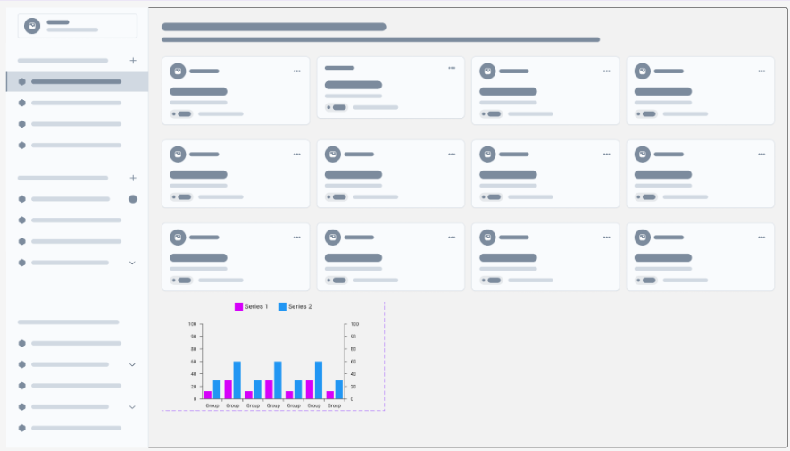

fonte: elaborada pelos autores.

O dashboard foi projetado com as seguintes telas principais:

- **Tela de Login:** Autenticação simples com email e senha.
- **Tela de Visualização de Cards:** Mostra vários cartões com informações sobre falhas e parâmetros críticos.
- **Tela de Visualização de Gráficos:** Apresenta análise gráfica de padrões detectados.

---

### 3. **Descrição das Telas**

#### 3.1. **Tela de Login**
- Campo para inserção de **email** e **senha**.
- Botão de **Entrar**.
- Logotipo da Volkswagen no canto superior esquerdo.

**Objetivo:** Garantir acesso seguro ao dashboard para os usuários autorizados.

---

#### 3.2. **Tela de Visualização de Cards**
- Disposição em formato de **grid**, com múltiplos cartões.
- **Heatmap Dinâmico:** Os cartões representarão áreas do processo produtivo com cores que indicam a criticidade:
  - **Verde:** Operação dentro do esperado.
  - **Amarelo:** Aumento nas falhas, acima do normal.
  - **Vermelho:** Limite crítico ultrapassado.
- **Agrupamentos Dinâmicos:**
  - **Por Área:** Análise de falhas segmentada por diferentes áreas da fábrica.
  - **Por Processo:** Visualização com agrupamento baseado no tipo de processo produtivo.
  - **Outros Agrupamentos:** Flexibilidade para criar visualizações personalizadas conforme necessário.

**Objetivo:** Fornecer uma visão rápida das falhas detectadas e sua prioridade, destacando áreas com problemas de forma intuitiva através do heatmap.

---

#### 3.3. **Tela de Visualização de Gráficos**
- Gráfico de área exibindo padrões de falhas ao longo do tempo.
- Eixos para análise temporal e intensidade das falhas.
- Filtros para ajuste da análise (ex.: turno, tipo de motor, etc.).

**Objetivo:** Permitir análises aprofundadas dos padrões de falhas com base em diferentes critérios.

---

### 4. **Funcionalidades do Dashboard**

- **Interatividade:** Filtros e seleções dinâmicas para facilitar a análise.
- **Navegação Lateral:** Menu persistente para acessar diferentes seções.
- **Responsividade:** Ajuste automático para diferentes tamanhos de tela.
- **Visualização com Heatmap:** Identificação rápida de áreas críticas através de cores.


# Análise de Alinhamento do Wireframe com os Insights da Análise Exploratória

O wireframe apresentado para o DataApp do projeto está alinhado com os insights obtidos na análise exploratória, demonstrando uma estrutura que favorece a navegação, a análise eficiente de dados e a tomada de decisão baseada em evidências. A seguir, são discutidos os principais pontos de alinhamento com a análise exploratória.

### 1. Interface Intuitiva e Acessível
A estrutura do wireframe segue um padrão visual claro e organizado, com uma interface de login simples, facilitando o acesso inicial ao sistema. Esse design reflete os insights levantados na análise exploratória, que destacaram a importância de um acesso direto e sem barreiras ao ambiente de análise, especialmente para operadores que precisam de agilidade na identificação e correção de falhas.

### 2. Organização dos Dados em Cards
A organização dos dados em cards interativos foi uma escolha feita com base nas necessidades identificadas. Durante a análise exploratória, notamos que os usuários buscavam uma forma rápida de visualizar agrupamentos de falhas, correlações e padrões relevantes. Os cards permitem essa visualização simplificada, oferecendo um panorama geral das principais métricas relacionadas à qualidade de produção.

### 3. Estrutura de Navegação Lateral
A barra lateral presente nas telas do wireframe promove uma navegação eficiente entre diferentes seções, o que está em consonância com os insights que destacaram a importância de facilitar o acesso a múltiplas fontes de dados. O layout escolhido permite alternar rapidamente entre dashboards, análise de falhas, registros históricos e relatórios, otimizando o tempo de análise.

### 4. Visualização Gráfica de Tendências
A presença de gráficos no wireframe, como o gráfico de linha mostrado, atende à demanda por análises visuais que tornem evidentes os padrões e as anomalias. A análise exploratória identificou a necessidade de exibir tendências de falhas ao longo do tempo, e a inclusão desses elementos gráficos responde de forma eficiente a essa necessidade, permitindo ao usuário identificar variações de forma intuitiva.

### 5. Foco na Governança e Rastreabilidade
A disposição dos elementos no wireframe reflete a preocupação com a governança de dados, um ponto crítico destacado na análise exploratória. A apresentação clara de registros, indicadores e painéis auxilia na garantia da rastreabilidade das informações, o que está diretamente relacionado com os requisitos de conformidade e segurança definidos para o projeto.

## Conclusão
O wireframe integra de forma eficiente os principais insights obtidos na análise exploratória, alinhando-se às necessidades mapeadas no contexto de governança de dados. A interface simples, os cards informativos, a navegação facilitada e os gráficos que destacam padrões e tendências contribuem para a utilidade prática do DataApp. Apesar de o design atual apresentar um bom alinhamento com as demandas identificadas, há espaço para otimizações pontuais, como a inclusão de filtros dinâmicos e opções de customização nas visualizações, visando atingir a excelência na análise de falhas e na governança de dados.

# Análise Comparativa de Tecnologias para o DataApp

## 1. Introdução
Avaliação de diferentes tecnologias e suas compatibilidades com o wireframe e os requisitos do DataApp. Análise comparativa das tecnologias selecionadas.

## 2. Arquitetura do Sistema
O DataApp segue uma arquitetura que envolve ingestão, transformação, armazenamento e visualização dos dados. O fluxo de dados é baseado no seguinte processo:

1. **Ingestão**:
   - Dados são recebidos via **RabbitMQ**.
   - Um programa em **Python** lê e armazena os dados em um **bucket**.

2. **Armazenamento Inicial (Data Lake)**:
   - Os dados são armazenados em um **Data Lake**.
   - Utilizamos **Supabase** (PostgreSQL) como banco intermediário.

3. **Processamento (ETL)**:
   - Um processo **ETL** em Python transforma os dados e os armazena em formato **Parquet**.
   - O resultado final é enviado para o **Data Warehouse (ClickHouse)**.

4. **Armazenamento Estruturado (Data Warehouse)**:
   - Utilizamos **ClickHouse** como o principal Data Warehouse para armazenar os dados estruturados e otimizados para consultas rápidas.

5. **Exposição de Dados via API**:
   - Uma **API** é responsável por fornecer os dados para aplicações clientes.

6. **Visualização**:
   - A visualização dos dados é feita por meio de dashboards.
   - **Streamlit** será utilizado para criar os dashboards.
   - **Grafana** será utilizado para observabilidade do sistema.

## 3. Tecnologias Avaliadas


## 4. Conclusão
A escolha das tecnologias para o DataApp foi baseada em critérios como escalabilidade, facilidade de integração e eficiência na manipulação de dados. O fluxo definido atende aos requisitos do projeto, garantindo confiabilidade e boa performance. Ao longo das sprints pretendemos considerar a possibilidade de substituir o streamlit por react para implementação do dashboard, visto que, após a apresentação, o parceiro de projeto se mostrou interessado por um dashboard interativo.

## 5. Próximos Passos
- Analise e tratamento do dados enviados pela volkswagen
- Avaliar a viabilidade de substituição do Streamlit por uma solução mais interativa, como React.


# Reestruturação do Wireframe 

O Wireframe a seguir foi a reestruturação do mockup já realizado pelo grupo. Adicionamos gráficos e separamos o dashboard de análise detalhada para melhor interpretação de dos dados.

A interface é composta por um menu lateral fixo que permite a navegação entre as seções do sistema, além de duas telas principais: **Acompanhamento - Geral** e **Gestão de Falhas - Análise Detalhada**.

## 1 Navegação e estrutura da interface

A interface tem com um menu lateral fixo à esquerda da tela, que contém duas opções principais: **HOME** e **Gestão de Falhas**. O menu permite ao usuário alternar entre a visão geral e a análise detalhada das falhas.



## 2.  Tela: Acompanhamento - Geral

Essa tela fornece uma visão panorâmica das falhas detectadas no processo produtivo e sua evolução ao longo do tempo.



### 2.1 Gráfico de Tendências

No topo da tela, há um gráfico de linha que exibe a variação da quantidade de falhas ao longo do tempo, o gráfico de tendências. A linha azul representa a quantidade de falhas registradas, enquanto a linha verde mostra o limite que estávamos imaginando. Caso o número de falhas ultrapasse esse limite, o sistema alerta os usuários sobre o problema.




 O gráfico de tendências foi escolhido como a melhor representação para a análise da variação da quantidade de falhas ao longo do tempo porque ele permite uma visualização contínua e intuitiva do comportamento dos dados. Diferente de tabelas estáticas ou gráficos de barras, que mostram apenas valores pontuais, o gráfico de linhas facilita a identificação de padrões, picos e tendências sazonais no número de falhas registradas.

Essa é uma representação eficaz porque permite correlacionar a evolução das falhas com períodos específicos, como turnos, dias da semana ou mudanças no processo produtivo. Isso auxilia na identificação das causas e na aplicação de melhorias contínuas.

### 2.2 Indicador de Falhas Recentes

Ao lado do gráfico de tendência, há um alerta vermelho que informa quando o limite de falhas foi ultrapassado, o indicador de falhas recentes. Esse indicador exibe o número total de veículos com falhas nas últimas 48 horas. Se o número estiver dentro do esperado, o alerta é exibido na cor verde.


### 2.3 Gráfico de Principais Problemas

Abaixo do gráfico de tendência, há um gráfico de barras que exibe os problemas mais recorrentes identificados nos veículos, o gráfico de principais problemas. A visualização permite que os usuários entendam quais falhas ocorreram com maior frequência, ajudando na priorização das ações corretivas.




O gráfico de barras foi escolhido para exibir os principais problemas identificados nos veículos porque ele facilita a comparação direta da frequência das falhas, permitindo que os usuários analisem rapidamente quais problemas ocorrem com maior incidência dentro de um período específico.
A disposição das barras facilita a leitura e interpretação, pois cada problema é representado de forma individual, permitindo uma identificação visual imediata dos problemas mais críticos. Quanto maior a barra, maior a frequência da falha, tornando evidente quais itens precisam de atenção prioritária na análise da qualidade.

### 2.4 ndicador de Carros para Desmontagem

Ao lado do gráfico de principais problemas, há um indicador que exibe a porcentagem de veículos destinados à desmontagem devido a falhas críticas, o indicador de carros para desmontagem. Esse número mostra a gravidade dos problemas detectados e ajuda a equipe de qualidade a avaliar a necessidade de medidas para correção.

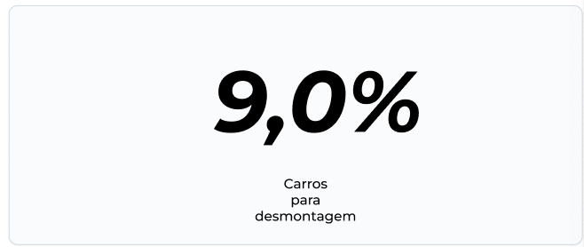

---

## 3. Tela: Gestão de Falhas - Análise Detalhada

Essa tela permite um aprofundamento na análise das falhas, tendo a opção dos filtros e uma categorização detalhada dos problemas detectados.



### 3.1 Filtros de Pesquisa

No topo da tela, há três campos principais para filtragem: **Data Início, Data Fim e Modelo**. Esses filtros permitem que os usuários ajustem o período de análise e visualizem falhas específicas por modelo de veículo.



### 3.2  Exibição das Falhas

Os problemas detectados são organizados em diferentes categorias para facilitar a análise. Cada falha é representada por uma barra horizontal, onde a cor mais escura indica uma maior frequência do problema. Esse formato de exibição permite que os usuários identifiquem rapidamente quais falhas ocorrem com maior frequência e necessitam de maior atenção.



---

## 4. Tipografia

A Volkswagen tem sua própria tipografia proprietária, desenvolvida especificamente para sua identidade visual e comunicação oficial. No entanto, devido a restrições de direitos autorais e à dificuldade de acesso a essa fonte para uso em aplicações externas, optamos por seguir por uma letra o mais semelhante possível, a tipografia **Montserrat**. Essa fonte foi escolhida por seu design limpo, moderno e de fácil leitura, garantindo uma identidade visual alinhada ao estilo da marca e mantendo a clareza necessária para a exibição dos dados.

### 4.1 Hierarquia Visual

- **Títulos e Cabeçalhos:** Montserrat Bold, com tamanhos maiores e espaçamento adequado para destacar as seções principais do sistema.
- **Subtítulos e Seções Intermediárias:** Montserrat Semibold, em um tamanho menor que os títulos, proporcionando um contraste harmonioso e auxiliando na organização das informações.
- **Textos e Informações Gerais:** Montserrat Regular, garantindo legibilidade sem comprometer a experiência do usuário.
- **Destaques e Indicadores Críticos:** Para alertas e informações críticas, utilizamos Montserrat Bold em vermelho, reforçando a importância da informação.
- **Elementos Secundários e Labels:** Para pequenas descrições e informações complementares, aplicamos Montserrat Light ou Regular, com um tom de cinza mais neutro para evitar poluição visual.

---

## 5. Esquema de Cores

Para manter a identidade visual alinhada com os padrões da Volkswagen, utilizamos um esquema de cores que mostra a estética da marca e facilita a interpretação dos dados no dashboard. Os tons de azul foram extraídos da tabela de cores oficial disponibilizada pelo parceiro, garantindo fidelidade à identidade cromática utilizada pela empresa. Essa cor desempenha um papel fundamental na interface, sendo aplicada em elementos primários, como títulos, gráficos e indicadores principais.

### 5.1 Cores Utilizadas

- **Azul Volkswagen :** Utilizado para títulos, elementos interativos e gráficos principais, garantindo coerência com a identidade da marca.
- **Cinza Neutro:** Aplicado em fundos secundários e textos complementares, ajudando a manter o equilíbrio visual sem gerar distração.
- **Vermelho de Alerta:** Destinado a notificações e mensagens críticas, como o indicador de falhas ultrapassadas. Essa cor reforça a urgência e necessidade de ação.
- **Verde para Status Positivos:** Empregado em indicadores de sucesso e elementos que representam aprovação ou funcionamento adequado.
- **Tons Claros para Destaques:** Cores mais suaves foram usadas para criar contrastes sutis, permitindo que as informações essenciais se sobressaiam sem tornar a interface visualmente pesada.


A escolha dessas cores segue um padrão de alta legibilidade e acessibilidade, garantindo que os usuários possam interpretar rapidamente os dados apresentados, mesmo em ambientes com diferentes condições de iluminação.

#  Documentação do Mockup - Gestão de Falhas

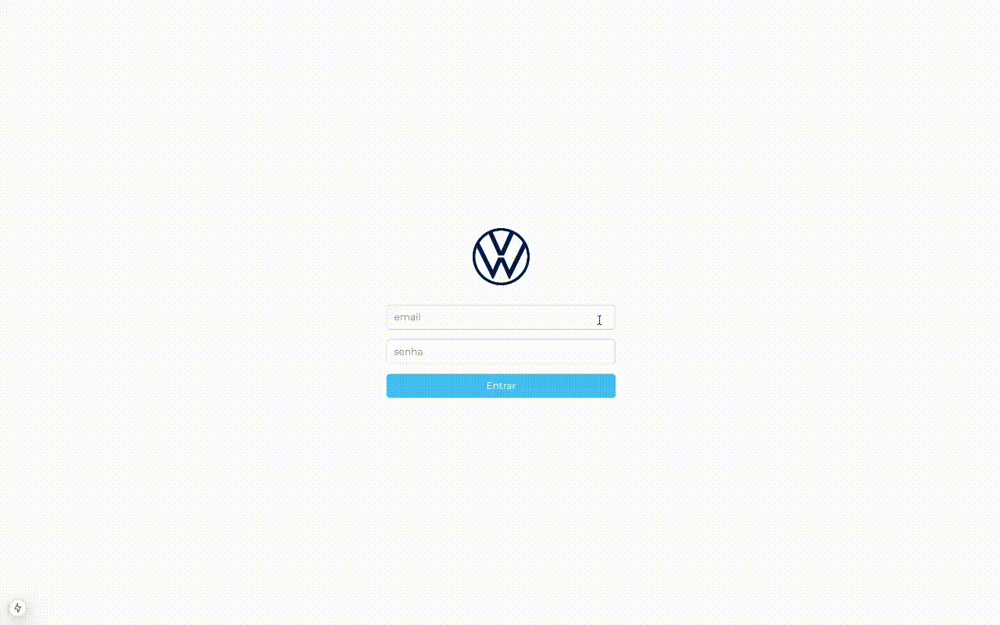

## **6. Navegação e Estrutura da Interface**
O menu lateral fixo, localizado à esquerda da interface, permite a navegação entre as seguintes seções:
- **HOME**: Tela inicial do sistema.  
- **GESTÃO DE FALHAS**: Tela principal para análise e visualização das falhas registradas no processo produtivo.  

Essa estrutura de navegação garante uma experiência de uso fluida, permitindo que o usuário acesse rapidamente as informações mais relevantes.

## **6.2. Tela: Acompanhamento - Geral**

Essa tela apresenta uma visão geral e consolidada sobre as falhas detectadas, permitindo um acompanhamento prático e objetivo.

### **6.2.1. Gráfico de Tendências**

No topo da tela, há um gráfico de linha que exibe a variação na quantidade de falhas registradas ao longo do tempo.  

- A linha azul representa o número real de falhas detectadas.  
- A linha pontilhada azul mais clara define o limite aceitável previamente estipulado.  

 O gráfico de tendências facilita a identificação rápida de picos, quedas e tendências sazonais ao longo dos meses. Isso ajuda a correlacionar a evolução das falhas com períodos específicos, como mudanças no processo, turnos de trabalho ou sazonalidades, auxiliando diretamente na identificação das causas e na aplicação de melhorias contínuas.

### **6.2.2. Indicador de Falhas Recentes**

Ao lado do gráfico de tendências, está o **indicador de falhas recentes**. Esse elemento mostra, de forma objetiva, a quantidade de veículos que apresentaram falhas nas últimas 24 horas.

- Se o número de falhas ultrapassa o limite esperado → **Alerta vermelho**.  
- Se o número está dentro do aceitável → **Indicador em verde**.  

 Essa visualização rápida permite que a equipe responsável aja de forma ágil em casos de não conformidade, mantendo o controle de qualidade em níveis satisfatórios.

### **6.2.3. Gráfico de Principais Problemas**

Logo abaixo do gráfico de tendências, temos o gráfico de barras que exibe os principais problemas registrados nos veículos.  
- Cada barra representa a quantidade de ocorrências de um tipo específico de falha.  
- A visualização hierárquica dos problemas mais recorrentes aparece no topo.  

O gráfico de barras facilita a comparação direta entre as diferentes falhas, permitindo uma análise rápida sobre quais problemas ocorrem com maior frequência.

### **6.2.4. Indicador de Carros para Desmontagem**

Ao lado do gráfico de principais problemas, está o **indicador de carros para desmontagem**, que mostra a porcentagem de veículos que precisarão passar por desmontagem devido à gravidade das falhas detectadas.

 Esse indicador ajuda a equipe de qualidade a avaliar a dimensão dos impactos causados pelas falhas críticas e a identificar a necessidade de ações corretivas mais rigorosas.

### **6.2.5. Modelos Mais Afetados**

Na parte inferior direita da tela, há um painel que exibe os modelos de veículos mais afetados pelas falhas.  
- Os modelos aparecem em ordem decrescente de incidência.  
- Cada barra de progresso indica visualmente o volume de ocorrências.  

## **6.3. Tela: Gestão de Falhas - Análise Detalhada**

Essa tela foi desenvolvida para uma análise mais profunda das falhas, permitindo ao usuário utilizar filtros avançados e visualizar informações mais segmentadas.

### **6.3.1. Filtros de Pesquisa**

No topo da tela, foram inseridos três filtros principais:
- **Data Início** – Define a data de início do período de análise.  
- **Data Fim** – Define a data de término do período de análise.  
- **Modelo** – Permite selecionar o modelo de veículo a ser analisado.

### **6.3.2. Visualização das Falhas por Categoria**

As falhas são organizadas por categoria para facilitar a análise segmentada.  
Entre as principais categorias estão:

- **Água**  
- **Rodagem**  
- **ZP7**  
- **ZP6**  
- **ZP5**  

 Cada falha é representada por uma barra horizontal com dois tons de azul, indicando a quantidade relativa de ocorrências. Quanto mais escuro o tom, maior a incidência da falha.

### **6.3.3. Explicação Detalhada**
Ao final da tela, há uma opção para **“Ver explicação detalhada”**.  
Esse recurso expande informações complementares sobre as falhas apresentadas, permitindo uma explicação mais minuciosa dos dados.

## **6.4. Tipografia**
A Volkswagen possui uma tipografia própria, mas devido a restrições de direitos autorais e à dificuldade de acesso, foi escolhida a tipografia **Montserrat** como alternativa.  

**6.4.1. Padrões Definidos:**
- **Títulos e Cabeçalhos** → Montserrat Bold  
- **Subtítulos** → Montserrat Semibold  
- **Textos Gerais** → Montserrat Regular  
- **Alertas e Destaques Críticos** → Montserrat Bold em vermelho  
- **Elementos Secundários** → Montserrat Light ou Regular em tons de cinza mais neutros  

## **6.5. Esquema de Cores**
Para manter a identidade visual próxima à marca Volkswagen, foi utilizado um esquema de cores baseado nos tons de azul extraídos da tabela de cores oficial disponibilizada pelo parceiro:

- **Azul Volkswagen (Primário)** → Títulos, elementos interativos e gráficos principais.  
- **Cinza Neutro** → Fundos secundários e textos complementares.  
- **Vermelho de Alerta** → Notificações e mensagens críticas.  
- **Verde de Status Positivo** → Indicadores de sucesso e aprovação.  
- **Tons Claros** → Para criar contrastes sutis e facilitar a leitura.  

## **6.6. Tecnologias Utilizadas**
O mockup foi desenvolvido com as seguintes tecnologias principais:

### **6.6.1. React + Next.js**
- Next.js oferece renderização híbrida (SSG e SSR) para melhor performance e flexibilidade.  
- Roteamento e estruturação de páginas simplificada.  
- Suporte à renderização assíncrona e otimização para SEO.  

### **6.6.2. TypeScript**
- Tipagem estática para maior segurança e redução de erros.  
- Melhor experiência de desenvolvimento com autocompletar e verificação de tipos.  

### **6.6.3. Tailwind CSS**
- Classes utilitárias para estilização rápida e consistente.  
- Facilidade de manutenção do código de estilo.  

### **6.6.4. PostCSS**
- Processamento e otimização de CSS.  
- Compatibilidade com funcionalidades modernas de CSS.  

## **6.7. Integração com o Backend**
A arquitetura baseada em **Next.js** facilita a futura integração com o backend.  

**6.7.1. Benefícios:**
- Baixa latência → ClickHouse é otimizado para análises rápidas de grandes volumes de dados.  
- Flexibilidade de consultas → Os dados podem ser estruturados para diferentes tipos de visualização.  
- Facilidade de manutenção → Separação entre frontend e backend simplifica a manutenção e a evolução da aplicação.

# Sprint 4:

# Frontend:


## 1. Visão Geral da Interface

A interface do sistema foi reestruturada seguindo as sugestões do Professor Cesar, focando em uma apresentação mais clara e intuitiva das informações críticas. O sistema é composto por duas telas principais:


### 1.1 Menu Lateral
- HOME
- Gestão de Falhas

### 1.2 Telas Principais
1. Acompanhamento - Geral
2. Gestão de Falhas - Análise Detalhada

## 2. Acompanhamento - Geral

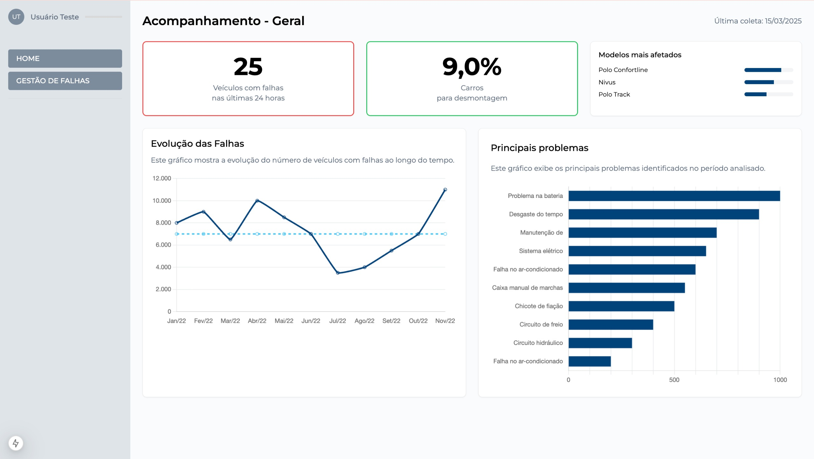

### 2.1 Seção Superior (Informações Críticas)

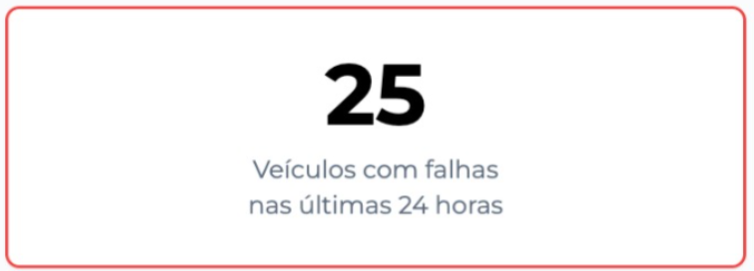

#### 2.1.1 Veículos com Falhas nas Últimas 24 Horas
- **Localização:** Topo da tela
- **Limite Crítico:** 20 veículos
- **Alerta Visual:** Borda vermelha quando ultrapassa o limite
- **Objetivo:** Monitoramento em tempo real das falhas recentes

#### 2.1.2 Carros para Desmontagem

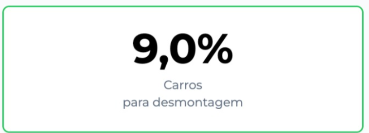

- **Localização:** Topo da tela
- **Métrica:** Porcentagem de veículos
- **Causa Principal:** Majoritariamente falhas no teste de água
- **Ação:** Necessidade de análise e remontagem manual

#### 2.1.3 Modelos Mais Afetados

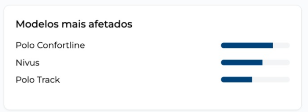

- **Localização:** Topo da tela
- **Visualização:** Lista ordenada por frequência de falhas
- **Objetivo:** Identificação rápida dos modelos problemáticos

#### 2.1.4 Data da Última Atualização


- **Localização:** Topo da tela
- **Função:** Garantir a atualidade das informações apresentadas

### 2.2 Seção Inferior (Análise Detalhada)

#### 2.2.1 Evolução das Falhas

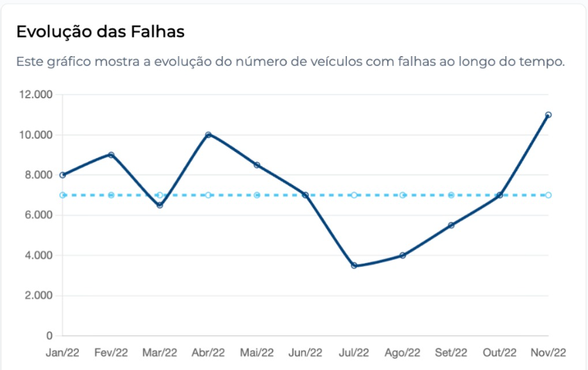

- **Tipo:** Gráfico de linha temporal
- **Objetivo:** Análise de tendências e padrões
- **Elementos:**
  - Linha azul: Quantidade real de falhas
  - Linha pontilhada: Limite aceitável

#### 2.2.2 Principais Problemas

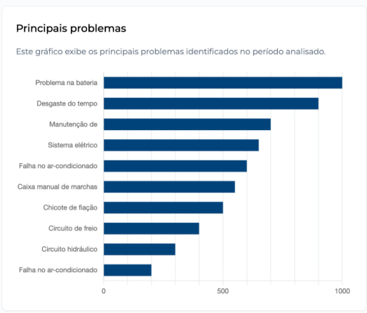

- **Tipo:** Gráfico de barras horizontais
- **Organização:** Hierarquia por frequência
- **Objetivo:** Identificação das falhas mais recorrentes

## 3. Gestão de Falhas - Análise Detalhada

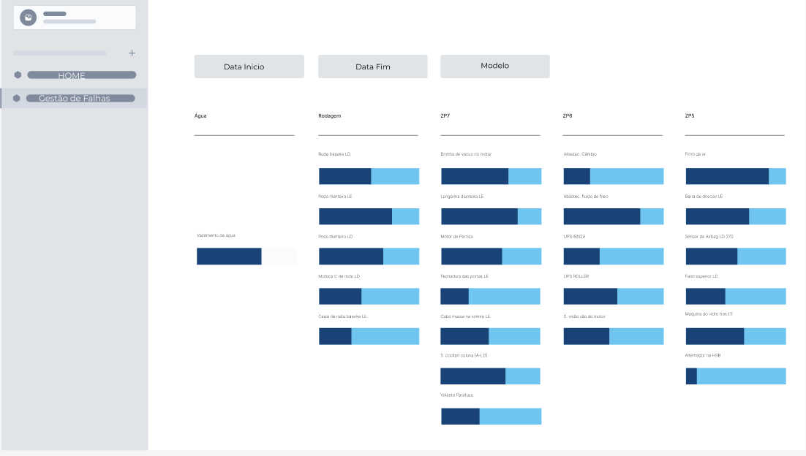

Mantida a estrutura original conforme aprovação do parceiro, incluindo:
- Filtros avançados
- Categorização detalhada
- Visualização intuitiva das falhas

## 4. Integração do Frontend

### 4.1 Tecnologias Utilizadas

#### 4.1.1 Framework Principal
- **React + Next.js**
  - Renderização híbrida (SSG e SSR)
  - Roteamento otimizado
  - Gerenciamento de estado eficiente

#### 4.1.2 Linguagem
- **TypeScript**
  - Tipagem estática
  - Maior segurança no desenvolvimento
  - Melhor manutenibilidade

#### 4.1.3 Estilização
- **Tailwind CSS**
  - Classes utilitárias
  - Responsividade
  - Customização eficiente

### 4.2 Arquitetura da Integração

#### 4.2.1 Componentes Principais
```typescript
// Estrutura de Componentes
src/
  components/
    Dashboard/
      FalhasRecentes.tsx
      CarrosDesmontagem.tsx
      ModelosAfetados.tsx
      EvolucaoFalhas.tsx
      PrincipaisProblemas.tsx
    Layout/
      Menu.tsx
      Header.tsx
    Common/
      Alert.tsx
      Graph.tsx
```

#### 4.2.2 Integração com Backend
- **API Routes do Next.js**
- **Endpoints principais:**
  - `/api/falhas/recentes`
  - `/api/falhas/evolucao`
  - `/api/desmontagem`
  - `/api/modelos`

#### 4.2.3 Gerenciamento de Estado
- **Context API** para estados globais
- **React Query** para cache e sincronização

### 4.3 Performance e Otimização

#### 4.3.1 Estratégias de Carregamento
- Lazy loading para componentes pesados
- Otimização de imagens automática
- Caching inteligente de dados

#### 4.3.2 Monitoramento
- Métricas de performance
- Logs de erros
- Análise de uso em tempo real

## 5. Identidade Visual

### 5.1 Tipografia
- **Principal:** Montserrat
- **Hierarquia:**
  - Títulos: Montserrat Bold
  - Subtítulos: Montserrat Semibold
  - Texto: Montserrat Regular

### 5.2 Cores
- **Primária:** Azul Volkswagen
- **Alertas:** Vermelho
- **Sucesso:** Verde
- **Neutras:** Tons de cinza

## 6. Considerações Finais

O sistema foi desenvolvido priorizando:
- Usabilidade
- Performance
- Escalabilidade
- Manutenibilidade

## 7. Como Rodar o Frontend

### 7.1 Pré-requisitos
- Node.js instalado
- npm instalado

### 7.2 Passos para Execução

1. **Entre na pasta do projeto**
```bash
cd 2025-1A-T06-ES11-G02
```

2. **Acesse a pasta do frontend**
```bash
cd frontend
```

3. **Instale as dependências**
```bash
npm install
```

4. **Inicie o servidor de desenvolvimento**
```bash
npm run dev
```

# Sprint 5:

## Introdução

Para facilitar a compreensão dos dados e apoiar a tomada de decisões, foram adicionados os principais gráficos gerados. Esses gráficos ajudam a visualizar melhor as falhas, entender padrões e identificar os pontos mais críticos do processo.

## Análise da Relevância dos Gráficos

### 1. Gráfico de Tendências


**Pertinência e Clareza:**
- O gráfico de linha temporal apresenta claramente a evolução das falhas ao longo do tempo
- Utiliza cores distintas (azul sólido e pontilhado) para diferenciar falhas reais do limite aceitável
- A visualização é intuitiva e permite identificar rapidamente picos e tendências

**Abrangência e Utilidade:**
- Permite análise histórica completa das falhas
- Facilita a identificação de padrões sazonais
- Auxilia na correlação entre mudanças no processo e variações nas falhas
- Fundamental para tomada de decisões baseadas em tendências

### 2. Gráfico de Principais Problemas


**Pertinência e Clareza:**
- Apresenta as falhas mais recorrentes de forma hierárquica
- Utiliza barras horizontais que facilitam a comparação visual
- A organização por frequência torna evidente quais problemas demandam atenção prioritária

**Abrangência e Utilidade:**
- Permite identificar rapidamente os problemas mais críticos
- Auxilia na priorização de ações corretivas
- Facilita a alocação de recursos para resolver as falhas mais frequentes
- Contribui para a melhoria contínua do processo produtivo

### 3. Indicador de Falhas Recentes


**Pertinência e Clareza:**
- Apresenta de forma objetiva o número de falhas nas últimas 24 horas
- Utiliza código de cores (verde/vermelho) para indicar situação normal/crítica
- Interface limpa e direta para monitoramento em tempo real

**Abrangência e Utilidade:**
- Permite ação rápida em casos de não conformidade
- Facilita o monitoramento contínuo da qualidade
- Auxilia na identificação imediata de problemas emergentes
- Fundamental para gestão proativa de falhas

### 4. Indicador de Carros para Desmontagem


**Pertinência e Clareza:**
- Apresenta claramente a porcentagem de veículos que necessitam desmontagem
- Visualização direta do impacto das falhas críticas
- Interface intuitiva que destaca a gravidade da situação

**Abrangência e Utilidade:**
- Permite avaliar o impacto financeiro das falhas
- Auxilia no planejamento de recursos para remontagem
- Facilita a identificação de padrões em falhas críticas
- Contribui para a otimização do processo produtivo

### 5. Modelos Mais Afetados


**Pertinência e Clareza:**
- Lista ordenada dos modelos com maior incidência de falhas
- Visualização clara através de barras de progresso
- Organização hierárquica que facilita a identificação dos problemas

**Abrangência e Utilidade:**
- Permite identificar modelos problemáticos
- Auxilia no direcionamento de ações específicas por modelo
- Facilita a análise de padrões por tipo de veículo
- Contribui para a melhoria contínua dos modelos afetados


1. **Pertinência e Clareza:**
- Todos os gráficos são altamente relevantes para o contexto de análise de falhas
- A apresentação visual é clara e intuitiva
- O uso de cores e elementos visuais facilita a interpretação
- A hierarquia de informações é bem definida

2. **Abrangência e Utilidade:**
- Os gráficos cobrem todos os aspectos essenciais do monitoramento de falhas
- Permitem análise em diferentes níveis (tempo real, histórico, por modelo)
- Facilitam a tomada de decisão em diferentes contextos
- Contribuem para a melhoria contínua do processo produtivo

3. **Integração e Complementaridade:**
- Os gráficos se complementam, oferecendo uma visão completa do sistema
- Permitem análise em diferentes perspectivas (tempo, tipo de falha, modelo)
- Facilitam a identificação de correlações entre diferentes aspectos
- Contribuem para uma gestão eficiente da qualidade

## Integração com a Arquitetura

A aplicação **DataApp** apresenta integração consistente com a arquitetura técnica existente, respeitando padrões de desenvolvimento frontend modernos e interagindo de forma fluida com a API REST da aplicação.

### Conformidade Arquitetural

O projeto utiliza a estrutura do `Next.js` com renderização client-side, como indicado pela diretiva:

```tsx
"use client";
export const dynamic = "force-dynamic";
```

As requisições à API são feitas utilizando `fetch` de forma padronizada, com interpolação das variáveis de data e ponto selecionadas pelo usuário:

```tsx
const res = await fetch(
  `https://api-m11.fly.dev/arvore-falhas/pct-por-tipo?data_inicio=${formattedStart}&data_fim=${formattedEnd}&ponto=${ponto}`
);
```

Esse mesmo padrão se repete em outras rotas da aplicação, garantindo uniformidade na integração:

- `/arvore-falhas/pct-por-tipo`
- `/arvore-falhas/falhas-por-periodo`
- `/arvore-falhas/status-etapas`
- `/dados/falhas/erros-por-modelo`
- `/dados/falhas/carros-afetados-por-dia`

O uso da API é direto e evita complexidade desnecessária, o que favorece a manutenção e a clareza do código.

### Eficiência e Coerência no Fluxo de Dados

As telas de análise e dashboard utilizam `useState` e `useEffect` para controlar o estado da aplicação e disparar as requisições:

```tsx
const [pctData, setPctData] = useState<any[]>([]);
const [periodData, setPeriodData] = useState<any[]>([]);
const [statusEtapasData, setStatusEtapasData] = useState<any>(null);
```

Os dados carregados são agrupados dinamicamente no frontend, como visto no agrupamento por ponto de falha:

```tsx
{Object.entries(
  periodData.reduce((acc, curr) => {
    const key = curr.ponto;
    if (!acc[key]) {
      acc[key] = [];
    }
    acc[key].push(curr);
    return acc;
  }, {} as { [key: string]: any[] })
)}
```

A arquitetura também permite alternar entre visualizações de árvore e gráfico com um controle de estado simples:

```tsx
const [viewMode, setViewMode] = useState<"tree" | "graph">("tree");
```

A consistência visual, a utilização de componentes reutilizáveis e o tratamento de carregamento (`isLoading`) contribuem para uma experiência coesa e fluida.

---

## Autenticação com Supabase

A autenticação do sistema é realizada por meio do **Supabase**, que fornece serviços de autenticação seguros e escaláveis. O backend da aplicação utiliza o Supabase para validar as credenciais dos usuários e emitir **tokens JWT**, que são utilizados para autenticação de sessões no frontend.

### Segurança e Funcionalidade

Na tela de login, os dados do usuário (email e senha) são enviados para a API, que se comunica com o Supabase para validação e geração do token JWT:

```tsx
const res = await fetch("https://api-m11.fly.dev/auth/login", {
  method: "POST",
  headers: { "Content-Type": "application/json" },
  body: JSON.stringify({ email, password })
});
```

Após a resposta bem-sucedida da API, o token JWT gerado pelo Supabase é armazenado no navegador:

```tsx
const data = await res.json();
localStorage.setItem("token", data.token);
router.push("/dashboard");
```

Esse token é utilizado para autenticar as requisições subsequentes e proteger rotas sensíveis da aplicação.

### Experiência do Usuário

A interface de login é simples e direta, com foco na usabilidade. O sistema trata possíveis erros de autenticação e fornece feedback imediato:

```tsx
{error && <p className="mt-4 text-red-600 text-center">{error}</p>}
```

O redirecionamento pós-login ocorre de forma transparente e fluida:

```tsx
router.push("/dashboard");
```

A escolha pelo Supabase garante conformidade com padrões modernos de autenticação e elimina a necessidade de construir uma infraestrutura de autenticação do zero.

---

## Integração com a Camada Gold do Data Warehouse

A arquitetura do DataApp conta com uma integração direta entre o frontend (dashboard) e a **camada Gold** do nosso **Data Warehouse**, que utiliza o banco de dados analítico **ClickHouse**.

As visualizações apresentadas na aplicação são construídas a partir de **views materializadas e otimizadas** na camada Gold. Essa camada representa o estágio mais refinado dos dados, onde já foram aplicados os processos de limpeza, transformação e agregação.

No frontend, as requisições são feitas a partir de endpoints específicos da API, os quais se conectam diretamente às views no ClickHouse. Por exemplo:

```tsx
const res = await fetch("https://api-m11.fly.dev/dados/falhas/erros-por-modelo");
```

Esse endpoint retorna dados diretamente da view `erros_por_modelo`, que está estruturada na camada Gold. O mesmo ocorre com outras rotas, como:

```tsx
const res = await fetch("https://api-m11.fly.dev/dados/falhas/carros-afetados-por-dia");
```

Essa abordagem garante:

- **Baixa Latência:** as views otimizadas permitem respostas rápidas.
- **Consistência de Dados:** os dados exibidos no dashboard seguem um padrão único de governança e verificação.
- **Desacoplamento entre Frontend e Lógica de Negócio:** o frontend consome os dados já tratados, sem a necessidade de transformações adicionais no navegador.
- **Alinhamento com o pipeline de dados:** reforçando o fluxo ingestão → transformação → camada Gold → visualização.

Essa integração é parte essencial da arquitetura moderna do DataApp, garantindo escalabilidade, segurança, confiabilidade e eficiência nas análises realizadas pelos usuários.
=======
## Sistema de Autenticação com Supabase

Este projeto utiliza o sistema de autenticação do Supabase para gerenciar usuários e suas permissões. O Supabase é uma plataforma de backend como serviço que oferece uma solução completa para autenticação, banco de dados e armazenamento.

### Benefícios do Uso do Supabase Auth

- **Facilidade de Uso:** O Supabase oferece uma API simples e intuitiva para gerenciar autenticação de usuários, permitindo operações como login, registro e recuperação de senha com facilidade.
- **Segurança:** O Supabase Auth é construído sobre o protocolo OAuth 2.0, garantindo que as operações de autenticação sejam seguras e confiáveis.
- **Escalabilidade:** O sistema de autenticação do Supabase é altamente escalável, permitindo que você gerencie um grande número de usuários sem comprometer o desempenho.
- **Integração com Roles:** O Supabase permite a criação de usuários com diferentes roles, facilitando a implementação de controle de acesso baseado em funções.

### Implementação no Sistema

Neste projeto, o sistema de autenticação é implementado usando o Supabase Auth. Aqui está uma visão geral de como ele está integrado:

- **Login:** A rota de login utiliza o serviço de autenticação do Supabase para verificar as credenciais do usuário e retornar um token de acesso.
- **Escalabilidade:** Embora o serviço `verify_role` ainda não esteja em uso, ele pode ser facilmente integrado a qualquer serviço ou rota para verificar as permissões do usuário com base em suas roles.

### Serviços de Autenticação Disponíveis

### Login
- **Endpoint:** `/auth/login`
- **Descrição:** Autentica um usuário com email e senha, retornando um token de acesso.
- **Falha no Login:** Se o login falhar, o usuário é informado com uma mensagem clara sobre o motivo da falha, como credenciais inválidas.

### Logout
- **Endpoint:** `/auth/logout`
- **Descrição:** Realiza o logout do usuário, invalidando o token de acesso. E voltando a tela inicial.

### Obter Usuário Logado
- **Endpoint:** `/auth/me`
- **Descrição:** Retorna as informações do usuário logado com base no token de acesso.

### Verificar Role
- **Descrição:** Verifica se o usuário possui a role necessária para acessar um recurso específico.Não precisa de rota pois é um serviço interno

## Tratamento de Tokens

- **Tokens Expirados ou Inválidos:** O sistema verifica a validade dos tokens em cada requisição. Se um token estiver expirado ou for inválido, o usuário é informado e solicitado a realizar o login novamente.

## Como Funciona

1. **Login:** O usuário envia suas credenciais (email e senha) para a rota de login.
2. **Verificação:** O serviço de autenticação do Supabase verifica as credenciais e, se válidas, retorna um token de acesso.
3. **Acesso:** O token de acesso pode ser usado para acessar rotas protegidas, garantindo que apenas usuários autenticados possam realizar certas operações.

O uso do Supabase Auth não só simplifica o processo de autenticação, mas também oferece uma base sólida para escalar o sistema de autenticação conforme o projeto cresce.

Para mais informações sobre o Supabase Auth, visite a [documentação oficial](https://supabase.com/docs/guides/auth).  


# Pipeline Qualidade com GitHub Actions

Pensando em manter um processo de desenvolvimento mais confiável e eficiente, foi configurado um pipeline de Integração Contínua (CI) com uso do **GitHub Actions**.

Esse pipeline tem como foco garantir que cada alteração no projeto seja validada automaticamente, cobrindo duas áreas principais:

- **Execução de testes unitários no backend**: assegura que o código esteja funcionando corretamente e pronto para interações com serviços como Supabase, RabbitMQ e ClickHouse.
- **Validação automática do frontend**: garante que novas mudanças não afetem a estrutura e funcionamento da interface.

## Por que isso é importante?

O pipeline traz ganhos reais para o time e para o projeto:

- **Resposta rápida a falhas**: qualquer problema introduzido no código é detectado rapidamente após o push.
- **Redução de erros manuais**: automatizar o processo evita esquecimentos e falhas humanas nas validações.
- **Fluxo de trabalho mais fluido**: libera os desenvolvedores para focarem em melhorias e novas funcionalidades, sem se preocupar com checagens manuais.

## Alternativa Local com ACT

Devido à limitação no uso de minutos gratuitos do GitHub Actions, adotamos a ferramenta **[ACT](https://github.com/nektos/act)**, que permite executar os mesmos workflows localmente, simulando o ambiente da nuvem no próprio computador.

### Como rodar localmente:

```bash
act --env-file .env
```

## Exemplo de Execução

Abaixo, apresentamos uma demonstração visual do pipeline em execução usando o ACT localmente:


## Conclusão

Ter esse pipeline funcionando é essencial para garantir qualidade contínua no projeto. Entre os principais benefícios, destacamos:

- **Rapidez para encontrar e resolver problemas**
- **Menos retrabalho e maior confiança nas entregas**
- **Processos padronizados, mesmo fora do ambiente online**

Com essa estrutura, conseguimos manter um ciclo de desenvolvimento sustentável, moderno e seguro — o que é fundamental para a confiabilidade da plataforma.

# Relações com os Testes e Apontamentos de Usabilidade
 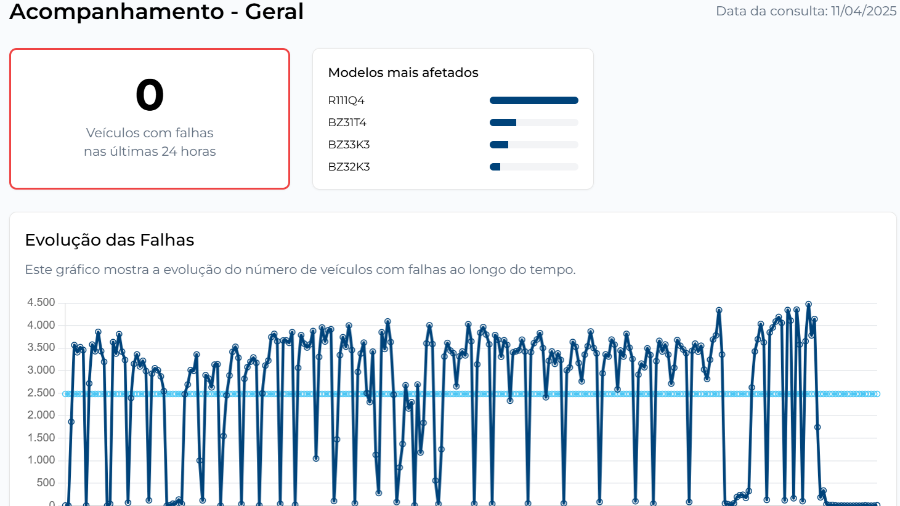
O sistema foi reformulado com foco na clareza, prioridade visual e usabilidade, seguindo as sugestões feitas pelo professor Chico. Ele conta com duas telas principais, acessíveis por meio de um menu lateral, que organiza as informações de forma mais intuitiva e funcional. Esse menu inclui as opções “Home” e “Gestão de Falhas”, direcionando o usuário para as duas principais áreas do sistema: o “Acompanhamento - Geral” e a “Gestão de Falhas - Análise Detalhada”.

Na tela “Acompanhamento - Geral”, as informações críticas foram posicionadas na parte superior da interface para garantir acesso rápido e facilitar a tomada de decisão. Nessa seção, estão os seguintes indicadores: “Veículos com Falhas nas Últimas 24 Horas”, que apresenta um limite crítico de 20 veículos e utiliza uma borda vermelha quando esse número é ultrapassado para indicar alerta visual; “Carros para Desmontagem”, que mostra a porcentagem de veículos que precisarão ser desmontados, sendo a principal causa a falha no teste de água; “Modelos Mais Afetados”, que exibe uma lista dos modelos que mais aparecem com falhas; e “Data da Última Atualização”, para garantir a confiança nas informações apresentadas.

Na parte inferior da mesma tela, o sistema apresenta análises mais detalhadas por meio de gráficos. O primeiro gráfico, de linha temporal, mostra a “Evolução das Falhas”, com uma linha azul representando o número real de falhas e uma linha pontilhada indicando o limite aceitável. Isso permite ao usuário identificar rapidamente tendências e picos fora do padrão. O segundo gráfico, de barras horizontais, mostra os “Principais Problemas”, ordenados por frequência, ajudando na identificação dos defeitos mais recorrentes.

A tela de “Gestão de Falhas - Análise Detalhada” foi mantida com a estrutura da versão aprovada pelo parceiro, contendo filtros avançados e uma categorização detalhada das falhas, para que a equipe de qualidade consiga fazer investigações mais específicas com facilidade.


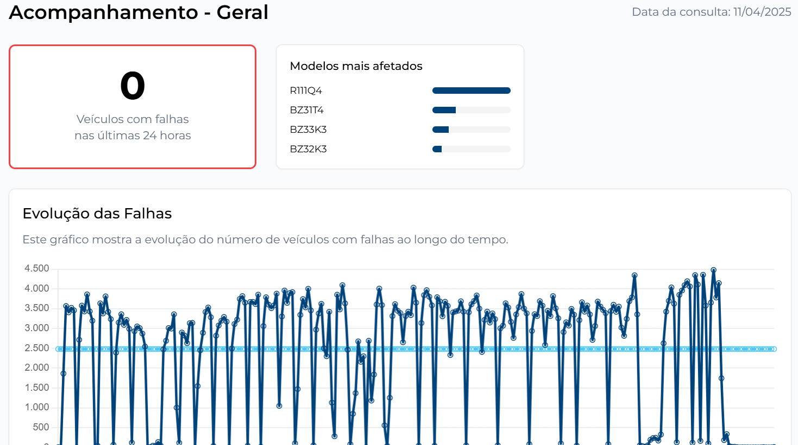

O frontend foi implementado utilizando o framework React com Next.js, que oferece renderização híbrida (SSG e SSR), além de um roteamento otimizado e gerenciamento de estado eficiente. A linguagem utilizada é TypeScript, que garante segurança com tipagem estática. A estilização foi feita com Tailwind CSS, que permite uma construção rápida e responsiva da interface com classes utilitárias.

A estrutura do projeto está organizada em componentes reutilizáveis, separados por tipo e função. Os componentes principais estão organizados em pastas como `Dashboard`, `Layout` e `Common`. A comunicação com o backend é feita por meio de rotas API do próprio Next.js, com endpoints como `/api/falhas/recentes`, `/api/falhas/evolucao`, `/api/desmontagem`, entre outros. O estado global é gerenciado com Context API, e a sincronização dos dados com cache é feita com a biblioteca React Query. Também foram aplicadas boas práticas de performance, como lazy loading para componentes pesados e otimização automática de imagens.

A identidade visual do projeto segue a linguagem da marca, utilizando a fonte Montserrat em diferentes pesos para criar uma hierarquia visual clara. A paleta de cores também foi respeitada, com o azul como cor principal, além de vermelho para alertas, verde para sucessos e tons de cinza neutros.

Em relação aos testes e apontamentos de usabilidade, a nova interface corrige os problemas da versão anterior e aplica melhorias concretas. As informações críticas foram agrupadas de forma mais visível e clara, os alertas visuais foram implementados corretamente, os gráficos foram aprimorados com linhas de referência e hierarquia de dados, e o menu lateral foi reestruturado para facilitar a navegação. Houve uma melhoria significativa na organização das telas, com separação entre indicadores gerais e análises detalhadas.

Por fim, a versão atual mostra um avanço claro em relação à versão inicial. As mudanças refletem diretamente os feedbacks recebidos e as boas práticas de design de interfaces, atendendo plenamente aos critérios do barema de avaliação. A experiência do usuário foi priorizada em cada decisão de design, garantindo uma navegação fluida, intuitiva e eficaz.
