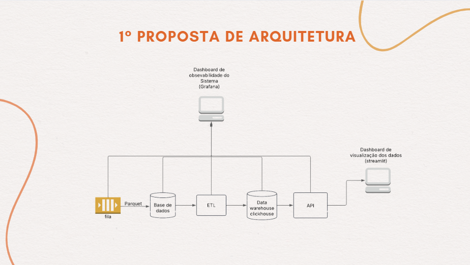

# Estrutura e Governança para Análise de Dados

**Nome do Projeto:** Análise de falhas de Qualidade com pipeline e Governança de Dados

**Nome do Parceiro:** Volkswagen do Brasil Ltda.

**Integrantes do grupo:** Bruno Leão, Eduarda Gonzaga, Emely Tavares, João Montagna, Isabela Rocha e Renan Ribeiro.

## **Conteúdo**

1. [Template de Projeto de Gestão e Governança de Dados](#1-template-de-projeto-de-gestão-e-governança-de-dados)
2. [Arquitetura de Negócios e de Dados](#2-arquitetura-de-negócios-e-de-dados)
   - [Visão Geral do Parceiro e do Projeto](#21-visão-geral-do-parceiro-e-do-projeto)
   - [Alinhamento Estratégico](#22-alinhamento-estratégico)
   - [Alinhamento com Objetivos de Negócio](#23-alinhamento-com-objetivos-de-negócio)
   - [Impacto na Eficiência Operacional](#24-impacto-na-eficiência-operacional)
   - [Aderência à LGPD e Conformidade Legal](#25-aderência-à-lgpd-e-conformidade-legal)
   - [Análise de Riscos e Contingência](#26-análise-de-riscos-e-contingência)
   - [Governança de Dados do Parceiro](#27-governança-de-dados-do-parceiro)
3. [Projeto de Gestão e Governança de Dados](#3-projeto-de-gestão-e-governança-de-dados)
   - [Requisitos Funcionais e Não Funcionais](#31-requisitos-funcionais-e-não-funcionais)
   - [Matriz de Rastreabilidade](#32-matriz-de-rastreabilidade)
   - [Data Product Canvas](#33-data-product-canvas)
4. [Arquitetura da Aplicação](#4-arquitetura-da-aplicação)
5. [Conformidade com Sprints do Módulo](#5-conformidade-com-sprints-do-módulo)
6. [Conformidade com Padrões Oficiais de Engenharia de Dados](#6-conformidade-com-padrões-oficiais-de-engenharia-de-dados)
7. [Qualidade, Organização e Navegação](#7-qualidade-organização-e-navegação)

# 1 Template de Projeto de Gestão e Governança de Dados

Com o objetivo fornecer um **Template de Projeto de Gestão e Governança de Dados**, estruturado conforme o **TOGAF (The Open Group Architecture Framework)**. Ele será um guia para equipes implementarem um projeto de governança de dados de forma estruturada, iterativa e alinhada com os objetivos do negócio.
serve como:

- **Roteiro estruturado:** Aborda desde a arquitetura de negócios até a implementação de um DataApp.
- **Ferramenta de planejamento:** Organiza e facilita a execução eficiente do projeto.
- **Guia de consistência:** Garante que a equipe e sprints sigam uma abordagem uniforme.
- **Suporte ao desenvolvimento iterativo:** Permite ajustes contínuos ao longo das sprints.
- **Facilitador de comunicação:** Atua como um ponto de referência central para todos os envolvidos.
- **Checklist abrangente:** Assegura que todos os aspectos críticos sejam considerados.
- **Instrumento de documentação:** Evolui com o projeto, registrando decisões e aprendizados.

## 2. Arquitetura de Negócios e de Dados (TOGAF - Fase de Arquitetura de Negócio)

### 2.1 Visão Geral do Parceiro e do Projeto
- **Objetivos e escopo**
- **Contexto de negócio e da indústria**

### 2.2 Alinhamento Estratégico
- **Fluxo de valor da organização**
- **Análise dos stakeholders**
- **Principais processos, objetivos e metas associadas ao contexto do projeto**

### 2.3 Alinhamento com Objetivos de Negócio
- **Objetivos Estratégicos**
  - Excelência em Qualidade
  - Eficiência Operacional
  - Inovação e Transformação Digital
- **Objetivos Operacionais**
  - Processos de Produção
  - Gestão de Qualidade
  - Compliance e Governança
- **Processos de Auditoria e Monitoramento**
  - Auditorias Contínuas
  - Melhorias Contínuas
  - Métricas de Desempenho

### 2.4 Impacto na Eficiência Operacional
- **Processos Otimizados**
  - Pipeline de Dados Automatizado
  - Análise de Falhas Inteligente
  - Gestão de Qualidade Eficiente
- **Redução de Redundâncias**
  - Centralização de Dados
  - Processos Padronizados
  - Automação de Tarefas Repetitivas
- **Operações Mais Fluídas**
  - Integração de Sistemas
  - Acesso Inteligente aos Dados
  - Gestão de Recursos

### 2.5 Aderência à LGPD e Conformidade Legal
- **Políticas e Procedimentos LGPD**
  - Coleta e Tratamento de Dados
  - Segurança e Proteção
  - Direitos dos Titulares
- **Integração com Regulamentações**
  - Conformidade com Normas Técnicas
  - Processos de Auditoria
  - Documentação Legal
- **Governança de Dados**
  - Estrutura Organizacional
  - Processos de Governança
  - Capacitação e Conscientização

### 2.6 Análise de Riscos e Contingência
- **Identificação de Riscos**
  - Riscos de Segurança
  - Riscos Operacionais
  - Riscos de Conformidade
- **Avaliação de Riscos**
  - Categorização
  - Priorização
  - Monitoramento
- **Estratégias de Mitigação**
  - Controles Preventivos
  - Controles Detectivos
  - Controles Corretivos
- **Planos de Contingência**
  - Continuidade de Negócio
  - Recuperação de Desastres
  - Gestão de Incidentes

### 2.7 Governança de Dados do Parceiro
- **Estrutura de governança de dados**
- **Políticas de acesso e segurança**
- **Adequação à LGPD**
- **Definição de métricas de qualidade de dados**
- **Processos de coleta e medição de qualidade**

## 3. Projeto de Gestão e Governança de Dados (TOGAF - Fase de Arquitetura de Dados e Aplicativos)

# **Arquitetura de Dados e Governança - Modelo TOGAF**  

## **1. Visão Geral**  
A arquitetura segue o modelo **TOGAF (The Open Group Architecture Framework)**, garantindo um alinhamento estruturado entre **negócio, aplicação, dados e tecnologia**. O sistema implementado permite ingestão, processamento, armazenamento e exposição de dados para auditoria, monitoramento e visualização.  

## **2. Arquitetura do Negócio (BA - Business Architecture)**  
### **Objetivos**  
- Garantir a governança e integridade dos dados desde a ingestão até a visualização.  
- Permitir rastreabilidade dos dados via auditoria.  
- Disponibilizar métricas de monitoramento da pipeline de dados.  
- Oferecer dashboards para análise de dados pelos clientes.  

### **Principais Stakeholders**  
- **Clientes**: Consomem os dados via dashboard interativo (Streamlit).  
- **Equipe de Governança de Dados**: Responsável pela auditoria e rastreabilidade dos dados.  
- **Equipe de Engenharia de Dados**: Desenvolve e mantém o pipeline de ingestão e processamento.  
- **Equipe de Observabilidade**: Monitora a integridade e performance do sistema via Grafana.  

## 3. Arquitetura de Dados (DA - Data Architecture)

### 3.1 Fluxo de Dados 
1. **Ingestão**  
   - Dados são recebidos via **fila de mensagens** e armazenados em **formato Parquet**.  
2. **Armazenamento Inicial**  
   - Dados brutos são armazenados na **Base de Auditoria**, permitindo rastreabilidade.  
3. **Processamento ETL**  
   - Transformações são aplicadas para limpeza, agregação e estruturação dos dados.  
4. **Armazenamento Analítico**  
   - Dados processados são armazenados no **Data Warehouse (ClickHouse)** para consulta otimizada.  
5. **Exposição via API**  
   - Dados são disponibilizados para **consumo externo**.  
6. **Monitoramento e Observabilidade**  
   - O **Grafana** monitora métricas da pipeline.  
7. **Visualização pelo Cliente**  
   - O **Streamlit** fornece um dashboard interativo para consulta dos dados.  

### 3.2 Requisitos Funcionais e Não Funcionais
- **RF1:** Implementação de pipeline de ingestão de dados.
- **RF2:** Garante controle de acesso com auditoria.
- **RNF1:** O sistema deve processar dados em tempo real.
- **RNF2:** Alta disponibilidade com uptime de 98,9%.

### 3.3 Matriz de Rastreabilidade
| Requisito | Teste de Validação |
|-----------|-------------------|
| RF1       | Pipeline processando dados corretamente |
| RF2       | Logs de auditoria registrados |

## **4. Arquitetura de Aplicação (AA - Application Architecture)**  
### **Principais Componentes**  
- **Fila de Mensagens**: Garante ingestão escalável de dados.  
- **Base de Auditoria**: Banco de dados primário para rastreabilidade.  
- **ETL (Extract, Transform, Load)**: Processa e estrutura os dados.  
- **Data Warehouse (ClickHouse)**: Armazena os dados analíticos.  
- **API**: Disponibiliza dados estruturados para consumo externo.  
- **Grafana**: Dashboard para observabilidade da pipeline de dados.  
- **Streamlit**: Dashboard interativo para visualização pelos clientes.  

## **5. Arquitetura de Tecnologia (TA - Technology Architecture)**  
### **Infraestrutura e Tecnologias Utilizadas**  
- **Mensageria**: Kafka ou RabbitMQ para ingestão.  
- **Banco de Dados**: PostgreSQL/MySQL para auditoria.  
- **ETL**: Apache Spark, Airflow ou DBT para transformação.  
- **Data Warehouse**: ClickHouse para armazenamento analítico.  
- **API**: FastAPI, Flask ou Node.js para exposição de dados.  
- **Monitoramento**: Grafana + Prometheus para métricas do sistema.  
- **Dashboard**: React.js para visualização interativa.  

## 5. Conformidade com Sprints do Módulo (TOGAF - Fase de Governança da Implementação)
Com o objetivo de ter um histórico de todas as alterações do sistema, as seções a seguir serão divididas por Sprint, contendo o objetivo inicial e as alterações após o status report com o parceiro. 

### 5.1 SPRINT 1 
#### 5.1.2 Planejamento da Sprint 1
    * Análise Exploratória E De Governança De Dados
    * Template De Projeto De Gestão E Governança De Dados
    * Wireframe Do DataApp
    * Documentação Do Projeto De Gestão E Governança De Dados
    * Gestão Evolutiva Do Projeto

### 5.2 SPRINT 2
#### 5.2.1 Planejamento Sprint 2
    * Módulo De Ingestão E Transformação De Dados
    * Documentação Do Projeto De Gestão E Governança De Dados
    * Gestão Evolutiva Do Projeto

### 5.3 SPRINT 3
#### 5.3.1 Planejamento Sprint 3
    * Módulo De Processamento, Integração E Manipulação De Dados.
    * Mockup Do DataApp
    * Documentação Do Projeto De Gestão E Governança De Dados
    * Gestão Evolutiva Do Projeto  

### 5.4 SPRINT 4
#### 5.4.1 Planejamento Sprint 4
    * Implatação Do Pipeline Na Nuvem
    * 1° Versão Do DataApp
    * Documentação Do Projeto De Gestão E Governança De Dados
    * Gestão Evolutiva Do Projeto  

### 5.5 SPRINT 5
#### 5.5.1 Planejamento Sprint 5
    * Versão Final Do DataApp
    * Documentação Do Projeto De Gestão E Governança De Dados
    * Gestão Evolutiva Do Projeto  

# 6. Conformidade com Padrões Oficiais de Engenharia de Dados
- **TOGAF:** Arquitetura geral.
- **DMBOK:** Governança de dados.
- **ISO 25012:** Qualidade de dados.
- **ISO 38505:** Segurança e gestão de dados.
- **DataOps:** Processos automatizados de gestão de dados.

---

# 7. Qualidade, Organização e Navegação
- **Sumário e links internos para facilitar navegação.**
- **Glossário:** Definição de termos técnicos.
- **Histórico de revisões:** Registro de modificações ao longo do projeto.

